# BÁO CÁO KHẢO SÁT HIỆN TRẠNG, ĐẶC TẢ YÊU CẦU & THIẾT KẾ HỆ THỐNG
## DỰ ÁN: CỔNG TƯ VẤN HỌC VỤ SINH VIÊN, QUẢN LÝ TICKET SLA & TRỢ LÝ AI RAG (QAUTE PORTAL)

> **Đơn vị đào tạo:** Trường Đại học Sư phạm Kỹ thuật TP. Hồ Chí Minh (HCMUTE)  
> **Hệ thống:** QAUTE Portal (Academic Consulting, SLA Helpdesk & Dual-Engine RAG Assistant)  
> **Ngôn ngữ & Nền tảng:** Java 17, Spring Boot 3.3, MySQL 8, Python 3.10+ (FastAPI, ChromaDB), Thymeleaf, Bootstrap 5  
> **Phiên bản tài liệu:** 2.0-FINAL  
> **Quy chuẩn mã nguồn đồ họa:** Toàn bộ sơ đồ được cung cấp mã nguồn **PlantUML** (`@startuml ... @enduml`) chuẩn mực, sẵn sàng biên dịch trực tiếp trên PlantUML, VS Code, PlantText hoặc StarUML.

---

# MỤC LỤC TỔNG THỂ

- [CHƯƠNG 2: KHẢO SÁT HIỆN TRẠNG & ĐÁNH GIÁ NHU CẦU THỰC TẾ](#chương-2-khảo-sát-hiện-trạng--đánh-giá-nhu-cầu-thực-tế)
  - [2.1. Khảo sát hiện trạng hỗ trợ học vụ tại HCMUTE](#21-khảo-sát-hiện-trạng-hỗ-trợ-học-vụ-tại-hcmute)
  - [2.2. Khảo sát các giải pháp cổng thông tin học vụ trong và ngoài nước](#22-khảo-sát-các-giải-pháp-cổng-thông-tin-học-vụ-trong-và-ngoài-nước)
  - [2.3. Bảng so sánh đánh giá ưu - nhược điểm các hệ thống hiện nay](#23-bảng-so-sánh-đánh-giá-ưu---nhược-điểm-các-hệ-thống-hiện-nay)
  - [2.4. Xác định bài toán cốt lõi & Tính cấp thiết của dự án QAUTE Portal](#24-xác-định-bài-toán-cốt-lõi--tính-cấp-thiết-của-dự-án-qaute-portal)
- [CHƯƠNG 3: PHÂN TÍCH YÊU CẦU & THIẾT KẾ HỆ THỐNG](#chương-3-phân-tích-yêu-cầu--thiết-kế-hệ-thống)
  - [3.1. Phân tích chức năng theo 4 nhóm Tác nhân (Actors)](#31-phân-tích-chức-năng-theo-4-nhóm-tác-nhân-actors)
  - [3.2. Ma trận phân quyền tính năng & Cách ly dữ liệu theo Khoa/Phòng (RBAC Matrix)](#32-ma-trận-phân-quyền-tính-năng--cách-ly-dữ-liệu-theo-khoaphòng-rbac-matrix)
  - [3.3. Biểu đồ Use Case tổng quan & phân hệ (Mã PlantUML)](#33-biểu-đồ-use-case-tổng-quan--phân-hệ-mã-plantuml)
  - [3.4. Đặc tả chi tiết các Use Case cốt lõi (Chuẩn quốc tế)](#34-đặc-tả-chi-tiết-các-use-case-cốt-lõi-chuẩn-quốc-tế)
  - [3.5. Biểu đồ Tuần tự (Sequence Diagrams - 8 kịch bản chuẩn PlantUML)](#35-biểu-đồ-tuần-tự-sequence-diagrams---8-kịch-bản-chuẩn-plantuml)
  - [3.6. Biểu đồ Hoạt động (Activity Diagrams - PlantUML)](#36-biểu-đồ-hoạt-động-activity-diagrams---plantuml)
  - [3.7. Thiết kế Cơ sở Dữ liệu quan hệ (ERD & Data Dictionary 12 bảng chuẩn 3NF)](#37-thiết-kế-cơ-sở-dữ-liệu-quan-hệ-erd--data-dictionary-12-bảng-chuẩn-3nf)
- [CHƯƠNG 4: THIẾT KẾ KIẾN TRÚC KỸ THUẬT & PHÂN HỆ AI RAG](#chương-4-thiết-kế-kiến-trúc-kỹ-thuật--phân-hệ-ai-rag)
  - [4.1. Kiến trúc tổng thể Hybrid Dual-Engine (Spring Boot & FastAPI Python)](#41-kiến-trúc-tổng-thể-hybrid-dual-engine-spring-boot--fastapi-python)
  - [4.2. Cơ chế phân tầng tìm kiếm & Phòng thủ Quota Gemini API](#42-cơ-chế-phân-tầng-tìm-kiếm--phòng-thủ-quota-gemini-api)
  - [4.3. Động cơ tính hạn chót SLA & Xử lý bất đồng bộ (Async Mail / Webhook)](#43-động-cơ-tính-hạn-chót-sla--xử-lý-bất-đồng-bộ-async-mail--webhook)

---

# CHƯƠNG 2: KHẢO SÁT HIỆN TRẠNG & ĐÁNH GIÁ NHU CẦU THỰC TẾ

## 2.1. Khảo sát hiện trạng hỗ trợ học vụ tại HCMUTE

Trường Đại học Sư phạm Kỹ thuật TP. Hồ Chí Minh (HCMUTE) là cơ sở giáo dục đại học định hướng ứng dụng đa ngành với quy mô hơn 25.000 sinh viên chính quy, học viên cao học cùng hàng chục ngàn thí sinh quan tâm mỗi kỳ tuyển sinh. Hiện nay, công tác truyền thông, giải đáp thắc mắc và xử lý thủ tục hành chính - học vụ được phân bổ qua nhiều đơn vị đầu mối:

1. **Phòng Tuyển sinh và Truyền thông (Phòng A1-101):** Đầu mối thông tin về đề án tuyển sinh các hệ đào tạo, học phí, điểm chuẩn xét tuyển, giải đáp thắc mắc của thí sinh và phụ huynh qua Hotline, Fanpage Facebook và các buổi tư vấn trực tiếp.
2. **Phòng Đào tạo & Phòng Công tác Sinh viên (Phòng A1-201):** Tiếp nhận và xử lý đăng ký môn học, lịch thi, hoãn thi, phúc khảo điểm thi, chứng chỉ ngoại ngữ chuẩn đầu ra (TOEIC, IELTS), học bổng khuyến khích học tập, trợ cấp xã hội và xét tốt nghiệp.
3. **Đoàn Thanh niên - Hội Sinh viên trường (Phòng A1-102):** Tiếp nhận thông tin phong trào, hoạt động tình nguyện, rèn luyện kỹ năng mềm, xác nhận điểm rèn luyện (ĐRL) và các chương trình truyền thông đa phương tiện.
4. **Các Khoa chuyên môn (Khoa CNTT - Tòa E1, Khoa Cơ khí, Điện - Điện tử, Ngoại ngữ...):** Hướng dẫn đồ án môn học, khóa luận tốt nghiệp, giới thiệu thực tập doanh nghiệp và giải quyết các vướng mắc chuyên ngành.

### Những bất cập và hạn chế trong quy trình hiện tại:
- **Tình trạng quá tải và phản hồi chậm trễ:** Vào các đợt cao điểm (đăng ký môn học đầu kỳ, xét học bổng, xét hoãn thi hoặc cao điểm tuyển sinh), các hòm thư điện tử và kênh tiếp nhận tiếp nhận hàng ngàn lượt câu hỏi mỗi ngày. Cán bộ tư vấn phải trả lời thủ công lặp đi lặp lại những câu hỏi đã có sẵn trong quy chế, dẫn đến quá tải và thời gian chờ đợi phản hồi kéo dài từ vài ngày đến hàng tuần.
- **Thiếu cam kết chuẩn dịch vụ (Service Level Agreement - SLA):** Sinh viên khi gửi yêu cầu hỗ trợ qua email hoặc mạng xã hội không có mã định danh để theo dõi tiến độ, không biết chính xác thời hạn tối đa nhận được câu trả lời và không có cơ chế cảnh báo khi yêu cầu bị bỏ quên hoặc quá hạn.
- **Phân tán kênh thông tin và dữ liệu tài liệu:** Các thông tư, quyết định, quy chế học vụ được ban hành dưới dạng văn bản PDF dung lượng lớn, lưu trữ rải rác trên website của từng phòng ban. Sinh viên gặp khó khăn khi tìm kiếm chính xác điều khoản cần tra cứu.
- **Thiếu kiểm duyệt trên các diễn đàn tự phát:** Sinh viên thường trao đổi, tìm nhóm học tập và chia sẻ tài liệu trên các hội nhóm mạng xã hội không chính thống. Điều này tiềm ẩn nguy cơ lan truyền thông tin sai lệch về quy chế thi, học phí hoặc phát sinh các bài viết có ngôn từ thiếu chuẩn mực học đường.

---

## 2.2. Khảo sát các giải pháp cổng thông tin học vụ trong và ngoài nước

Nhằm có cái nhìn toàn diện, nhóm nghiên cứu đã tiến hành khảo sát các mô hình cổng thông tin và hệ thống hỗ trợ sinh viên tại các cơ sở giáo dục đại học tiêu biểu:

### 1. Cổng thông tin một cửa - ĐHQG TP.HCM & Trường ĐH Bách Khoa (HCMUT)
- **Đặc điểm:** Triển khai mô hình "Bộ phận Một cửa" (One-Stop Service) tích hợp vào hệ thống quản lý đào tạo (MyBK). Cho phép sinh viên nộp đơn trực tuyến đối với các nghiệp vụ hành chính cơ bản (cấp giấy chứng nhận sinh viên, xin hoãn thi, xin bảo lưu).
- **Ưu điểm:** Tích hợp trực tiếp với cơ sở dữ liệu sinh viên, giảm thiểu giấy tờ văn phòng.
- **Hạn chế:** Hệ thống chủ yếu mang tính chất giải quyết thủ tục tĩnh, chưa có kênh tương tác hỏi đáp mở, không có trợ lý AI tự động đọc hiểu quy chế và không có diễn đàn sinh viên chính thống có kiểm duyệt.

### 2. Hệ thống Hỗ trợ sinh viên - Trường ĐH FPT & HUTECH
- **Đặc điểm:** Ứng dụng kênh tiếp nhận Ticket (Helpdesk) trên nền tảng web hoặc ứng dụng di động, kết hợp với các chatbot rule-based (dựa trên kịch bản nút bấm cố định).
- **Ưu điểm:** Sinh viên có thể theo dõi trạng thái đơn yêu cầu (Mới tiếp nhận / Đang xử lý / Đã xử lý).
- **Hạn chế:** Chatbot dạng cây quyết định (decision-tree) rất cứng nhắc, không hiểu được câu hỏi tự nhiên bằng tiếng Việt khi sinh viên dùng từ ngữ viết tắt hoặc đặt câu hỏi phức hợp. Hệ thống Helpdesk chưa liên thông trực tiếp với diễn đàn và bảng tin đa phương tiện.

### 3. Các nền tảng Service Desk tiêu chuẩn doanh nghiệp (Zendesk, Jira Service Management)
- **Đặc điểm:** Khung quản lý yêu cầu chuẩn quốc tế (ITIL / ITSM) với SLA đa tầng, phân quyền theo nhóm hỗ trợ, đo lường thời gian xử lý và tỷ lệ vi phạm hạn chót.
- **Ưu điểm:** Quy trình xử lý chuyên nghiệp, minh bạch, báo cáo thống kê chuyên sâu.
- **Hạn chế:** Chi phí bản quyền quá cao đối với môi trường giáo dục đại học công lập, giao diện phức tạp và thiếu khả năng tùy biến sâu cho quy trình xét duyệt học vụ và trợ lý AI RAG chuyên biệt cho tài liệu tiếng Việt.

---

## 2.3. Bảng so sánh đánh giá ưu - nhược điểm các hệ thống hiện nay

| Tiêu chí so sánh | Website / Fanpage HCMUTE hiện tại | Hệ thống One-Stop ĐH lớn (Bách Khoa, FPT) | Hệ thống Helpdesk Doanh nghiệp (Zendesk/Jira) | Dự án QAUTE Portal đề xuất |
| :--- | :--- | :--- | :--- | :--- |
| **Kênh tiếp nhận** | Phân tán (Email, Fanpage, Trực tiếp) | Tập trung trên Web Portal trường | Tập trung qua Portal / Email Ingestion | **Tập trung đa kênh (Form Ticket + Chuyển từ Chat AI)** |
| **Cam kết thời hạn (SLA)** | Không có cam kết hạn chót | Có thời gian ước tính (không tự động) | Tự động tính hạn chót, đếm ngược SLA | **Tự động gán SLA theo mức ưu tiên (`24h`, `72h`, `7 ngày`)** |
| **Trợ lý AI hỏi đáp** | Không có hoặc Bot trả lời tự động cứng nhắc | Chatbot theo kịch bản nút bấm (Rule-based) | AI trả lời theo mẫu có sẵn | **AI RAG kép (Dual-Engine) đọc hiểu văn bản quy chế PDF** |
| **Chống quá tải & Cản lọc** | 100% cán bộ phải đọc và trả lời | Cản lọc được khoảng 20-30% câu hỏi cơ bản | Phụ thuộc vào kho bài viết KB tĩnh | **Phễu cản tải 4 tầng (Cache + FAQ + RAG), giảm $\ge 70\%$ áp lực** |
| **Bảng tin & Diễn đàn** | Tách rời, không có diễn đàn sinh viên | Có thông báo nội bộ, không có diễn đàn | Không hỗ trợ diễn đàn cộng đồng | **2 luồng độc lập: Bảng tin Cán bộ & Diễn đàn có kiểm duyệt** |
| **Đa phương tiện & Video** | Nhúng link thủ công | Tải file đính kèm đơn giản | Lưu trữ file đính kèm | **Tích hợp Webhook nhận Video MP4 tự động từ Microservice Node.js** |
| **Phân quyền Khoa/Phòng** | Thủ công theo phòng trực tiếp | Phân quyền theo chức năng quản trị | Phân quyền Queue theo phòng ban | **Cách ly dữ liệu nghiêm ngặt theo `department_id`** |

---

## 2.4. Xác định bài toán cốt lõi & Tính cấp thiết của dự án QAUTE Portal

Từ kết quả khảo sát thực trạng tại HCMUTE và đối sánh các giải pháp hiện nay, việc xây dựng và hoàn thiện **QAUTE Portal** là hết sức cấp thiết nhằm giải quyết trọn vẹn 4 bài toán lớn:

1. **Tự động hóa giải đáp học vụ 24/7:** Giải phóng sức lao động của cán bộ tư vấn bằng Trợ lý AI RAG có khả năng đọc hiểu ngữ nghĩa từ hàng trăm trang công văn, quy chế học bổng, chuyển đổi điểm ngoại ngữ và bộ tri thức tích lũy từ thực tế.
2. **Chuẩn hóa quy trình xử lý yêu cầu theo cam kết chất lượng (SLA):** Đảm bảo mọi thắc mắc học vụ từ sinh viên và thí sinh đều được tiếp nhận, cấp mã tra cứu bảo mật, định tuyến chính xác về Khoa/Phòng phụ trách và giải quyết đúng hạn định.
3. **Môi trường kết nối học đường chính thống và lành mạnh:** Cung cấp kênh thông báo chính thức có đính kèm văn bản và video chuẩn mực, song song với diễn đàn thảo luận sinh viên có cơ chế tiền kiểm duyệt (Pre-moderation) và xử lý báo cáo vi phạm nghiêm minh.
4. **Kiến trúc bền vững, an toàn và tối ưu chi phí:** Kết hợp sức mạnh của Java Spring Boot cho nghiệp vụ lõi bảo mật cao với Python FastAPI/ChromaDB cho xử lý vector AI, có khả năng phòng vệ hạn mức API, ngăn ngừa quá tải và hoạt động bền bỉ trong mọi điều kiện hạ tầng mạng.

---

# CHƯƠNG 3: PHÂN TÍCH YÊU CẦU & THIẾT KẾ HỆ THỐNG

## 3.1. Phân tích chức năng theo 4 nhóm Tác nhân (Actors)

Hệ thống phân định ranh giới trách nhiệm rõ ràng giữa 4 nhóm tác nhân tương tác:

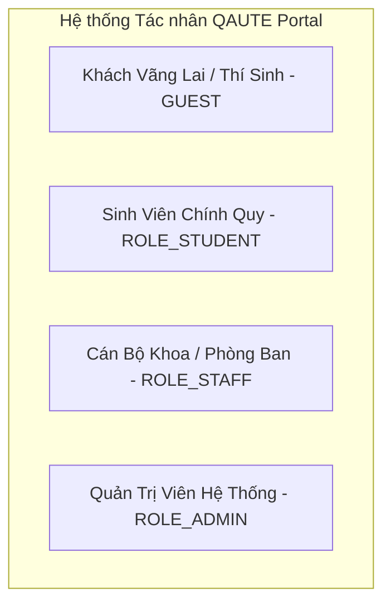

### 1. Phía Khách vãng lai / Thí sinh (`GUEST`):
| STT | Tên chức năng | Mô tả chi tiết chức năng |
| :---: | :--- | :--- |
| **F-GST-01** | Tra cứu thông tin tuyển sinh & Hỏi đáp AI Bot | Đặt câu hỏi tự nhiên về đề án tuyển sinh, mức học phí, điểm chuẩn và nhận câu trả lời trích nguồn từ tài liệu chính thức. |
| **F-GST-02** | Gửi Ticket tư vấn qua Email | Nhập Họ tên, Số điện thoại, Email cá nhân để gửi yêu cầu hỗ trợ đến Phòng Tuyển sinh hoặc Phòng Đào tạo mà không cần đăng nhập tài khoản. |
| **F-GST-03** | Chuyển đổi cuộc hội thoại thành Ticket | Khi Chatbot AI không thỏa mãn nhu cầu, nhấn nút chuyển tiếp toàn bộ ngữ cảnh hội thoại thành Ticket gửi cán bộ. |
| **F-GST-04** | Tra cứu tiến độ xử lý Ticket qua Token | Sử dụng đường link bảo mật gửi về Email chứa Token tra cứu để xem tiến trình và phản hồi của cán bộ. |
| **F-GST-05** | Đánh giá mức độ hài lòng (CSAT) | Đánh giá chất lượng phục vụ từ 1 đến 5 sao và gửi góp ý sau khi Ticket được giải quyết. |
| **F-GST-06** | Xem Bảng tin thông báo & Tải tệp công văn | Xem các thông báo công khai và tải các tệp đính kèm (`.pdf`, `.docx`, `.xlsx`, `.mp4`). |

### 2. Phía Sinh viên chính quy (`ROLE_STUDENT`):
| STT | Tên chức năng | Mô tả chi tiết chức năng |
| :---: | :--- | :--- |
| **F-STU-01** | Đăng ký & Kích hoạt tài khoản bằng Email trường | Đăng ký tài khoản với email `@student.hcmute.edu.vn` và kích hoạt bằng mã OTP gửi về hòm thư điện tử. |
| **F-STU-02** | Đăng nhập, Đăng xuất & Quản lý hồ sơ | Đăng nhập hệ thống, cập nhật thông tin cá nhân, ảnh đại diện, đổi mật khẩu và xem lịch sử tương tác. |
| **F-STU-03** | Tra cứu Trợ lý AI RAG không giới hạn | Trò chuyện với Trợ lý AI với hạn mức ưu tiên cao, hỗ trợ mở rộng từ viết tắt học vụ (ĐRL, ĐKMH, CTĐT, CĐR...). |
| **F-STU-04** | Tạo Ticket hỗ trợ học vụ có đính kèm minh chứng | Gửi yêu cầu giải quyết vướng mắc (trùng lịch thi, miễn giảm môn, khiếu nại điểm...) kèm tệp đơn từ PDF hoặc hình ảnh chứng minh. |
| **F-STU-05** | Theo dõi vòng đời Ticket cá nhân | Quản lý danh sách các Ticket đã gửi, trạng thái hạn chót SLA, trao đổi tin nhắn phản hồi trực tiếp với Cán bộ. |
| **F-STU-06** | Đăng bài viết lên Diễn đàn sinh viên | Soạn bài viết chia sẻ tài liệu, tìm nhóm học tập, đính kèm hình ảnh; bài viết được đưa vào hàng đợi kiểm duyệt (`PENDING_APPROVAL`). |
| **F-STU-07** | Tương tác Thả tim (Like) & Bình luận (Comment) | Tương tác thả tim, bình luận nhiều cấp trên các bài viết Diễn đàn đã được duyệt công khai. |
| **F-STU-08** | Báo cáo nội dung vi phạm (Report) | Báo cáo bài viết hoặc bình luận có nội dung tiêu cực, xuyên tạc hoặc từ ngữ phản cảm lên ban kiểm duyệt. |

### 3. Phía Cán bộ Khoa / Phòng ban (`ROLE_STAFF`):
| STT | Tên chức năng | Mô tả chi tiết chức năng |
| :---: | :--- | :--- |
| **F-STF-01** | Đăng nhập phân quyền theo Khoa/Phòng | Đăng nhập bằng tài khoản Cán bộ gắn mã đơn vị (`department_id`). |
| **F-STF-02** | Dashboard quản lý Ticket theo phạm vi quản lý | Xem danh sách Ticket gửi riêng cho Khoa/Phòng mình, theo dõi nhãn cảnh báo thời hạn SLA (Còn hạn, Sắp quá hạn, Đã trễ hạn). |
| **F-STF-03** | Tiếp nhận xử lý Ticket (Claim Ticket) | Bấm "Tiếp nhận" để nhận trách nhiệm xử lý, chuyển trạng thái từ `OPEN` sang `IN_PROGRESS` (chống tranh chấp nhận xử lý). |
| **F-STF-04** | Trả lời, Hướng dẫn & Đóng Ticket (Resolved) | Soạn câu trả lời giải đáp, đính kèm file văn bản hướng dẫn và chuyển trạng thái sang `RESOLVED`. |
| **F-STF-05** | Đăng bài Bảng tin chính thức kèm Video/Tài liệu | Soạn thảo thông báo chính thức có đính kèm văn bản và liên kết Video MP4 (tự động nhận qua Webhook từ Node.js). |
| **F-STF-06** | Phê duyệt bài viết Diễn đàn sinh viên | Duyệt (`APPROVED`) hoặc từ chối kèm lý do (`REJECTED`) các bài viết sinh viên gửi lên diễn đàn. |
| **F-STF-07** | Xử lý danh sách báo cáo vi phạm | Xem các bài viết/bình luận bị sinh viên tố cáo, thực hiện ẩn bài (`HIDDEN`) hoặc xóa vi phạm. |

### 4. Phía Quản trị viên hệ thống (`ROLE_ADMIN`):
| STT | Tên chức năng | Mô tả chi tiết chức năng |
| :---: | :--- | :--- |
| **F-ADM-01** | Quản trị tài khoản & Phân quyền người dùng | Thêm, sửa, khóa tài khoản sinh viên vi phạm quy chế; cấp tài khoản Cán bộ và gán Khoa/Phòng ban. |
| **F-ADM-02** | Quản lý danh mục Khoa/Phòng & Cấu hình SLA | Quản lý thông tin liên hệ các Khoa/Phòng; thiết lập cấu hình thời gian SLA cho từng mức độ ưu tiên (`URGENT`, `MEDIUM`, `LOW`). |
| **F-ADM-03** | Quản trị trung tâm tri thức AI (Knowledge Hub) | Tải lên quy chế đào tạo mới dạng PDF, kích hoạt bóc tách Điều/Khoản tự động, kiểm tra vector embedding và trực quan hóa không gian vector 3D (WebGL). |
| **F-ADM-04** | Quản lý ngân hàng câu hỏi FAQ chuẩn hóa | Quản lý bộ 300+ câu hỏi chuẩn hóa và chuyển đổi các câu hỏi thực tế có lời giải xuất sắc từ Ticket thành câu hỏi FAQ. |
| **F-ADM-05** | Báo cáo thống kê hiệu năng & Tuân thủ SLA | Thống kê số lượng Ticket toàn trường, tỷ lệ giải quyết đúng hạn (%) của từng Khoa/Phòng, số lượng vi phạm và thời gian xử lý trung bình. |
| **F-ADM-06** | Cấu hình tích hợp Webhook an toàn | Cấu hình Secret Token và giám sát luồng webhook nhận video render từ Microservice Node.js. |

---

## 3.2. Ma trận phân quyền tính năng & Cách ly dữ liệu theo Khoa/Phòng (RBAC Matrix)

```
[Bảng Phân Quyền & Phạm Vi Dữ Liệu]
- GUEST: Không định danh (chỉ qua Email OTP khi gửi Ticket)
- ROLE_STUDENT: Toàn quyền tạo nội dung cá nhân, không can thiệp nội dung người khác
- ROLE_STAFF: Toàn quyền trên Ticket/Bài viết thuộc department_id của mình, CẤM can thiệp chéo
- ROLE_ADMIN: Quyền tối thượng trên toàn bộ hệ thống
```

| Phân hệ / Nghiệp vụ | GUEST (Khách) | ROLE_STUDENT (Sinh viên) | ROLE_STAFF (Cán bộ) | ROLE_ADMIN (Quản trị viên) |
| :--- | :---: | :---: | :---: | :---: |
| **Đăng ký tài khoản & Xác thực Email OTP** | ❌ | ✅ | ❌ (Admin cấp) | ❌ (Root cấp) |
| **Chatbot AI RAG tra cứu quy chế** | ✅ (Giới hạn rate) | ✅ (Ưu tiên cao) | ✅ | ✅ |
| **Tạo Ticket tư vấn (Form trực tiếp)** | ✅ (Nhập Email + Tên) | ✅ (Tự động Profile) | ❌ | ❌ |
| **Chuyển đoạn hội thoại Chat thành Ticket** | ✅ | ✅ | ❌ | ❌ |
| **Xem danh sách & Xử lý Ticket** | ❌ (Chỉ xem qua Token Email) | ❌ (Chỉ xem Ticket của mình) | ✅ (Chỉ Ticket thuộc Khoa mình) | ✅ (Toàn bộ Khoa/Phòng) |
| **Tiếp nhận xử lý Ticket (Claim Lock)** | ❌ | ❌ | ✅ (Gán chính chủ) | ✅ (Điều phối lại) |
| **Đánh giá hài lòng Ticket (CSAT)** | ✅ (Qua link bảo mật) | ✅ (Trên giao diện Portal) | ❌ | ❌ |
| **Xem Bảng tin chính thức & Tải tệp** | ✅ | ✅ | ✅ | ✅ |
| **Đăng thông báo Bảng tin kèm tệp/Video** | ❌ | ❌ | ✅ | ✅ |
| **Đăng bài Diễn đàn sinh viên** | ❌ | ✅ (Chờ duyệt) | ✅ (Duyệt thẳng) | ✅ (Duyệt thẳng) |
| **Phê duyệt bài Diễn đàn** | ❌ | ❌ | ✅ (Theo thẩm quyền) | ✅ (Toàn hệ thống) |
| **Thả tim (Like) & Bình luận (Comment)** | ❌ | ✅ | ✅ | ✅ |
| **Gửi báo cáo vi phạm (Report bài/cmt)** | ❌ | ✅ | ✅ | ✅ |
| **Xử lý danh sách báo cáo & Khóa bài** | ❌ | ❌ | ✅ | ✅ |
| **Nạp tài liệu PDF & Quản trị AI Knowledge** | ❌ | ❌ | ❌ | ✅ |
| **Quản trị người dùng & Báo cáo SLA** | ❌ | ❌ | ❌ | ✅ |

### Quy tắc cách ly dữ liệu bắt buộc (Department Data Isolation Rule):
Cán bộ thuộc Khoa CNTT (`department_id = 4`) **tuyệt đối không được phép xem hoặc thay đổi Ticket** thuộc Phòng Tuyển sinh (`department_id = 2`) hoặc Phòng Đào tạo (`department_id = 3`). Mọi hành vi cố tình gọi API hoặc truy cập trái thẩm quyền đều bị Spring Security và tầng Business Service chặn đứng với mã lỗi `403 Forbidden` (`AccessDeniedBusinessException`).

---

## 3.3. Biểu đồ Use Case tổng quan & phân hệ (Mã PlantUML)

Dưới đây là mã nguồn PlantUML hoàn chỉnh cho các biểu đồ Use Case, phục vụ biên dịch xuất ảnh:

### 1. Mã PlantUML: Biểu đồ Use Case Tổng Quan Toàn Hệ Thống

```plantuml
@startuml
skinparam packageStyle rectangle
skinparam shadowing false
skinparam defaultFontName "Arial"
skinparam defaultFontSize 12

actor "Khách Vãng Lai / Thí Sinh\n(GUEST)" as Guest
actor "Sinh Viên Chính Quy\n(ROLE_STUDENT)" as Student
actor "Cán Bộ Khoa / Phòng\n(ROLE_STAFF)" as Staff
actor "Quản Trị Viên\n(ROLE_ADMIN)" as Admin

rectangle "QAUTE Portal System" {
    package "Phân Hệ 1: Xác Thực & Tài Khoản" {
        usecase "UC01: Đăng Ký Tài Khoản (Email OTP)" as UC01
        usecase "UC02: Đăng Nhập & Phân Quyền" as UC02
        usecase "UC03: Quản Lý Hồ Sơ Cá Nhân" as UC03
    }

    package "Phân Hệ 2: Trợ Lý AI RAG & FAQ" {
        usecase "UC04: Hỏi Đáp AI Tra Cứu Quy Chế" as UC04
        usecase "UC05: Quản Trị Tri Thức PDF & Vector" as UC05
    }

    package "Phân Hệ 3: Quản Lý Ticket & SLA" {
        usecase "UC06: Gửi Yêu Cầu Hỗ Trợ (Tạo Ticket)" as UC06
        usecase "UC07: Chuyển Hội Thoại Thành Ticket" as UC07
        usecase "UC08: Tiếp Nhận & Xử Lý Ticket (Theo Khoa)" as UC08
        usecase "UC09: Đánh Giá Mức Độ Hài Lòng (CSAT)" as UC09
    }

    package "Phân Hệ 4: Bảng Tin & Diễn Đàn Sinh Viên" {
        usecase "UC10: Đăng Thông Báo Kèm Video/Tài Liệu" as UC10
        usecase "UC11: Đăng Bài Diễn Đàn (Chờ Duyệt)" as UC11
        usecase "UC12: Kiểm Duyệt Bài Viết Diễn Đàn" as UC12
        usecase "UC13: Tương Tác Like, Comment & Báo Cáo" as UC13
        usecase "UC14: Xử Lý Báo Cáo Vi Phạm" as UC14
    }

    package "Phân Hệ 5: Báo Cáo & Quản Trị Hệ Thống" {
        usecase "UC15: Thống Kê Tuân Thủ Hạn Chót SLA" as UC15
        usecase "UC16: Quản Lý Người Dùng & Khoa/Phòng" as UC16
    }
}

' Quan hệ Guest
Guest --> UC04
Guest --> UC06
Guest --> UC07
Guest --> UC09

' Quan hệ Student
Student --> UC01
Student --> UC02
Student --> UC03
Student --> UC04
Student --> UC06
Student --> UC07
Student --> UC09
Student --> UC11
Student --> UC13

' Quan hệ Staff
Staff --> UC02
Staff --> UC08
Staff --> UC10
Staff --> UC12
Staff --> UC14

' Quan hệ Admin
Admin --> UC02
Admin --> UC05
Admin --> UC08
Admin --> UC10
Admin --> UC12
Admin --> UC14
Admin --> UC15
Admin --> UC16

' Quan hệ Include / Extend nội bộ
UC07 ..> UC04 : <<extend>>
UC06 ..> UC08 : <<trigger>>
UC13 ..> UC14 : <<trigger report>>
@enduml
```

### 2. Mã PlantUML: Phân rã Use Case Phân Hệ Quản Lý Ticket & Cam Kết SLA

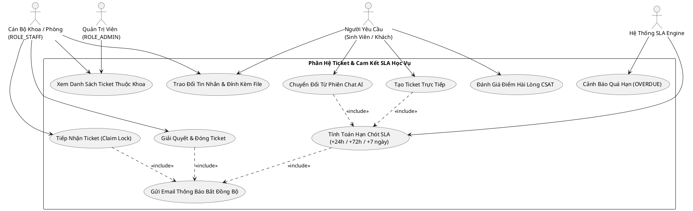

---

## 3.4. Đặc tả chi tiết các Use Case cốt lõi (Chuẩn quốc tế)

### UC01: Đăng ký tài khoản sinh viên và Xác thực Email OTP

| Thuộc tính | Chi tiết đặc tả |
| :--- | :--- |
| **Use Case ID** | **UC01** |
| **Use Case Name** | Đăng ký tài khoản sinh viên và xác thực mã OTP qua Email trường |
| **Actor Chính** | Sinh viên chưa có tài khoản (`GUEST` chuyển đổi sang `ROLE_STUDENT`) |
| **Tiền điều kiện (Pre-conditions)** | Sinh viên có hòm thư điện tử chính thức của trường (`@student.hcmute.edu.vn`). |
| **Hậu điều kiện (Post-conditions)** | Tài khoản được tạo ở trạng thái `ACTIVE`, được gán vai trò `ROLE_STUDENT` và có thể đăng nhập ngay. |
| **Luồng sự kiện chính (Main Flow)** | 1. Sinh viên truy cập trang `/register`, nhập Họ và tên, Tên đăng nhập, Mật khẩu, Số điện thoại và Email sinh viên.<br>2. Nhấn nút "Tiếp tục".<br>3. Hệ thống kiểm tra định dạng email và tính duy nhất của Username/Email.<br>4. Hệ thống sinh mã OTP ngẫu nhiên gồm 6 chữ số (thời hạn 5 phút), lưu vào bảng `otp_tokens` và gửi email bất đồng bộ qua `AsyncEmailService`.<br>5. Màn hình chuyển sang giao diện nhập mã OTP xác thực.<br>6. Sinh viên kiểm tra hòm thư, nhập mã OTP gồm 6 chữ số và nhấn "Xác nhận".<br>7. Hệ thống xác thực mã OTP hợp lệ, chưa hết hạn; kích hoạt tài khoản `status = 'ACTIVE'` và đánh dấu OTP `is_used = true`.<br>8. Hiển thị thông báo đăng ký thành công và tự động chuyển hướng đến màn hình đăng nhập. |
| **Luồng rẽ nhánh (Alternative Flows)** | **4a. Yêu cầu gửi lại mã OTP (Resend OTP):**<br>- Nếu sau 60 giây chưa nhận được email, sinh viên nhấn nút "Gửi lại mã OTP". Hệ thống hủy mã cũ, tạo mã mới và gửi lại email.<br>**6a. Sinh viên nhấn "Hủy bỏ":**<br>- Hệ thống hủy quy trình đăng ký tạm thời, dữ liệu chưa được kích hoạt. |
| **Luồng ngoại lệ (Exception Flows)** | **3a. Username hoặc Email đã tồn tại:**<br>- Hệ thống hiển thị thông báo lỗi màu đỏ ngay dưới ô nhập: *"Tên đăng nhập hoặc Email đã được sử dụng"*. Dừng quy trình.<br>**7a. Mã OTP sai hoặc đã hết hạn:**<br>- Hệ thống hiển thị thông báo: *"Mã OTP không chính xác hoặc đã hết thời gian hiệu lực"*. Tăng biến đếm nhập sai (tối đa 5 lần). |

---

### UC02: Chuyển đổi cuộc hội thoại AI Chatbot thành Ticket hỗ trợ học vụ

| Thuộc tính | Chi tiết đặc tả |
| :--- | :--- |
| **Use Case ID** | **UC02** |
| **Use Case Name** | Chuyển đổi cuộc hội thoại thành Ticket hỗ trợ chính thức & Tính toán SLA Deadline |
| **Actor Chính** | `ROLE_STUDENT`, `GUEST`, `SYSTEM` (AI Fallback Trigger) |
| **Tiền điều kiện** | Người dùng đang trong phiên Chat với AI Bot nhưng câu hỏi vượt quá phạm vi hoặc cần xác nhận thủ tục giấy tờ chính thức. |
| **Hậu điều kiện** | Một Ticket mới được khởi tạo ở trạng thái `OPEN`, kế thừa toàn bộ nội dung chat và gán hạn chót `due_date` theo SLA. |
| **Luồng sự kiện chính (Main Flow)** | 1. Trong cửa sổ Chat AI, người dùng nhấn nút *"Chuyển thành Ticket gửi Thầy/Cô"* (hoặc AI tự động đề xuất nút này khi độ tin cậy thấp).<br>2. Hệ thống hiển thị hộp thoại Modal chuyển tiếp Ticket:<br>   - Tiêu đề Ticket (tự động tóm tắt từ câu hỏi gần nhất).<br>   - Chọn Khoa / Phòng phụ trách (Đào tạo, Tuyển sinh, Đoàn Hội, Khoa CNTT...).<br>   - Chọn Mức độ ưu tiên (`URGENT`, `MEDIUM`, `LOW`).<br>   - Nhập Email nhận phản hồi (đối với Khách vãng lai; Sinh viên tự động khóa theo email đăng nhập).<br>3. Người dùng nhấn nút "Gửi Ticket hỗ trợ".<br>4. Động cơ SLA tính toán thời hạn giải quyết:<br>   - `URGENT`: `due_date = now + 24 giờ`<br>   - `MEDIUM`: `due_date = now + 72 giờ`<br>   - `LOW`: `due_date = now + 7 ngày`<br>5. Hệ thống sinh mã Ticket duy nhất (VD: `TK-20261002-881923`), sinh mã bảo mật Access Token đối với Khách và lưu bản ghi vào bảng `tickets`.<br>6. Sao chép các tin nhắn trong phiên chat thành các bản ghi trong bảng `ticket_messages`.<br>7. Hệ thống kích hoạt gửi Email bất đồng bộ thông báo tạo Ticket thành công kèm đường link theo dõi tiến độ.<br>8. Hiển thị thông báo trên giao diện Chat: *"Ticket của bạn đã được chuyển đến Phòng Đào tạo. Hạn chót xử lý: [due_date]"*. |
| **Luồng ngoại lệ** | **2a. Khách vãng lai nhập sai định dạng Email:**<br>- Hệ thống cảnh báo đỏ và yêu cầu nhập đúng địa chỉ email để nhận kết quả. |

---

### UC03: Cán bộ tiếp nhận (Claim) và Xử lý vòng đời Ticket

| Thuộc tính | Chi tiết đặc tả |
| :--- | :--- |
| **Use Case ID** | **UC03** |
| **Use Case Name** | Cán bộ tiếp nhận xử lý (Claim) và cập nhật tiến trình giải quyết Ticket |
| **Actor Chính** | `ROLE_STAFF` (Cán bộ phụ trách theo Khoa/Phòng) |
| **Tiền điều kiện** | Cán bộ đã đăng nhập thành công và được gắn mã `department_id`. |
| **Hậu điều kiện** | Trạng thái Ticket chuyển sang `IN_PROGRESS`, gán người xử lý chính chủ và chuyển sang `RESOLVED` khi có kết luận. |
| **Luồng sự kiện chính (Main Flow)** | 1. Cán bộ mở trang Dashboard Quản lý Ticket của đơn vị mình.<br>2. Hệ thống thực thi truy vấn lọc nghiêm ngặt theo `department_id` của Cán bộ; hiển thị bảng danh sách các Ticket kèm badge SLA màu sắc (Xanh: Còn hạn, Vàng: Sắp quá hạn < 24h, Đỏ: Đã quá hạn `OVERDUE`).<br>3. Cán bộ bấm vào một Ticket có trạng thái `OPEN` để xem chi tiết nội dung và các file đính kèm.<br>4. Cán bộ nhấn nút *"Tiếp nhận xử lý"* (Claim Ticket).<br>5. Hệ thống thực thi câu lệnh cập nhật nguyên tử (Atomic Update) kiểm tra trạng thái:<br>   `UPDATE tickets SET assigned_staff_id = :id, status = 'IN_PROGRESS' WHERE id = :id AND status = 'OPEN'`<br>6. Ticket chuyển sang `IN_PROGRESS`, hiển thị tên Cán bộ chịu trách nhiệm.<br>7. Cán bộ nhập nội dung văn bản trả lời, đính kèm văn bản giải quyết hoặc quyết định liên quan (PDF/Hình ảnh).<br>8. Cán bộ nhấn nút *"Hoàn thành giải quyết"* (Resolve Ticket).<br>9. Trạng thái chuyển sang `RESOLVED`, ghi nhận thời gian `resolved_at = now()`.<br>10. Hệ thống tự động gửi Email thông báo kết quả chính thức cho Sinh viên kèm liên kết đánh giá mức độ hài lòng CSAT (1-5 sao). |
| **Luồng rẽ nhánh** | **7a. Cần yêu cầu sinh viên cung cấp thêm minh chứng:**<br>- Cán bộ gửi tin nhắn trao đổi trong Ticket; trạng thái vẫn giữ `IN_PROGRESS`, sinh viên nhận được thông báo để bổ sung giấy tờ. |
| **Luồng ngoại lệ** | **5a. Tranh chấp tiếp nhận (Race Condition - Đồng nghiệp đã nhận trước):**<br>- Nếu hai cán bộ cùng bấm tiếp nhận cùng một thời điểm, câu lệnh Atomic Update của người đến sau trả về kết quả 0 bản ghi.<br>- Hệ thống ném ngoại lệ `TicketAlreadyClaimedException` và hiển thị cảnh báo: *"Ticket này vừa được Cán bộ khác tiếp nhận xử lý!"*. |

---

## 3.5. Biểu đồ Tuần tự (Sequence Diagrams - 8 kịch bản chuẩn PlantUML)

### SD01: Tra cứu thông tin học vụ qua Trợ lý AI RAG & Fallback

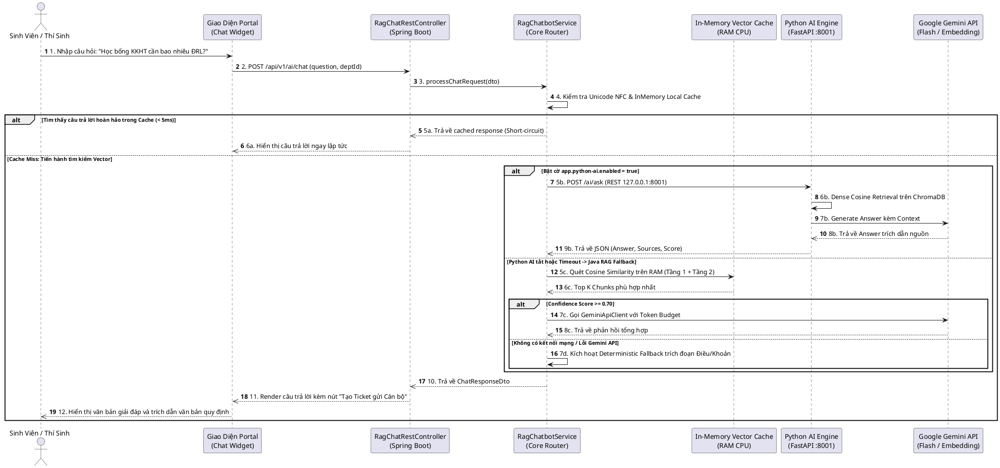

### SD02: Chuyển đổi cuộc hội thoại thành Ticket & Thiết lập SLA

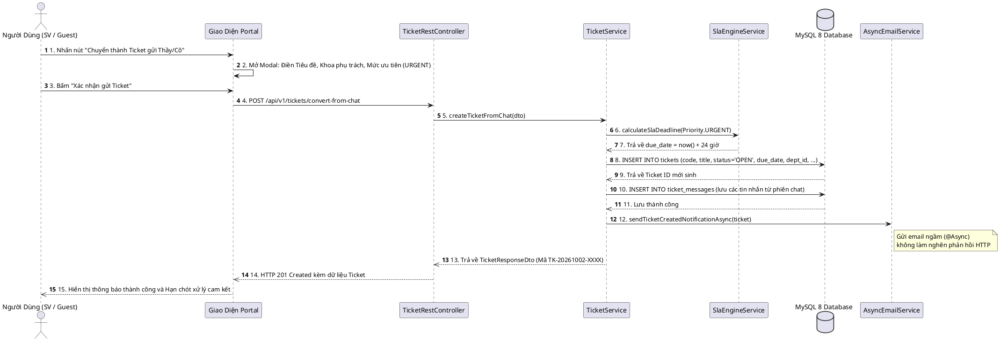

### SD03: Cán bộ Khoa tiếp nhận (Claim) và Xử lý Ticket

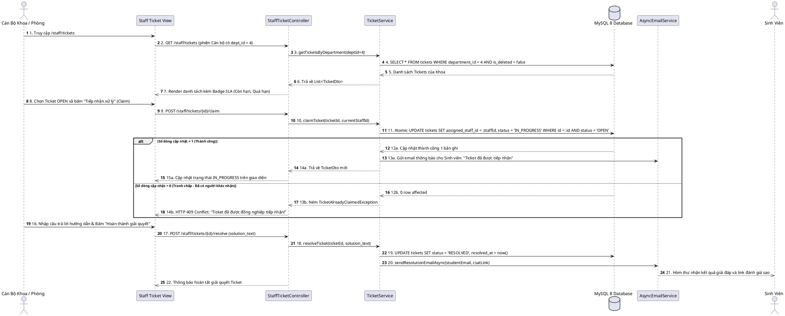

### SD04: Cán bộ đăng Bảng tin chính thức & Tích hợp Video Webhook Node.js

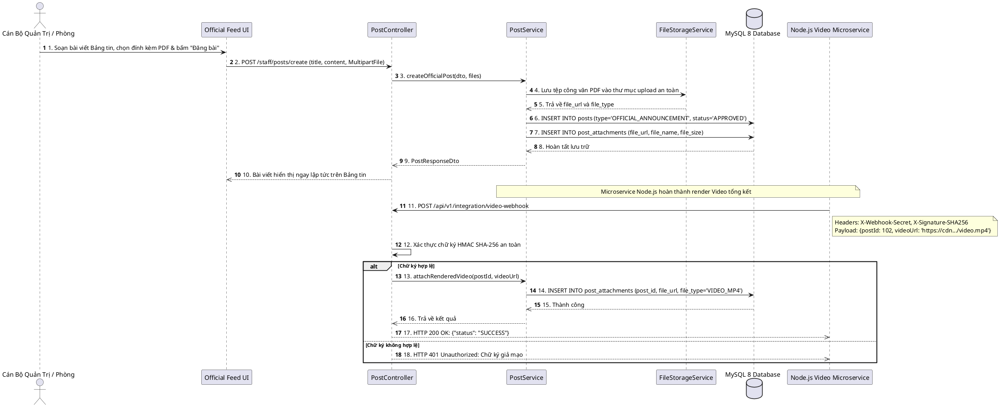

### SD05: Sinh viên đăng bài Diễn đàn & Quy trình Phê duyệt của Cán bộ

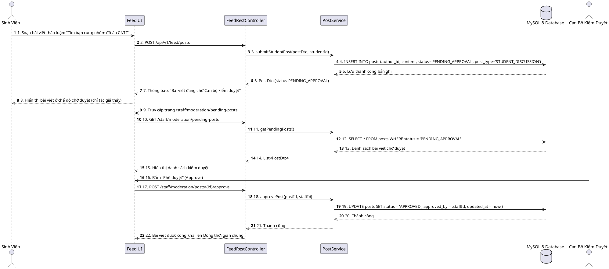

### SD06: Tương tác Thảo luận, Thả tim và Báo cáo vi phạm (Report)

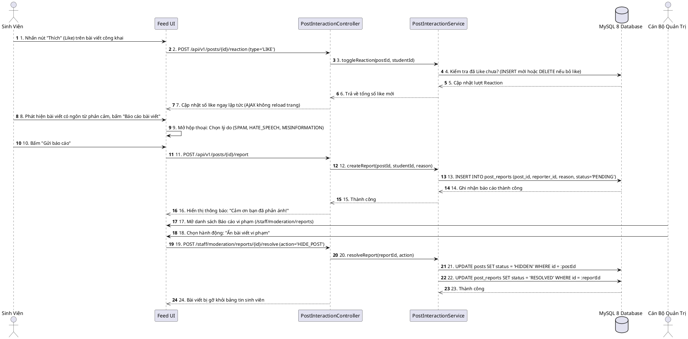

### SD07: Quản trị viên nạp công văn PDF, tách Chunk & nhúng Vector Embedding

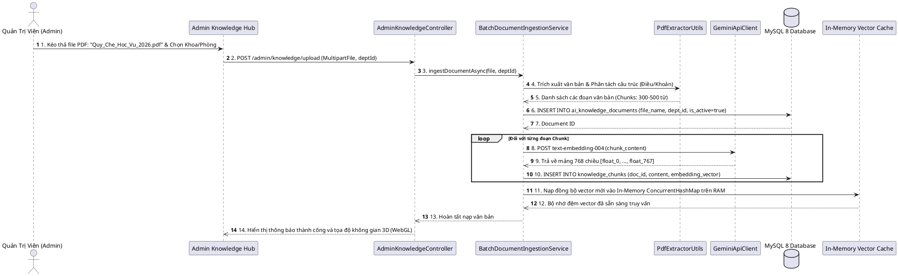

### SD08: Đăng ký tài khoản sinh viên & Xác thực OTP qua Email

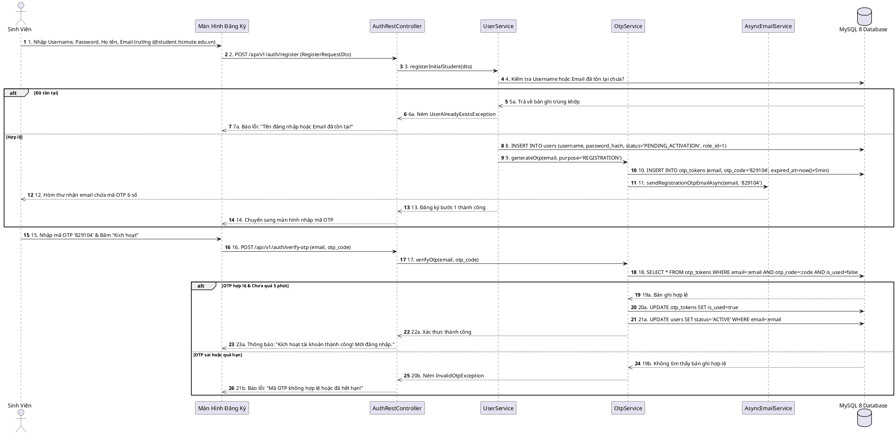

---

## 3.6. Biểu đồ Hoạt động (Activity Diagrams - PlantUML)

### AD01: Luồng xử lý liên thông 3 bên: Sinh viên - Chatbot AI - Cán bộ tiếp nhận Ticket

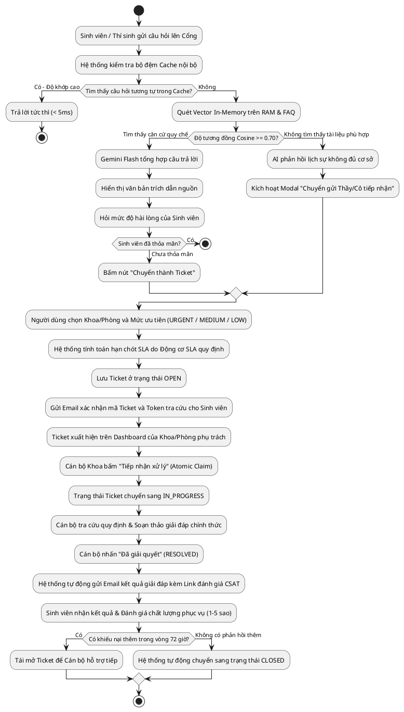

---

## 3.7. Thiết kế Cơ sở Dữ liệu quan hệ (ERD & Data Dictionary 12 bảng chuẩn 3NF)

### 1. Mã PlantUML: Mô hình Thực Thể Liên Kết (Entity Relationship Diagram - ERD)

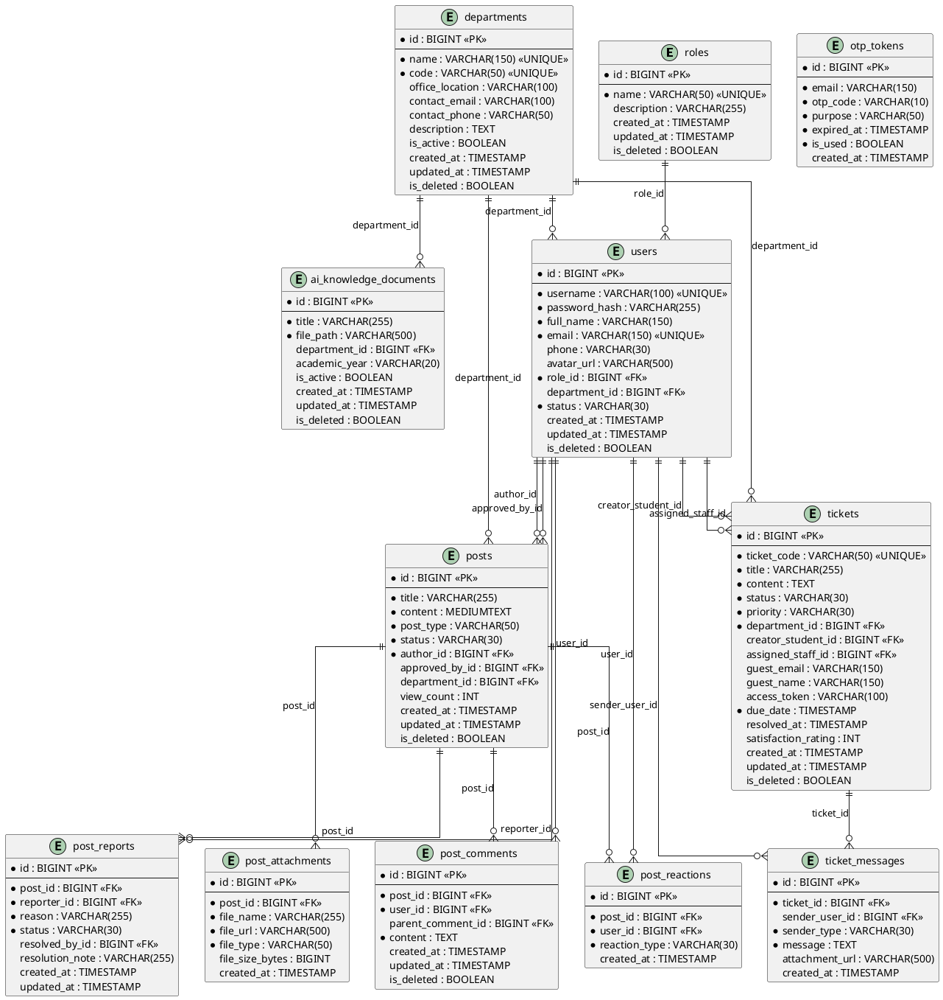

---

### 2. Từ điển dữ liệu chi tiết (Data Dictionary 12 Bảng Thực Tế)

#### Bảng 1: `roles` (Vai trò người dùng trong hệ thống)
| Tên cột | Kiểu dữ liệu | Khóa | Null | Mặc định | Mô tả nghiệp vụ |
| :--- | :--- | :---: | :---: | :--- | :--- |
| `id` | `BIGINT` | PK | NO | AUTO_INCREMENT | Khóa chính định danh vai trò |
| `name` | `VARCHAR(50)` | UNIQUE | NO | | Mã vai trò: `ROLE_STUDENT`, `ROLE_STAFF`, `ROLE_ADMIN` |
| `description` | `VARCHAR(255)` | | YES | NULL | Mô tả quyền hạn của vai trò |
| `created_at` | `TIMESTAMP` | | YES | CURRENT_TIMESTAMP | Thời điểm tạo |
| `updated_at` | `TIMESTAMP` | | YES | CURRENT_TIMESTAMP | Thời điểm cập nhật cuối cùng |
| `is_deleted` | `BOOLEAN` | | YES | FALSE | Cờ xóa mềm (Soft Delete) |

#### Bảng 2: `departments` (Khoa, Phòng ban & Đơn vị chức năng)
| Tên cột | Kiểu dữ liệu | Khóa | Null | Mặc định | Mô tả nghiệp vụ |
| :--- | :--- | :---: | :---: | :--- | :--- |
| `id` | `BIGINT` | PK | NO | AUTO_INCREMENT | Khóa chính định danh Khoa/Phòng |
| `name` | `VARCHAR(150)` | UNIQUE | NO | | Tên đơn vị (Phòng Đào tạo, Tuyển sinh, Khoa CNTT...) |
| `code` | `VARCHAR(50)` | UNIQUE | NO | | Mã viết tắt: `DAO_TAO`, `TUYEN_SINH`, `KHOA_CNTT`, `DOAN_HOI` |
| `office_location` | `VARCHAR(100)` | | YES | NULL | Vị trí văn phòng (Phòng A1-201, E1-402...) |
| `contact_email` | `VARCHAR(100)` | | YES | NULL | Hòm thư điện tử chính thức của đơn vị |
| `contact_phone` | `VARCHAR(50)` | | YES | NULL | Số điện thoại liên hệ nội bộ |
| `description` | `TEXT` | | YES | NULL | Chức năng nhiệm vụ tiếp nhận của đơn vị |
| `is_active` | `BOOLEAN` | | YES | TRUE | Trạng thái hoạt động tiếp nhận |
| `created_at` | `TIMESTAMP` | | YES | CURRENT_TIMESTAMP | Thời điểm khởi tạo |
| `updated_at` | `TIMESTAMP` | | YES | CURRENT_TIMESTAMP | Thời điểm cập nhật |
| `is_deleted` | `BOOLEAN` | | YES | FALSE | Cờ xóa mềm |

#### Bảng 3: `users` (Tài khoản người dùng hệ thống)
| Tên cột | Kiểu dữ liệu | Khóa | Null | Mặc định | Mô tả nghiệp vụ |
| :--- | :--- | :---: | :---: | :--- | :--- |
| `id` | `BIGINT` | PK | NO | AUTO_INCREMENT | Khóa chính định danh người dùng |
| `username` | `VARCHAR(100)` | UNIQUE | NO | | Tên đăng nhập (MSSV hoặc mã Cán bộ) |
| `password_hash` | `VARCHAR(255)` | | NO | | Mật khẩu mã hóa BCrypt chuẩn Spring Security |
| `full_name` | `VARCHAR(150)` | | NO | | Họ và tên đầy đủ |
| `email` | `VARCHAR(150)` | UNIQUE | NO | | Hòm thư điện tử chính danh |
| `phone` | `VARCHAR(30)` | | YES | NULL | Số điện thoại cá nhân |
| `avatar_url` | `VARCHAR(500)` | | YES | NULL | Đường dẫn ảnh đại diện |
| `role_id` | `BIGINT` | FK | NO | | Khóa ngoại liên kết bảng `roles(id)` |
| `department_id` | `BIGINT` | FK | YES | NULL | Khóa ngoại `departments(id)` (Bắt buộc với Cán bộ) |
| `status` | `VARCHAR(30)` | | NO | 'ACTIVE' | Trạng thái: `ACTIVE`, `PENDING_ACTIVATION`, `LOCKED` |
| `created_at` | `TIMESTAMP` | | YES | CURRENT_TIMESTAMP | Thời điểm tạo tài khoản |
| `updated_at` | `TIMESTAMP` | | YES | CURRENT_TIMESTAMP | Thời điểm cập nhật |
| `is_deleted` | `BOOLEAN` | | YES | FALSE | Cờ xóa mềm |

#### Bảng 4: `otp_tokens` (Mã xác thực đăng ký & Đổi mật khẩu)
| Tên cột | Kiểu dữ liệu | Khóa | Null | Mặc định | Mô tả nghiệp vụ |
| :--- | :--- | :---: | :---: | :--- | :--- |
| `id` | `BIGINT` | PK | NO | AUTO_INCREMENT | Khóa chính |
| `email` | `VARCHAR(150)` | | NO | | Email nhận mã xác nhận OTP |
| `otp_code` | `VARCHAR(10)` | | NO | | Mã 6 số ngẫu nhiên sinh từ hệ thống |
| `purpose` | `VARCHAR(50)` | | NO | | Mục đích sử dụng: `REGISTRATION`, `PASSWORD_RESET` |
| `expired_at` | `TIMESTAMP` | | NO | | Thời điểm hết hạn hiệu lực (now + 5 phút) |
| `is_used` | `BOOLEAN` | | YES | FALSE | Đánh dấu mã đã sử dụng hay chưa |
| `created_at` | `TIMESTAMP` | | YES | CURRENT_TIMESTAMP | Thời điểm sinh mã |

#### Bảng 5: `tickets` (Quản lý yêu cầu hỗ trợ học vụ & SLA)
| Tên cột | Kiểu dữ liệu | Khóa | Null | Mặc định | Mô tả nghiệp vụ |
| :--- | :--- | :---: | :---: | :--- | :--- |
| `id` | `BIGINT` | PK | NO | AUTO_INCREMENT | Khóa chính định danh Ticket |
| `ticket_code` | `VARCHAR(50)` | UNIQUE | NO | | Mã tra cứu duy nhất: `TK-YYYYMMDD-XXXXXX` |
| `title` | `VARCHAR(255)` | | NO | | Tiêu đề thắc mắc học vụ |
| `content` | `TEXT` | | NO | | Nội dung chi tiết yêu cầu giải quyết |
| `status` | `VARCHAR(30)` | | NO | 'OPEN' | Trạng thái: `OPEN`, `IN_PROGRESS`, `RESOLVED`, `CLOSED` |
| `priority` | `VARCHAR(30)` | | NO | 'MEDIUM' | Mức độ ưu tiên: `URGENT` (24h), `MEDIUM` (72h), `LOW` (7d) |
| `department_id` | `BIGINT` | FK | NO | | Khóa ngoại `departments(id)` chỉ định đơn vị xử lý |
| `creator_student_id` | `BIGINT` | FK | YES | NULL | Khóa ngoại `users(id)` (nếu là Sinh viên đăng nhập) |
| `assigned_staff_id` | `BIGINT` | FK | YES | NULL | Khóa ngoại `users(id)` cán bộ chịu trách nhiệm (Claim) |
| `guest_email` | `VARCHAR(150)` | | YES | NULL | Email liên hệ nếu người tạo là Khách vãng lai |
| `guest_name` | `VARCHAR(150)` | | YES | NULL | Tên người liên hệ nếu là Khách vãng lai |
| `access_token` | `VARCHAR(100)` | | YES | NULL | Chuỗi bảo mật ngẫu nhiên tra cứu Ticket cho Guest |
| `due_date` | `TIMESTAMP` | | NO | | Hạn chót cam kết giải quyết theo SLA |
| `resolved_at` | `TIMESTAMP` | | YES | NULL | Thời điểm Cán bộ hoàn tất giải quyết |
| `satisfaction_rating` | `INT` | | YES | NULL | Điểm đánh giá mức độ hài lòng từ 1 đến 5 sao |
| `created_at` | `TIMESTAMP` | | YES | CURRENT_TIMESTAMP | Thời điểm mở Ticket |
| `updated_at` | `TIMESTAMP` | | YES | CURRENT_TIMESTAMP | Thời điểm cập nhật cuối cùng |
| `is_deleted` | `BOOLEAN` | | YES | FALSE | Cờ xóa mềm |

#### Bảng 6: `ticket_messages` (Nhật ký trao đổi trong Ticket)
| Tên cột | Kiểu dữ liệu | Khóa | Null | Mặc định | Mô tả nghiệp vụ |
| :--- | :--- | :---: | :---: | :--- | :--- |
| `id` | `BIGINT` | PK | NO | AUTO_INCREMENT | Khóa chính tin nhắn |
| `ticket_id` | `BIGINT` | FK | NO | | Khóa ngoại `tickets(id)` |
| `sender_user_id` | `BIGINT` | FK | YES | NULL | Khóa ngoại `users(id)` người gửi |
| `sender_type` | `VARCHAR(30)` | | NO | | Phân loại: `STUDENT`, `STAFF`, `GUEST`, `SYSTEM` |
| `message` | `TEXT` | | NO | | Nội dung trao đổi hoặc kết luận |
| `attachment_url` | `VARCHAR(500)` | | YES | NULL | Đường dẫn tệp đính kèm văn bản hướng dẫn/minh chứng |
| `created_at` | `TIMESTAMP` | | YES | CURRENT_TIMESTAMP | Thời điểm gửi tin |

#### Bảng 7: `posts` (Bài viết Bảng tin chính thức & Diễn đàn sinh viên)
| Tên cột | Kiểu dữ liệu | Khóa | Null | Mặc định | Mô tả nghiệp vụ |
| :--- | :--- | :---: | :---: | :--- | :--- |
| `id` | `BIGINT` | PK | NO | AUTO_INCREMENT | Khóa chính bài viết |
| `title` | `VARCHAR(255)` | | NO | | Tiêu đề bài viết |
| `content` | `MEDIUMTEXT` | | NO | | Nội dung bài viết (hỗ trợ văn bản phong phú) |
| `post_type` | `VARCHAR(50)` | | NO | | Loại: `OFFICIAL_ANNOUNCEMENT`, `STUDENT_DISCUSSION` |
| `status` | `VARCHAR(30)` | | NO | 'PENDING_APPROVAL' | Trạng thái: `PENDING_APPROVAL`, `APPROVED`, `REJECTED`, `HIDDEN` |
| `author_id` | `BIGINT` | FK | NO | | Khóa ngoại `users(id)` người đăng |
| `approved_by_id` | `BIGINT` | FK | YES | NULL | Khóa ngoại `users(id)` cán bộ phê duyệt |
| `department_id` | `BIGINT` | FK | YES | NULL | Khóa ngoại `departments(id)` đơn vị ban hành |
| `view_count` | `INT` | | YES | 0 | Số lượt xem bài viết |
| `created_at` | `TIMESTAMP` | | YES | CURRENT_TIMESTAMP | Thời điểm đăng |
| `updated_at` | `TIMESTAMP` | | YES | CURRENT_TIMESTAMP | Thời điểm cập nhật |
| `is_deleted` | `BOOLEAN` | | YES | FALSE | Cờ xóa mềm |

#### Bảng 8: `post_attachments` (Tệp đính kèm đa phương tiện của bài viết)
| Tên cột | Kiểu dữ liệu | Khóa | Null | Mặc định | Mô tả nghiệp vụ |
| :--- | :--- | :---: | :---: | :--- | :--- |
| `id` | `BIGINT` | PK | NO | AUTO_INCREMENT | Khóa chính tệp đính kèm |
| `post_id` | `BIGINT` | FK | NO | | Khóa ngoại `posts(id)` |
| `file_name` | `VARCHAR(255)` | | NO | | Tên tệp tin gốc |
| `file_url` | `VARCHAR(500)` | | NO | | Đường dẫn lưu trữ (Cloudinary / File server) |
| `file_type` | `VARCHAR(50)` | | NO | | Định dạng: `PDF`, `DOCX`, `XLSX`, `IMAGE_JPG`, `VIDEO_MP4` |
| `file_size_bytes` | `BIGINT` | | YES | NULL | Dung lượng tệp tính bằng bytes |
| `created_at` | `TIMESTAMP` | | YES | CURRENT_TIMESTAMP | Thời điểm tải lên |

#### Bảng 9: `post_comments` (Bình luận thảo luận nhiều cấp)
| Tên cột | Kiểu dữ liệu | Khóa | Null | Mặc định | Mô tả nghiệp vụ |
| :--- | :--- | :---: | :---: | :--- | :--- |
| `id` | `BIGINT` | PK | NO | AUTO_INCREMENT | Khóa chính bình luận |
| `post_id` | `BIGINT` | FK | NO | | Khóa ngoại `posts(id)` |
| `user_id` | `BIGINT` | FK | NO | | Khóa ngoại `users(id)` người bình luận |
| `parent_comment_id` | `BIGINT` | FK | YES | NULL | Tự liên kết bình luận cha (hỗ trợ comment dạng cây) |
| `content` | `TEXT` | | NO | | Nội dung bình luận |
| `created_at` | `TIMESTAMP` | | YES | CURRENT_TIMESTAMP | Thời điểm gửi |
| `updated_at` | `TIMESTAMP` | | YES | CURRENT_TIMESTAMP | Thời điểm sửa |
| `is_deleted` | `BOOLEAN` | | YES | FALSE | Cờ xóa mềm |

#### Bảng 10: `post_reactions` (Lượt thả tim tương tác)
| Tên cột | Kiểu dữ liệu | Khóa | Null | Mặc định | Mô tả nghiệp vụ |
| :--- | :--- | :---: | :---: | :--- | :--- |
| `id` | `BIGINT` | PK | NO | AUTO_INCREMENT | Khóa chính |
| `post_id` | `BIGINT` | FK | NO | | Khóa ngoại `posts(id)` |
| `user_id` | `BIGINT` | FK | NO | | Khóa ngoại `users(id)` |
| `reaction_type` | `VARCHAR(30)` | | NO | 'LIKE' | Loại cảm xúc: `LIKE`, `HEART`, `HELPFUL` |
| `created_at` | `TIMESTAMP` | | YES | CURRENT_TIMESTAMP | Thời điểm thả cảm xúc |

#### Bảng 11: `post_reports` (Báo cáo nội dung vi phạm quy tắc cộng đồng)
| Tên cột | Kiểu dữ liệu | Khóa | Null | Mặc định | Mô tả nghiệp vụ |
| :--- | :--- | :---: | :---: | :--- | :--- |
| `id` | `BIGINT` | PK | NO | AUTO_INCREMENT | Khóa chính báo cáo |
| `post_id` | `BIGINT` | FK | NO | | Khóa ngoại `posts(id)` bị báo cáo |
| `reporter_id` | `BIGINT` | FK | NO | | Khóa ngoại `users(id)` người tố cáo |
| `reason` | `VARCHAR(255)` | | NO | | Lý do: `SPAM`, `HATE_SPEECH`, `MISINFORMATION`, `OTHER` |
| `status` | `VARCHAR(30)` | | NO | 'PENDING' | Trạng thái: `PENDING`, `RESOLVED`, `DISMISSED` |
| `resolved_by_id` | `BIGINT` | FK | YES | NULL | Khóa ngoại `users(id)` cán bộ xử lý |
| `resolution_note` | `VARCHAR(255)` | | YES | NULL | Ghi chú biện pháp xử lý (ví dụ: đã ẩn bài viết) |
| `created_at` | `TIMESTAMP` | | YES | CURRENT_TIMESTAMP | Thời điểm gửi báo cáo |
| `updated_at` | `TIMESTAMP` | | YES | CURRENT_TIMESTAMP | Thời điểm giải quyết |

#### Bảng 12: `ai_knowledge_documents` (Kho văn bản quy chế phục vụ AI RAG)
| Tên cột | Kiểu dữ liệu | Khóa | Null | Mặc định | Mô tả nghiệp vụ |
| :--- | :--- | :---: | :---: | :--- | :--- |
| `id` | `BIGINT` | PK | NO | AUTO_INCREMENT | Khóa chính tài liệu |
| `title` | `VARCHAR(255)` | | NO | | Tiêu đề công văn (VD: Quy chế học vụ 2026) |
| `file_path` | `VARCHAR(500)` | | NO | | Đường dẫn lưu tệp PDF trên máy chủ |
| `department_id` | `BIGINT` | FK | YES | NULL | Khóa ngoại `departments(id)` cơ quan ban hành |
| `academic_year` | `VARCHAR(20)` | | YES | '2026' | Năm học áp dụng để tính toán Time-Decay |
| `is_active` | `BOOLEAN` | | YES | TRUE | Hiệu lực pháp lý của văn bản |
| `created_at` | `TIMESTAMP` | | YES | CURRENT_TIMESTAMP | Thời điểm nạp văn bản |
| `updated_at` | `TIMESTAMP` | | YES | CURRENT_TIMESTAMP | Thời điểm sửa đổi |
| `is_deleted` | `BOOLEAN` | | YES | FALSE | Cờ xóa mềm |

---

# CHƯƠNG 4: THIẾT KẾ KIẾN TRÚC KỸ THUẬT & PHÂN HỆ AI RAG

## 4.1. Kiến trúc tổng thể Hybrid Dual-Engine (Spring Boot & FastAPI Python)

Hệ thống kết hợp mô hình kiến trúc lai hai tầng nhằm tận dụng tối đa thế mạnh của từng nền tảng công nghệ:

```plantuml
@startuml
skinparam componentStyle rectangle
skinparam defaultFontName "Arial"

node "Tầng Client (Trình Duyệt Người Dùng)" {
    [Web Browser: Thymeleaf + Bootstrap 5] as ClientUI
    [Chat Widget Nổi Góc Phải (Vanilla JS)] as ChatWidget
}

node "Cụm Máy Chủ Ứng Dụng (Spring Boot 3.3 - Port 8080)" {
    package "Tầng Bảo Mật & Lọc (Security)" {
        [Spring Security 6 FilterChain] as Security
        [Department Scope Interceptor] as DeptFilter
    }

    package "Tầng Nghiệp Vụ Cốt Lõi (Core Business)" {
        [Ticket & SLA Engine Service] as TicketService
        [Feed & Moderation Service] as FeedService
        [Async Email Dispatcher] as MailService
        [Node.js Video Webhook Controller] as WebhookCtrl
    }

    package "Phân Hệ AI Java (Java RAG Engine)" {
        [RagChatbotService (Central Router)] as CentralRouter
        [In-Memory Vector Cache (RAM CPU)] as MemoryCache
        [Academic Abbreviation Utils] as AbbrUtils
        [Deterministic Rule Fallback] as RuleFallback
    }

    package "Tích Hợp Python Engine" {
        [PythonAiEngineClient (RestClient)] as PyClient
    }
}

node "Phân Hệ Python AI Engine (FastAPI - Port 8001)" {
    [FastAPI Controller (:8001)] as FastApiApp
    [ChromaDB Local Vector DB] as ChromaStore
    [Parent-Child Document Chunker] as Chunker
    [RAG Triad Evaluator (LLM Judge)] as Evaluator
}

cloud "Dịch Vụ Đám Mây Ngoài (Cloud Providers)" {
    [Google Gemini 2.5 Flash & Embedding API] as GeminiCloud
    [Node.js Video Render Microservice] as NodeService
    [SMTP Server (Google Mail)] as SmtpServer
}

database "Hệ Quản Trị Cơ Sở Dữ Liệu" {
    database "MySQL 8 Database\n(InnoDB UTF8MB4)" as MySQL
}

' Kết nối luồng
ClientUI --> Security : HTTPS Request
ChatWidget --> CentralRouter : POST /api/v1/ai/chat

Security --> DeptFilter
DeptFilter --> TicketService
DeptFilter --> FeedService

TicketService --> MySQL : ACID Queries
TicketService --> MailService : Event Trigger
MailService --> SmtpServer : Async SMTP (Port 587)
NodeService --> WebhookCtrl : POST Video Webhook (HMAC-SHA256)

CentralRouter --> PyClient : Khi app.python-ai.enabled = true
PyClient --> FastApiApp : HTTP REST (127.0.0.1:8001)
FastApiApp --> ChromaStore : Dense Cosine Query
FastApiApp --> GeminiCloud : RAG Context + Prompt

CentralRouter --> MemoryCache : Fallback nội bộ trên RAM
CentralRouter --> AbbrUtils : Chuẩn hóa từ viết tắt
CentralRouter --> GeminiCloud : Trực tiếp khi Java RAG
CentralRouter --> RuleFallback : Khi mất mạng / Hết Quota

CentralRouter --> MySQL : Đọc FAQ & Công văn
FeedService --> MySQL
@enduml
```

---

## 4.2. Cơ chế phân tầng tìm kiếm & Phòng thủ Quota Gemini API

Nhằm bảo vệ hệ thống không bị vượt ngưỡng hạn mức dịch vụ miễn phí (15 RPM) của Google Gemini API và tối ưu hóa độ trễ phản hồi cho sinh viên, hệ thống triển khai phễu cản tải 4 cấp độ:

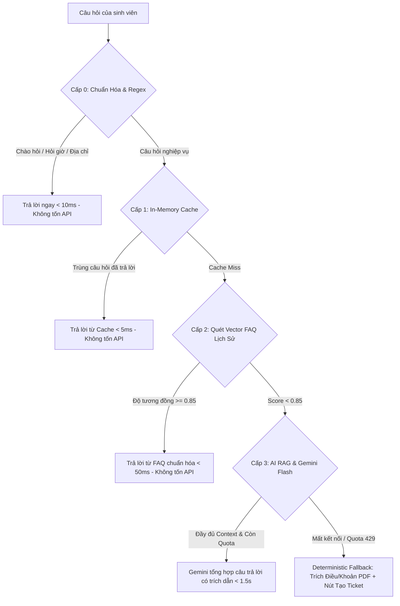

### Nguyên lý thiết kế phòng vệ:
1. **Tỷ lệ cản tải nội bộ:** Đạt $\ge 70\%$ tổng lượng truy vấn không cần gửi lên máy chủ Google, tiết kiệm tài nguyên và bảo đảm thời gian phản hồi tức thì.
2. **Kiểm soát Token Budget:** Dữ liệu ngữ cảnh nạp vào câu nhắc (Prompt) được giới hạn nghiêm ngặt ở mức tối đa 2.500 ký tự (khoảng 350-400 từ), triệt tiêu hiện tượng "ảo giác" (Hallucination) và giữ độ trễ dưới 1,5 giây.
3. **Phục hồi mềm (Graceful Degradation):** Khi dịch vụ quốc tế gặp sự cố hoặc cạn kiệt Quota, hệ thống không trả về lỗi `HTTP 500` mà tự động chuyển sang chế độ phản hồi quy chuẩn trích từ văn bản gốc kèm nút bấm gửi Ticket cho Cán bộ tiếp nhận.

---

## 4.3. Động cơ tính hạn chót SLA & Xử lý bất đồng bộ (Async Mail / Webhook)

### 1. Thuật toán phân luồng và cam kết thời gian SLA (Service Level Agreement):
Mỗi Ticket khi được tạo sẽ tự động được gán thời hạn chót giải quyết theo công thức xác định:
$$\text{due\_date} = \text{created\_at} + \Delta T_{\text{priority}}$$
Trong đó:
- Mức độ `URGENT`: $\Delta T = 24\text{ giờ}$ (áp dụng cho khiếu nại hoãn thi, trùng ca thi sát ngày, sự cố học phí).
- Mức độ `MEDIUM`: $\Delta T = 72\text{ giờ}$ (áp dụng cho xin cấp giấy xác nhận, bảng điểm, xét miễn chứng chỉ).
- Mức độ `LOW`: $\Delta T = 7\text{ ngày}$ (áp dụng cho góp ý chương trình đào tạo, đăng ký chuyên đề thực tập).

### 2. Thuật toán Atomic Claim chống xung đột nhận xử lý:
Để ngăn chặn tình trạng hai cán bộ cùng mở một Ticket và cùng bấm tiếp nhận dẫn đến tranh chấp, hệ thống sử dụng câu lệnh Atomic Update với mức cô lập giao dịch chuẩn:
```sql
UPDATE tickets 
SET assigned_staff_id = :staffId, status = 'IN_PROGRESS', updated_at = NOW() 
WHERE id = :ticketId AND status = 'OPEN';
```
Nếu kết quả thực thi trả về `rows_affected = 0`, hệ thống ném ra `TicketAlreadyClaimedException`, bảo đảm tính toàn vẹn tuyệt đối của dữ liệu.

### 3. Cơ chế Webhook an toàn tích hợp Video từ Microservice Node.js:
Quá trình biên tập và render video giới thiệu tuyển sinh hoặc hoạt động phong trào do Microservice Node.js đảm nhận. Khi hoàn tất, Node.js gọi Webhook về Spring Boot với chữ ký số:
$$\text{Signature} = \text{HMAC-SHA256}(\text{Payload}, \text{SecretKey})$$
Bộ điều phối Spring Boot kiểm tra Header `X-Signature-SHA256` trước khi lưu trữ liên kết Video MP4 vào bài viết, triệt tiêu hoàn toàn nguy cơ giả mạo đường truyền.

---

*Tài liệu được biên soạn và chuẩn hóa toàn diện theo đúng mã nguồn và kiến trúc triển khai thực tế của dự án QAUTE Portal (HCMUTE).*
