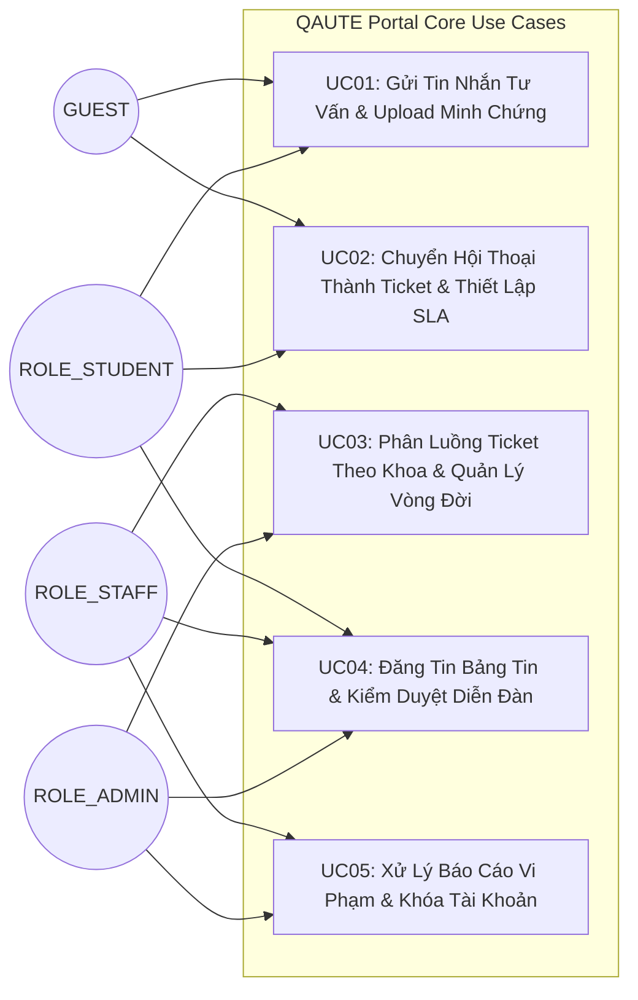
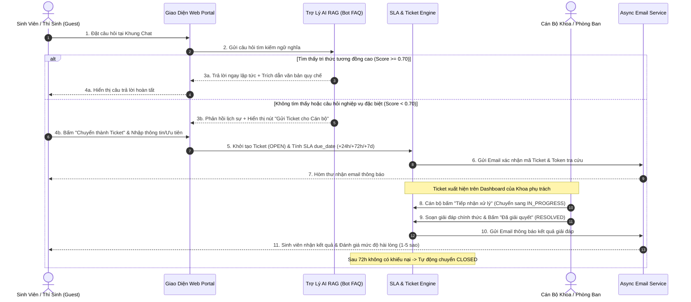

# TÀI LIỆU ĐẶC TẢ YÊU CẦU PHẦN MỀM (SOFTWARE REQUIREMENTS SPECIFICATION - SRS)

* **Tên hệ thống:** QAUTE Portal - Hệ Thống Hỗ Trợ & Tư Vấn Sinh Viên Trực Tuyến
* **Nền tảng:** Spring Boot 3, Hibernate JPA, MySQL 8 / SQL Server, Thymeleaf, Bootstrap 5
* **Phiên bản:** 1.0.0-SRS
* **Tác giả:** Solution Architect & Senior Business Analyst

---

## 1. Danh Sách User Stories Theo Chuẩn INVEST (Kèm Tiêu Chí Gherkin)

Các User Story được thiết kế độc lập, có thể thương lượng, có giá trị, ước lượng được, tinh gọn và có thể kiểm thử (INVEST standard).

### 1.1. Nhóm Tác Nhân: GUEST (Khách Vãng Lai / Thí Sinh)

#### `US-GST-01`: Tra Cứu Thông Tin & Hỏi Đáp Tuyển Sinh Với AI Bot
* **Là một:** Thí sinh / Khách vãng lai quan tâm đến trường.
* **Tôi muốn:** Trò chuyện với Trợ lý AI và tra cứu các thông tin về đề án tuyển sinh, học phí, điểm chuẩn và quy chế tuyển sinh.
* **Để:** Nhanh chóng nắm bắt thông tin 24/7 mà không cần chờ giờ hành chính.
* **Acceptance Criteria (Gherkin):**
  * **Given** Khách vãng lai truy cập trang chủ mà chưa đăng nhập.
  * **When** Mở khung chat và đặt câu hỏi về học phí ngành CNTT năm 2026.
  * **Then** AI phản hồi chính xác nội dung trích từ Đề án tuyển sinh kèm đường dẫn nguồn tài liệu tham khảo.

#### `US-GST-02`: Gửi Yêu Cầu Tư Vấn Tuyển Sinh Bằng Email (Guest Ticket)
* **Là một:** Thí sinh có thắc mắc học vụ/tuyển sinh chuyên sâu.
* **Tôi muốn:** Gửi một Ticket hỗ trợ trực tiếp đến Phòng Tuyển sinh & Truyền thông bằng cách cung cấp Họ tên, Số điện thoại và Email cá nhân.
* **Để:** Nhận được giải đáp chính thức từ Cán bộ tuyển sinh qua Email.
* **Acceptance Criteria (Gherkin):**
  * **Given** Thí sinh điền form tư vấn với email cá nhân hợp lệ `thisinh@gmail.com`.
  * **When** Nhấn "Gửi yêu cầu".
  * **Then** Hệ thống tạo Ticket mới (mã `TK-XXXX`), sinh Token bảo mật tra cứu và gửi email xác nhận chứa liên kết theo dõi tiến độ về hòm thư của thí sinh.

---

### 1.2. Nhóm Tác Nhân: ROLE_STUDENT (Sinh Viên Chính Quy)

#### `US-STU-01`: Đăng Ký & Kích Hoạt Tài Khoản Bằng Email Trường
* **Là một:** Sinh viên của trường.
* **Tôi muốn:** Đăng ký tài khoản hệ thống và xác thực thông qua mã OTP gửi về Email trường (`@hcmute.edu.vn` / `@student.hcmute.edu.vn`).
* **Để:** Bảo đảm tính chính danh khi gửi các yêu cầu học vụ chính thức.
* **Acceptance Criteria (Gherkin):**
  * **Given** Sinh viên nhập đầy đủ thông tin đăng ký với định dạng email hợp lệ.
  * **When** Nhấn nút "Đăng ký".
  * **Then** Hệ thống gửi mã OTP 6 chữ số (hiệu lực 5 phút) đến email; khi nhập đúng OTP tài khoản chuyển sang trạng thái `ACTIVE`.

#### `US-STU-02`: Gửi Yêu Cầu Tư Vấn & Đính Kèm Minh Chứng (PDF / Hình Ảnh)
* **Là một:** Sinh viên gặp sự cố học vụ (trùng lịch thi, khiếu nại điểm, hoãn thi).
* **Tôi muốn:** Tạo Ticket gửi đến đúng Phòng Đào tạo hoặc Khoa chuyên môn kèm tệp minh chứng (Đơn xin hoãn thi PDF, ảnh chụp phiếu điểm).
* **Để:** Cán bộ có đầy đủ cơ sở xem xét và giải quyết.
* **Acceptance Criteria (Gherkin):**
  * **Given** Sinh viên đã đăng nhập và đang ở trang `/tickets/create`.
  * **When** Điền tiêu đề, chọn mức ưu tiên `URGENT`, chọn Phòng Đào tạo & CTSV, đính kèm tệp `don_hoan_thi.pdf` ($\le 10\text{MB}$).
  * **Then** Hệ thống lưu Ticket thành công, tính toán `due_date = now + 24h` và gửi email thông báo xác nhận cho sinh viên.

#### `US-STU-03`: Đăng Bài Thảo Luận Trên Diễn Đàn & Báo Cáo Vi Phạm
* **Là một:** Sinh viên muốn trao đổi kinh nghiệm học tập.
* **Tôi muốn:** Đăng bài viết chia sẻ tài liệu trên Diễn đàn sinh viên và báo cáo các bài viết có ngôn từ xúc phạm hoặc thông tin sai lệch.
* **Để:** Xây dựng cộng đồng học tập lành mạnh.
* **Acceptance Criteria (Gherkin):**
  * **Given** Sinh viên gửi bài viết mới trên Diễn đàn.
  * **When** Bài viết được submit.
  * **Then** Bài viết chuyển vào trạng thái `PENDING_APPROVAL` (chờ duyệt); đồng thời sinh viên có nút "Báo cáo bài viết" đối với các bài viết công khai vi phạm.

---

### 1.3. Nhóm Tác Nhân: ROLE_STAFF (Cán Bộ Khoa / Phòng Ban / Đoàn Thể)

#### `US-STF-01`: Tiếp Nhận Xử Lý & Cam Kết SLA Theo Đơn Vị Quản Lý
* **Là một:** Cán bộ phụ trách tư vấn của Khoa Công nghệ Thông tin.
* **Tôi muốn:** Xem danh sách các Ticket gửi đến Khoa mình, bấm "Tiếp nhận xử lý" (Claim) và phản hồi cho sinh viên.
* **Để:** Phân công rõ ràng trách nhiệm, giải quyết đúng hạn cam kết SLA và tránh xung đột xử lý giữa các đồng nghiệp.
* **Acceptance Criteria (Gherkin):**
  * **Given** Cán bộ Khoa CNTT đăng nhập vào hệ thống.
  * **When** Mở danh sách Ticket và bấm "Tiếp nhận" một Ticket trạng thái `OPEN`.
  * **Then** Ticket chuyển sang `IN_PROGRESS`, gán `assigned_to = ID cán bộ`, hiển thị badge cảnh báo thời gian SLA và gửi email thông báo cho sinh viên.

#### `US-STF-02`: Đăng Bài Thông Báo Chính Thức Kèm Đa Phương Tiện
* **Là một:** Cán bộ Đoàn Thanh niên hoặc Phòng Tuyển sinh.
* **Tôi muốn:** Đăng thông báo chính thức kèm nhiều tệp văn bản (PDF, Excel, Word) và Video giới thiệu MP4 (tự động nhận từ Node.js Microservice qua Webhook).
* **Để:** Truyền tải thông tin học vụ và sự kiện rộng rãi đến toàn thể sinh viên.
* **Acceptance Criteria (Gherkin):**
  * **Given** Cán bộ Tuyển sinh soạn thảo bài thông báo "Đề án Tuyển sinh 2026".
  * **When** Đính kèm file PDF quy chế và bấm "Đăng bài".
  * **Then** Bài viết hiển thị ngay lập tức trên Bảng tin chính thức (`status = APPROVED`, `post_type = OFFICIAL_ANNOUNCEMENT`).

---

### 1.4. Nhóm Tác Nhân: ROLE_ADMIN (Quản Trị Viên Hệ Thống)

#### `US-ADM-01`: Quản Trị Toàn Diện Người Dùng, Phân Quyền & Báo Cáo Thống Kê
* **Là một:** Quản trị viên hệ thống (Admin).
* **Tôi muốn:** Quản lý danh sách tài khoản, khóa tài khoản vi phạm nhiều lần, xem thống kê tỷ lệ hoàn thành Ticket đúng hạn SLA của từng Khoa/Phòng.
* **Để:** Đảm bảo hệ thống vận hành an toàn và nâng cao chất lượng phục vụ sinh viên.
* **Acceptance Criteria (Gherkin):**
  * **Given** Admin truy cập trang `/admin/dashboard`.
  * **When** Xem biểu đồ thống kê SLA.
  * **Then** Hệ thống hiển thị trực quan: Tổng số ticket, Tỷ lệ xử lý đúng hạn (%), Số lượng bài viết vi phạm đã xử lý theo từng đơn vị.

---

## 2. Use Case Specifications Chuẩn Quốc Tế

### 2.1. UC01: Gửi Tin Nhắn Tư Vấn & Upload Tài Liệu Minh Chứng

| Thuộc tính | Chi tiết đặc tả |
| :--- | :--- |
| **Use Case ID** | **UC01** |
| **Use Case Name** | Gửi tin nhắn tư vấn và đính kèm tài liệu minh chứng (PDF / Hình ảnh) |
| **Actor Chính** | `ROLE_STUDENT`, `GUEST` (Khách vãng lai) |
| **Pre-conditions** | Người dùng đã mở khung Chat AI / Form tư vấn trực tiếp trên cổng thông tin. |
| **Post-conditions** | Yêu cầu được ghi nhận vào cơ sở dữ liệu, file đính kèm được lưu an toàn tại kho lưu trữ (Cloudinary / Local `C:\upload`). |
| **Luồng Sự Kiện Chính (Main Flow)** | 1. Người dùng nhập câu hỏi hoặc mô tả sự cố. 2. Người dùng nhấn nút đính kèm và chọn tệp tin (`.pdf`, `.jpg`, `.png`). 3. Hệ thống kiểm tra dung lượng ($\le 10\text{MB}$) và đọc Magic Bytes xác thực định dạng hợp lệ. 4. Hệ thống lưu tệp vào thư mục lưu trữ, tạo bản ghi đính kèm và hiển thị phản hồi trên giao diện. |
| **Luồng Phụ / Ngoại Lệ (Alternative Flows)** | **3a. File sai định dạng hoặc vượt quá dung lượng:** - Hệ thống từ chối tải lên và hiển thị thông báo lỗi: *"Tệp không hợp lệ hoặc vượt quá dung lượng cho phép"*. |

---

### 2.2. UC02: Chuyển Đổi Cuộc Hội Thoại Thành Ticket Hỗ Trợ & Thiết Lập SLA/Deadline

| Thuộc tính | Chi tiết đặc tả |
| :--- | :--- |
| **Use Case ID** | **UC02** |
| **Use Case Name** | Chuyển đổi cuộc hội thoại thành Ticket hỗ trợ chính thức & Tính toán SLA Deadline |
| **Actor Chính** | `ROLE_STUDENT`, `GUEST`, `SYSTEM` (AI Fallback Trigger) |
| **Pre-conditions** | Người dùng đang trong phiên Chat với AI Bot nhưng câu hỏi vượt quá phạm vi hoặc cần xác nhận thủ tục giấy tờ chính thức. |
| **Post-conditions** | Một Ticket mới được khởi tạo ở trạng thái `OPEN`, kế thừa toàn bộ nội dung chat và gán hạn chót `due_date` theo SLA. |
| **Luồng Sự Kiện Chính (Main Flow)** | 1. AI phát hiện độ tin cậy thấp hoặc người dùng nhấn nút *"Chuyển thành Ticket gửi Thầy/Cô"*. 2. Hệ thống hiển thị Modal xác nhận: Điền thông tin Đơn vị nhận (Phòng Đào tạo / Khoa / Tuyển sinh) và Mức độ ưu tiên (`URGENT`, `MEDIUM`, `LOW`). 3. Khách vãng lai nhập Email nhận phản hồi (Sinh viên tự động lấy Email tài khoản). 4. Động cơ SLA tính toán Deadline:    - `URGENT`: `due_date = created_at + 24h`    - `MEDIUM`: `due_date = created_at + 72h`    - `LOW`: `due_date = created_at + 7 ngày` 5. Hệ thống lưu Ticket, tạo mã tra cứu (VD: `TK-20260905-136469`) và kích hoạt gửi Email xác nhận bất đồng bộ. |
| **Luồng Ngoại Lệ** | **3a. Guest nhập email không đúng định dạng:** - Hệ thống cảnh báo đỏ và yêu cầu nhập đúng địa chỉ email để nhận kết quả. |

---

### 2.3. UC03: Phân Luồng Tiếp Nhận Ticket Theo Khoa/Phòng & Quản Lý Vòng Đời SLA

| Thuộc tính | Chi tiết đặc tả |
| :--- | :--- |
| **Use Case ID** | **UC03** |
| **Use Case Name** | Phân luồng tiếp nhận Ticket theo Khoa/Phòng và Xử lý vòng đời Ticket |
| **Actor Chính** | `ROLE_STAFF` (Cán bộ phụ trách theo Khoa/Phòng), `ROLE_ADMIN` |
| **Pre-conditions** | Cán bộ đã đăng nhập thành công vào tài khoản Staff được gán mã `department_id`. |
| **Post-conditions** | Ticket được cập nhật trạng thái (`OPEN` $\rightarrow$ `IN_PROGRESS` $\rightarrow$ `RESOLVED` $\rightarrow$ `CLOSED`) và lưu lịch sử trao đổi. |
| **Luồng Sự Kiện Chính (Main Flow)** | 1. Cán bộ mở Dashboard Ticket; hệ thống tự động lọc chỉ hiển thị các Ticket thuộc Khoa/Phòng của Cán bộ (`department_id`). 2. Cán bộ xem mức độ ưu tiên và badge hạn chót SLA (Xanh: Còn hạn, Vàng: Sắp hết hạn < 24h, Đỏ: Quá hạn `OVERDUE`). 3. Cán bộ nhấn nút *"Tiếp nhận xử lý"* (Claim): Trạng thái chuyển sang `IN_PROGRESS`, gán `assigned_to = staff_id`. 4. Cán bộ nhập câu trả lời / hướng dẫn giải quyết và đính kèm văn bản quyết định nếu có. 5. Cán bộ nhấn *"Đã giải quyết"*: Trạng thái chuyển sang `RESOLVED`, lưu `resolved_at = now`. 6. Hệ thống tự động gửi Email thông báo giải đáp kèm link đánh giá 1-5 sao đến Sinh viên / Guest. 7. Sau 72h kể từ khi `RESOLVED`, nếu sinh viên không có phản hồi thêm, hệ thống tự động chuyển sang `CLOSED`. |
| **Luồng Ngoại Lệ** | **1a. Cán bộ cố tình truy cập Ticket thuộc đơn vị khác (Can thiệp chéo):** - Hệ thống chặn ngay lập tức và trả về trang lỗi `403 Forbidden` (`BRULE-TICKET-004`). |

---

## 3. Activity Diagram (Luồng Liên Thông Sinh Viên - FAQ Bot - Cán Bộ Tư Vấn)

---

## 4. Ma Trận Phân Quyền Chi Tiết (RBAC Matrix) & Cơ Chế Chống Truy Cập Chéo

### 4.1. Bảng Phân Quyền Tính Năng (Functional RBAC Matrix)

| Module / Chức năng | GUEST (Khách) | ROLE_STUDENT (Sinh viên) | ROLE_STAFF (Cán bộ Phòng/Khoa) | ROLE_ADMIN (Quản trị viên) |
| :--- | :---: | :---: | :---: | :---: |
| **Đăng ký tài khoản + Xác thực OTP Email** | ❌ | ✅ | ❌ (Do Admin cấp) | ❌ (Do Root cấp) |
| **Chatbot AI RAG tra cứu tri thức** | ✅ (Giới hạn rate) | ✅ (Không giới hạn) | ✅ | ✅ |
| **Tạo Ticket tư vấn (Form trực tiếp / Chuyển từ Chat)** | ✅ (Nhập Email + Token) | ✅ (Tự động Profile) | ❌ | ❌ |
| **Xem & Xử lý Ticket (Theo Đơn vị của mình)** | ❌ | ❌ | ✅ (Chỉ Khoa mình) | ✅ (Tất cả Khoa) |
| **Xem Bảng tin chính thức & Tải tệp (PDF/Word/Excel)** | ✅ | ✅ | ✅ | ✅ |
| **Đăng thông báo chính thức kèm tệp/Video MP4** | ❌ | ❌ | ✅ | ✅ |
| **Đăng bài Diễn đàn sinh viên (Dòng thời gian Feed)** | ❌ | ✅ (`PENDING_APPROVAL`) | ✅ (`APPROVED` ngay) | ✅ (`APPROVED` ngay) |
| **Phê duyệt bài Diễn đàn sinh viên** | ❌ | ❌ | ✅ (Theo thẩm quyền) | ✅ (Toàn hệ thống) |
| **Tương tác Like, Comment trên bài đã duyệt** | ❌ | ✅ | ✅ | ✅ |
| **Gửi Báo cáo vi phạm (Report bài viết/comment)** | ❌ | ✅ | ✅ | ✅ |
| **Xử lý danh sách Báo cáo vi phạm (Ẩn bài / Khóa)** | ❌ | ❌ | ✅ | ✅ |
| **Tiếp nhận Webhook Video từ Node.js Microservice** | ❌ | ❌ | ❌ | ✅ (Hệ thống xác thực Secret) |
| **Cấu hình SLA, Quản lý danh mục & Log hệ thống** | ❌ | ❌ | ❌ | ✅ |

### 4.2. Cơ Chế Cách Ly Dữ Liệu Chống Can Thiệp Chéo (Data Isolation Rule)
* **Quy tắc bảo vệ dữ liệu:**
  1. Mỗi Cán bộ `ROLE_STAFF` khi đăng nhập đều có thuộc tính `department_id` gắn chặt trong phiên làm việc.
  2. Mọi truy vấn đọc/ghi danh sách Ticket, phản hồi, phê duyệt bài viết đều tự động bọc điều kiện lọc:
     $$\text{WHERE } \text{department\_id} = \text{currentUser.getDepartmentId()}$$
  3. Nếu một Cán bộ Khoa CNTT (`dept_id = 4`) cố tình gửi request hoặc gõ URL `/staff/tickets/detail/10` (thuộc Phòng Tuyển sinh `dept_id = 2`), tầng Business Service lập tức ném ra ngoại lệ `AccessDeniedBusinessException` và trả về mã lỗi `HTTP 403 Forbidden`.
