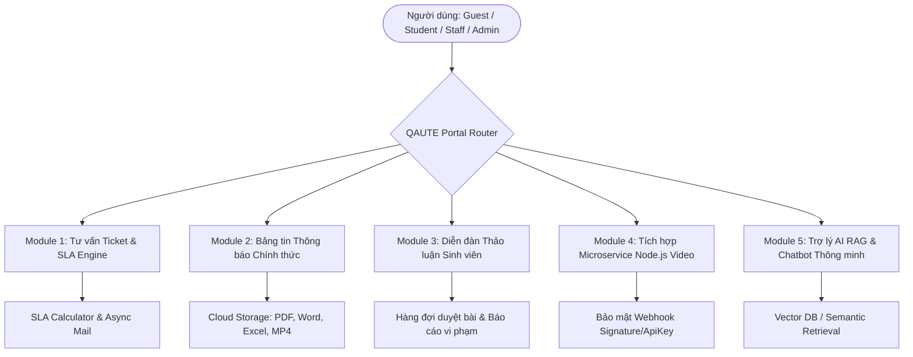
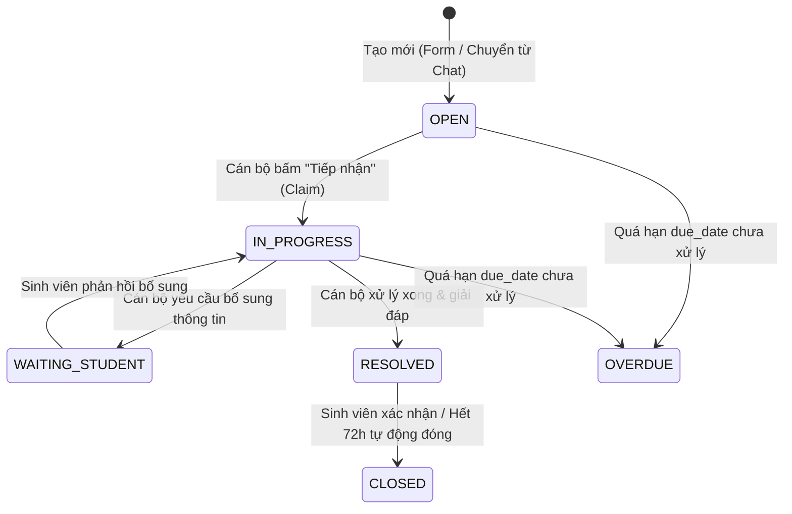
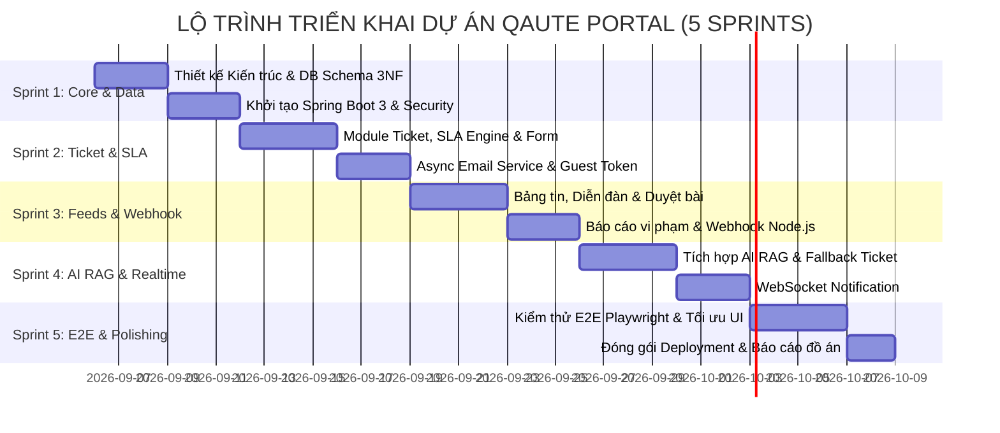

# TÀI LIỆU YÊU CẦU SẢN PHẨM & QUY TẮC NGHIỆP VỤ (PRODUCT BRIEF & BUSINESS RULES)

* **Tên hệ thống:** QAUTE Portal - Cổng Tư Vấn Sinh Viên, Quản Lý Ticket SLA, Bảng Tin Đa Phương Tiện & Trợ Lý AI RAG
* **Phiên bản:** 1.0.0-RELEASE (MVP Specification)
* **Ngày phát hành:** 05/09/2026
* **Trạng thái:** Approved / Ready for Architecture Design

---

## 1. Executive Summary & Core Objectives (Tóm Tắt & Mục Tiêu Cốt Lõi)

### 1.1. Bối cảnh & Thách thức
Hiện tại, công tác tiếp nhận, xử lý thắc mắc học vụ và truyền thông tại các trường đại học (đặc biệt các đơn vị như Phòng Đào tạo, Phòng Tuyển sinh & Truyền thông, Đoàn Thanh niên - Hội Sinh viên, các Khoa chuyên môn) đang gặp các vấn đề lớn:
1. **Quá tải và chậm trễ:** Hàng ngàn câu hỏi lặp đi lặp lại về quy chế, điểm số, học bổng, chuyển đổi chứng chỉ ngoại ngữ khiến cán bộ tư vấn bị quá tải.
2. **Thiếu chuẩn cam kết thời gian (SLA):** Sinh viên gửi yêu cầu không biết khi nào nhận được phản hồi, không có hạn chót xử lý cụ thể.
3. **Phân tán kênh thông tin:** Thông báo chính thức, thảo luận sinh viên, tài liệu PDF, video giới thiệu nằm rời rạc, khó tra cứu.
4. **Khách vãng lai/Thí sinh:** Khó tiếp cận nguồn giải đáp chính thống 24/7.

### 1.2. Mục tiêu cốt lõi của QAUTE Portal
* **Tự động hóa phản hồi thông minh (AI RAG):** Cung cấp trợ lý AI đọc hiểu toàn bộ kho văn bản quy chế PDF, đề án tuyển sinh và bộ tri thức 2.600+ câu hỏi thực tế để phản hồi tức thì 24/7 với độ chính xác cao và trích dẫn nguồn.
* **Quy trình Ticket chuẩn SLA phân quyền đa phòng ban:** Tiếp nhận từ Form trực tiếp hoặc chuyển đổi từ phiên Chat, tự động gán Deadline xử lý theo mức độ ưu tiên (`URGENT: 24h`, `MEDIUM: 72h`, `LOW: 7 ngày`), gửi email cập nhật tiến độ bất đồng bộ (Async Mail).
* **Cổng thông tin & Diễn đàn 2 luồng độc lập:**
  * *Bảng tin chính thức:* Cán bộ đăng thông báo đính kèm tài liệu dung lượng lớn (PDF, Word, Excel) và Video MP4 tự động từ Microservice Node.js.
  * *Diễn đàn sinh viên (Feed):* Sinh viên đăng trạng thái thảo luận có kiểm duyệt (`PENDING_APPROVAL` $\rightarrow$ `APPROVED`), hỗ trợ Like, Comment, Report vi phạm.

---

## 2. Product Scope (Phạm Vi Sản Phẩm & Các Module Nghiệp Vụ)

### 2.1. Module 1: Kênh tư vấn Ticket & Deadline SLA
* Tiếp nhận yêu cầu tư vấn từ 2 nguồn:
  1. Form tạo Ticket trực tiếp (Hỗ trợ cả Sinh viên đã đăng nhập và Khách vãng lai nhập Email).
  2. Nút chuyển đổi trực tiếp từ phiên Chat tư vấn (khi Chatbot AI không giải đáp trọn vẹn hoặc người dùng yêu cầu gặp chuyên viên).
* Phân luồng tự động theo Đơn vị phụ trách:
  * **Đoàn Thanh niên & Hội Sinh viên:** Phong trào, công tác tình nguyện, điểm rèn luyện, video truyền thông.
  * **Phòng Tuyển sinh & Truyền thông:** Tư vấn tuyển sinh các hệ, đề án tuyển sinh, học phí đầu vào, ngày hội tư vấn.
  * **Phòng Đào tạo & CTSV:** Đăng ký môn học, điểm số, xét tốt nghiệp, hoãn thi, chứng chỉ ngoại ngữ TOEIC/IELTS, học bổng, trợ cấp xã hội.
  * **Khoa chuyên môn (Khoa CNTT, Cơ khí, Kinh tế, Ngoại ngữ...):** Đồ án tốt nghiệp, thực tập doanh nghiệp, học phần chuyên ngành.
* Động cơ tính Deadline (SLA Engine) gắn nhãn trạng thái: `OPEN`, `IN_PROGRESS`, `RESOLVED`, `CLOSED`, `OVERDUE`.

### 2.2. Module 2: Bảng tin chính thức (Official Announcements)
* Dành riêng cho `ROLE_STAFF` và `ROLE_ADMIN` công bố thông tư, thông báo, quy chế, đề án tuyển sinh.
* Cho phép đính kèm tệp không giới hạn định dạng văn phòng (`.pdf`, `.docx`, `.xlsx`) và đa phương tiện (`.mp4`, `.jpg`, `.png`).
* Bài viết hiển thị công khai ngay sau khi đăng, có phân mục theo Đơn vị ban hành.

### 2.3. Module 3: Diễn đàn thảo luận sinh viên (Student Community Feed)
* Giao diện dạng dòng thời gian (Facebook Feed) phục vụ sinh viên trao đổi kinh nghiệm học tập, tìm nhóm, chia sẻ tài liệu.
* Cơ chế kiểm duyệt nghiêm ngặt: Bài viết của sinh viên ban đầu ở trạng thái `PENDING_APPROVAL`, chỉ hiển thị sau khi Staff/Admin duyệt.
* Tương tác cộng đồng: Thả tim (Reaction Like), bình luận nhiều cấp (Comment), báo cáo nội dung xấu (Report vi phạm).

### 2.4. Module 4: Tích hợp Microservice Node.js Video Webhook
* Kết nối vệ tinh với hệ thống dựng/render video tự động chạy bằng Node.js (ví dụ render video tổng kết hoạt động, video giới thiệu ngành tuyển sinh).
* Endpoint `/api/v1/integration/video-webhook` nhận kết quả qua Webhook có xác thực `X-Webhook-Secret` và SHA256 Signature, tự động đính kèm liên kết Video MP4 vào bài viết tương ứng.

### 2.5. Module 5: Trợ lý AI RAG & Chatbot Thông Minh
* Tích hợp kho tri thức văn bản học vụ và bộ dữ liệu 2.600+ câu hỏi thực tế.
* Tìm kiếm ngữ nghĩa (Semantic Search) trả về câu trả lời chuẩn xác kèm trích dẫn văn bản quy định.
* Fallback mượt mà: Nếu độ tin cậy thấp hoặc người dùng chưa hài lòng, hệ thống kích hoạt modal: *"Bạn có muốn tạo Ticket gửi đến Phòng Đào tạo / Khoa phụ trách không?"* kèm dữ liệu đã nhập sẵn.

---

## 3. Role-Based Access Control (RBAC) Matrix

| Quyền hạn / Nghiệp vụ | GUEST (Khách/Thí sinh) | ROLE_STUDENT (Sinh viên) | ROLE_STAFF (Cán bộ Phòng/Khoa) | ROLE_ADMIN (Quản trị viên) |
| :--- | :---: | :---: | :---: | :---: |
| **Đăng ký / Đăng nhập / Xác thực OTP** | ❌ (Chỉ nhập Email khi gửi Ticket) | ✅ (Tài khoản SV + OTP Email) | ✅ (Được Admin cấp tài khoản) | ✅ (Toàn quyền hệ thống) |
| **Trò chuyện với AI RAG Chatbot** | ✅ (Giới hạn câu/phút) | ✅ (Không giới hạn) | ✅ | ✅ |
| **Gửi Ticket qua Form trực tiếp** | ✅ (Nhập Họ tên + Email) | ✅ (Tự động điền Profile) | ❌ | ❌ |
| **Chuyển hội thoại Chat thành Ticket** | ✅ | ✅ | ❌ | ❌ |
| **Tiếp nhận, Xử lý, Đổi trạng thái Ticket** | ❌ | ❌ | ✅ (Chỉ Ticket thuộc Khoa mình) | ✅ (Toàn bộ Khoa/Phòng) |
| **Đóng Ticket & Đánh giá mức độ hài lòng** | ✅ (Qua link bảo mật Email) | ✅ (Trên giao diện Portal) | ❌ | ✅ |
| **Xem Bảng tin & Tải file PDF/Word/Excel** | ✅ | ✅ | ✅ | ✅ |
| **Đăng bài viết Bảng tin chính thức** | ❌ | ❌ | ✅ (Kèm Video/PDF/Word/Excel) | ✅ |
| **Đăng bài Diễn đàn sinh viên** | ❌ | ✅ (Trạng thái PENDING_APPROVAL) | ✅ (Được duyệt thẳng) | ✅ (Được duyệt thẳng) |
| **Duyệt / Từ chối bài Diễn đàn** | ❌ | ❌ | ✅ (Thuộc phạm vi quản lý) | ✅ (Toàn hệ thống) |
| **Thả Tim (Like) & Bình luận (Comment)** | ❌ | ✅ | ✅ | ✅ |
| **Báo cáo bài viết vi phạm (Report)** | ❌ | ✅ | ✅ | ✅ |
| **Xử lý danh sách Báo cáo vi phạm** | ❌ | ❌ | ✅ | ✅ |
| **Quản lý Người dùng, Cấu hình SLA, Log** | ❌ | ❌ | ❌ | ✅ |

---

## 4. Danh Sách Quy Tắc Nghiệp Vụ (Business Rules List)

### 4.1. Nhóm Xác thực & Phân quyền (Authentication & Authorization)
* **`BRULE-AUTH-001` (Cơ chế Đăng ký & Kích hoạt):** Người dùng đăng ký tài khoản sinh viên bắt buộc phải kích hoạt qua mã OTP 6 chữ số gửi về Email trường. Mã OTP có hiệu lực trong vòng 5 phút.
* **`BRULE-AUTH-002` (Mã hóa Mật khẩu):** Mật khẩu người dùng bắt buộc mã hóa bằng thuật toán `BCryptPasswordEncoder` với độ dài salt tối thiểu 10 vòng lặp. Cấm lưu mật khẩu thuần trong Database.
* **`BRULE-AUTH-003` (Bảo mật Session Cookie):** Sử dụng cơ chế Spring Security Session Cookie tiêu chuẩn (`JSESSIONID` với cờ `HttpOnly`, `SameSite=Lax`, `Secure` trên HTTPS). Bật chống tấn công giả mạo `Spring CSRF Protection` trên tất cả các Form HTML.
* **`BRULE-AUTH-004` (Khóa tài khoản vi phạm):** Tài khoản bị tích lũy từ 3 bài viết/bình luận vi phạm nghiêm trọng sẽ tự động bị chuyển trạng thái `status = LOCKED` và không thể đăng nhập trong 7 ngày.
* **`BRULE-AUTH-005` (Phân quyền theo Đơn vị):** Cán bộ `ROLE_STAFF` thuộc Khoa/Phòng ban nào (Department ID) chỉ có quyền xem và xử lý các Ticket, bài viết thuộc phạm vi quản lý của Đơn vị đó.

---

### 4.2. Nhóm Quản lý Ticket & Cam kết SLA (Ticket & SLA Management)

* **`BRULE-TICKET-001` (Nguồn tạo Ticket linh hoạt):** Hỗ trợ 2 luồng tạo Ticket:
  1. *Luồng Trực tiếp:* Điền Form gửi yêu cầu (Student hoặc Guest cung cấp Email).
  2. *Luồng Chuyển đổi Chat:* Nút chuyển đổi ngay trong khung chat AI khi cần sự can thiệp của Cán bộ chuyên trách.
* **`BRULE-TICKET-002` (Tính toán Deadline SLA tự động):** Khi Ticket được khởi tạo, hệ thống tự động tính toán trường `due_date` dựa vào mức độ ưu tiên (`priority`):
  * `URGENT` (Khẩn cấp - Ví dụ: hoãn thi, sự cố học phí sát giờ G): `due_date = created_at + 24 giờ`.
  * `MEDIUM` (Bình thường - Ví dụ: đăng ký môn học, giấy xác nhận): `due_date = created_at + 72 giờ`.
  * `LOW` (Thấp - Ví dụ: hỏi thăm dò học bổng, thông tin chung): `due_date = created_at + 7 ngày`.
* **`BRULE-TICKET-003` (Cơ chế Nhận việc - Claiming Rule):** Khi một Cán bộ bấm *"Tiếp nhận Ticket"*, trường `assigned_to` sẽ cập nhật ID của Cán bộ đó và chuyển trạng thái sang `IN_PROGRESS`. Các Cán bộ khác cùng đơn vị chỉ có quyền xem chế độ đọc (Read-only) để tránh trùng lặp trả lời.
* **`BRULE-TICKET-004` (Cấm can thiệp chéo Khoa/Phòng):** Cán bộ Khoa CNTT tuyệt đối không thể xem, tiếp nhận hoặc phản hồi Ticket thuộc Phòng Tuyển sinh hay Khoa Cơ khí (trừ `ROLE_ADMIN`).
* **`BRULE-TICKET-005` (Email Notification Bất đồng bộ - Async):** Mọi hành vi thay đổi trạng thái Ticket (`Tạo mới`, `Tiếp nhận`, `Có phản hồi mới`, `Đã giải quyết`) phải kích hoạt gửi Email HTML thông báo đến Sinh viên / Guest qua luồng `@Async` phi tập trung, không làm nghẽn Main Thread.
* **`BRULE-TICKET-006` (Tra cứu Ticket ẩn danh cho Guest):** Khách vãng lai tra cứu tiến độ Ticket thông qua liên kết chứa Token bảo mật ngẫu nhiên `uuid_token` được gửi trực tiếp trong email xác nhận khởi tạo.
* **`BRULE-TICKET-007` (Tự động đóng Ticket):** Ticket ở trạng thái `RESOLVED` sau 72 giờ nếu Sinh viên không có phản hồi thêm sẽ được Scheduler tự động chuyển thành `CLOSED`.

---

### 4.3. Nhóm Bảng Tin & Diễn Đàn Sinh Viên (Official Feed & Student Forum)
* **`BRULE-POST-001` (Đăng bài Thông báo Chính thức):** Cán bộ `ROLE_STAFF` và `ROLE_ADMIN` được phép đăng bài viết chính thức kèm đính kèm tối đa 5 tệp tin định dạng `.pdf`, `.docx`, `.xlsx`, `.mp4` với dung lượng mỗi tệp lên đến 100MB. Bài viết được phát hành ngay lập tức (`is_pinned`, `status = PUBLISHED`).
* **`BRULE-POST-002` (Đăng bài Thảo luận Sinh viên):** Sinh viên chỉ được phép đăng bài trên Diễn đàn sinh viên dưới dạng văn bản và tối đa 1 hình ảnh minh họa. Trạng thái khởi tạo luôn là `PENDING_APPROVAL`.
* **`BRULE-POST-003` (Kiểm duyệt Bài viết Bắt buộc):** Bài thảo luận của sinh viên BẮT BUỘC phải qua danh sách chờ duyệt (`/moderation/posts`). Cán bộ hoặc Admin nhấn `Phê duyệt` (chuyển sang `APPROVED`) thì bài mới hiển thị trên bảng tin công khai, hoặc nhấn `Từ chối` kèm lý do gửi về thông báo cá nhân của sinh viên.
* **`BRULE-POST-004` (Quy trình Báo cáo Vi phạm - Report):**
  * Mọi người dùng đã đăng nhập đều có nút *"Báo cáo bài viết"* hoặc *"Báo cáo bình luận"*.
  * Lý do báo cáo gồm: `SPAM`, `INAPPROPRIATE_LANGUAGE` (ngôn từ xúc phạm), `WRONG_ACADEMIC_INFO` (thông tin học vụ sai lệch), `OTHER`.
  * Khi bài viết nhận từ $\ge 3$ báo cáo hoặc có báo cáo mức độ nghiêm trọng, hệ thống tự động gắn cờ cảnh báo trong Dashboard Kiểm duyệt để Cán bộ đưa ra quyết định: *Giữ lại / Ẩn bài viết / Khóa tài khoản tác giả*.
* **`BRULE-POST-005` (Tương tác An toàn):** Sinh viên chỉ được bình luận và thả tim vào các bài viết đã ở trạng thái `APPROVED` hoặc bài viết chính thức.

---

### 4.4. Nhóm Tích hợp Microservice & AI RAG (Integrations & AI Engine)
* **`BRULE-NODE-001` (Webhook Video Rendering từ Node.js):** 
  * Microservice Node.js sau khi render xong Video MP4 sẽ gửi HTTP POST request tới Spring Boot endpoint `/api/v1/integration/video-webhook`.
  * Request bắt buộc phải có Header `X-Webhook-Signature` (mã hóa HMAC-SHA256 với Secret Key bí mật).
  * Payload chứa `post_id`, `video_url`, `duration_seconds`, `thumbnail_url`. Spring Boot xác thực chữ ký trước khi gán đính kèm vào bài viết.
* **`BRULE-RAG-001` (Trợ lý Tri thức Học vụ AI RAG):**
  * Khi User/Guest gửi câu hỏi vào Chatbot, hệ thống truy vấn Vector Embeddings từ kho tài liệu quy chế và dữ liệu 2.600+ câu hỏi thực tế.
  * Phản hồi của AI phải kèm tên văn bản trích dẫn (ví dụ: *Trích Quyết định số 123/QĐ-ĐHSPKT về chuẩn đầu ra ngoại ngữ*).
  * Trường hợp điểm số tương đồng dưới ngưỡng tin cậy ($< 0.70$), AI phản hồi lịch sự và hiển thị nút hành động: *"Chuyển câu hỏi này thành Ticket tư vấn gửi Thầy/Cô"*.

---

## 5. Milestone Roadmap (Lộ Trình Phát Triển 5 Sprint)

### Chi tiết các Sprint:
* **Sprint 1: Core Foundation & Database Schema**
  * Hoàn thiện `docs/brief.md`, `engineering-rules.md`, `schema.sql` và `dictionary.md`.
  * Khởi tạo dự án Spring Boot 3.3.x, kết nối MySQL, cấu hình Spring Security với Session Cookie và phân quyền RBAC.
* **Sprint 2: Ticket Workflow, SLA Engine & Async Email**
  * Xây dựng luồng tạo Ticket trực tiếp và chuyển đổi từ Chat.
  * Triển khai SLA Calculator tự động gắn `due_date`.
  * Triển khai Async Email Service thông báo trạng thái và link tra cứu cho Guest.
* **Sprint 3: Bảng Tin Đa Phương Tiện, Diễn Đàn & Node.js Webhook**
  * Bảng tin chính thức (Upload PDF, Word, Excel dung lượng lớn).
  * Diễn đàn sinh viên, quy trình kiểm duyệt `PENDING_APPROVAL` và xử lý Báo cáo vi phạm (`post_reports`).
  * Endpoint Webhook nhận Video tự động từ Node.js.
* **Sprint 4: AI RAG Assistant & Tích Hợp Tri Thức Học Vụ**
  * Nạp 2.672 dữ liệu thực tế vào Knowledge Store.
  * Tích hợp AI RAG Engine (trả lời trích dẫn nguồn, chuyển đổi mượt sang Ticket).
* **Sprint 5: Toàn Diện Hóa Giao Diện, Kiểm Thử E2E & Báo Cáo**
  * Hoàn thiện giao diện Bootstrap 5 sạch đẹp, chuẩn UI/UX.
  * Chạy kịch bản kiểm thử E2E (Playwright) toàn bộ luồng nghiệp vụ.
  * Đóng gói bàn giao và xuất tài liệu kỹ thuật đồ án.
