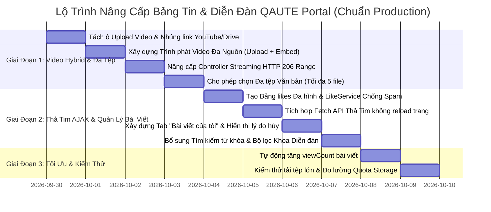

# 📋 THIẾT KẾ CHI TIẾT TÍNH NĂNG BẢNG TIN CHÍNH THỨC & DIỄN ĐÀN SINH VIÊN
## KIẾN TRÚC PHÁT VIDEO TRỰC TUYẾN, QUẢN LÝ ĐA TỆP ĐÍNH KÈM & BẢO ĐẢM QUY TẮC NGHIỆP VỤ (RULE & ROLE SPECIFICATION)

- **Mã tài liệu:** `docs/progress/tiendo4.md`
- **Dự án:** QAUTE Portal - HCMUTE Student Support & Counseling Portal
- **Tác giả:** Đội ngũ Phát triển & Kiến trúc sư Phần mềm
- **Mục tiêu:** Rà soát toàn diện hiện trạng Bảng tin (`/feed/official`) và Diễn đàn (`/feed/forum`); thiết kế kiến trúc chuẩn hóa phục vụ phát video trực tiếp trên web, xử lý upload đa tệp đính kèm theo `BRULE-POST-001`, xóa bỏ triệt để các hạn chế của tính năng Like/Comment, bổ sung tìm kiếm và quản lý bài viết cá nhân; bảo đảm tuân thủ 100% RBAC theo phân quyền và quy tắc nghiệp vụ.
- **Trạng thái:** BẢN THIẾT KẾ CHUẨN KIẾN TRÚC (DESIGN SPECIFICATION - CHƯA VIẾT CODE)

---

## 🔍 1. KẾT QUẢ ĐÁNH GIÁ HIỆN TRẠNG (CURRENT STATE & GAP ANALYSIS)

### 1.1. Bảng Tin Thông Báo Chính Thức (`/feed/official`)
| Tiêu chí | Hiện trạng hệ thống | Khoảng cách so với Đặc tả (Gap) | Mức độ ưu tiên |
| :--- | :--- | :--- | :--- |
| **Upload Video** | Đã cho phép chọn file `.mp4` trong ô `attachment` | Chỉ cho phép chọn **1 file duy nhất** (gộp chung với tài liệu). Chưa tách riêng ô Upload Video và ô Upload Văn bản PDF/Word. | 🔴 Cao |
| **Phát Video trên Web** | Đã có thẻ `<video controls>` HTML5 trong `official-detail.html` | Thẻ video trước đây chỉ hiển thị nếu có videoUrl từ Node.js. Cán bộ tự tay upload file video `.mp4` thì video bị đẩy xuống danh sách tệp đính kèm và **chỉ hiện nút "Tải Về", không tự động phát trên web**. | 🔴 Cấp thiết |
| **Đa tệp đính kèm** | Đang nhận `MultipartFile attachment` (1 tệp) | Vi phạm đặc tả `BRULE-POST-001`: Cán bộ được phép đính kèm **tối đa 5 tệp tin văn bản** (`.pdf`, `.docx`, `.xlsx`, `.zip`, `.rar`) + 1 Video. | 🔴 Cao |
| **Lượt xem bài viết** | Entity `Post` có trường `viewCount` | Khi sinh viên bấm vào xem chi tiết bài viết, `PostService.getPostById` **chưa có dòng lệnh tăng `viewCount`**, dẫn đến số lượt xem luôn bằng 0. | 🟡 Trung bình |
| **Tích hợp ngoài (YouTube/Drive)** | Chưa có ô dán link video ngoài | Toàn bộ video phụ thuộc vào upload trực tiếp, dễ gây tràn dung lượng đối với các gói lưu trữ Free Tier. | 🔴 Cao |

---

### 1.2. Diễn Đàn Thảo Luận Sinh Viên (`/feed/forum`)
| Tiêu chí | Hiện trạng hệ thống | Khoảng cách so với Đặc tả (Gap) | Mức độ ưu tiên |
| :--- | :--- | :--- | :--- |
| **Dữ liệu mẫu (Mock)** | Không có dữ liệu cứng (hardcoded mock) trên HTML | 100% giao diện đã nối vào JPA Repository và Service. Các bài viết ban đầu là seed data chuẩn từ `DataInitializer.java` vào MySQL. | ✅ Đã đạt |
| **Tìm kiếm & Bộ lọc** | Chưa có thanh tìm kiếm hay bộ lọc Khoa | Sinh viên không thể tra cứu lại các bài thảo luận cũ theo từ khóa hoặc theo Khoa/Phòng (trong khi Bảng tin đã có). | 🔴 Cao |
| **Quản lý Bài của Tôi** | Chưa có khu vực/tab xem lại bài viết cá nhân | Sinh viên không biết bài viết mình vừa gửi đang ở trạng thái nào (`CHỜ DUYỆT`, `ĐÃ PHÊ DUYỆT`, hay `BỊ TỪ CHỐI` vì lý do gì). | 🔴 Cao |
| **Cơ chế Like (Thả tim)** | Gọi Form POST reload toàn trang, không lưu danh tính | **Không lưu danh tính người Like**: 1 tài khoản có thể bấm Like vô hạn lần; gây chớp giật màn hình khi tải lại trang web. | 🔴 Cấp thiết |
| **Quyền Xóa bài** | Chưa có chức năng Xóa cho tác giả sinh viên | Sinh viên khi đăng nhầm hoặc đã giải quyết xong thắc mắc không thể tự hủy bài của mình. | 🟡 Trung bình |

---

## 🛡️ 2. MA TRẬN PHÂN QUYỀN (RBAC) & QUY TẮC NGHIỆP VỤ (RULE SPECIFICATION)

### 2.1. Ma trận Phân quyền Vai trò (Role-Based Matrix)

| Chức năng / Hành động | Khách (Guest) | Sinh Viên (`ROLE_STUDENT`) | Cán Bộ (`ROLE_STAFF`) | Quản Trị (`ROLE_ADMIN`) | Mã Quy Tắc |
| :--- | :---: | :---: | :---: | :---: | :--- |
| Xem Bảng Tin & Xem Video | ✅ Cho phép | ✅ Cho phép | ✅ Cho phép | ✅ Cho phép | `PUBLIC_READ` |
| Đăng Thông Báo Chính Thức | ❌ Chặn | ❌ Chặn | ✅ Phê duyệt ngay | ✅ Phê duyệt ngay | `BRULE-POST-001` |
| Upload Video & Đa tệp (Tối đa 5) | ❌ Chặn | ❌ Chặn | ✅ File $\le$ 50MB hoặc link nhúng | ✅ File $\le$ 50MB hoặc link nhúng | `BRULE-POST-001` |
| Xem Diễn Đàn Sinh Viên | ✅ Cho phép | ✅ Cho phép | ✅ Cho phép | ✅ Cho phép | `PUBLIC_READ` |
| Đăng bài Thảo luận Diễn đàn | ❌ Chặn | ✅ Chờ duyệt | ✅ Duyệt ngay | ✅ Duyệt ngay | `BRULE-POST-002` |
| Thả tim (Like) AJAX tức thì | ❌ Yêu cầu Login | ✅ 1 like/bài (Toggle) | ✅ 1 like/bài (Toggle) | ✅ 1 like/bài (Toggle) | `BRULE-POST-005` |
| Bình luận (Comment) | ❌ Yêu cầu Login | ✅ Chỉ bài APPROVED | ✅ Toàn quyền | ✅ Toàn quyền | `BRULE-POST-005` |
| Báo cáo vi phạm (Report) | ❌ Yêu cầu Login | ✅ Gửi báo cáo | ✅ Gửi báo cáo | ✅ Gửi báo cáo | `BRULE-POST-004` |
| Xem hàng đợi Duyệt bài | ❌ Chặn | ❌ Chặn | ✅ Thuộc Khoa/Tất cả | ✅ Toàn quyền | `BRULE-POST-003` |
| Phê duyệt / Từ chối bài viết | ❌ Chặn | ❌ Chặn | ✅ Nhập lý do | ✅ Nhập lý do | `BRULE-POST-003` |
| Hủy/Xóa bài viết của chính mình | ❌ Chặn | ✅ Bài chưa duyệt/của mình | ✅ Toàn quyền | ✅ Toàn quyền | `BRULE-POST-006` |

---

### 2.2. Chi Tiết Các Quy Tắc Nghiệp Vụ Chuẩn (Business Rules)

#### 📌 `BRULE-POST-001` (Đăng thông báo chính thức & Video Bảng tin - Bỏ Node.js, Chuẩn Production Free):
1. **Phân quyền:** Chỉ tài khoản có quyền `ROLE_STAFF` hoặc `ROLE_ADMIN` mới được truy cập `/feed/official/create`.
2. **Trạng thái bài viết:** Bài viết tự động có trạng thái `status = 'APPROVED'` và hiển thị ngay lập tức.
3. **Đa tệp đính kèm văn bản:**
   - Cho phép tải lên **tối đa 5 tệp tin văn bản** (`.pdf`, `.docx`, `.xlsx`, `.zip`, `.rar`), tối đa 20MB/tệp.
4. **Cơ chế Video Production cho Tài khoản Free (Tránh tràn dung lượng 100%):**
   - **Mô hình Hybrid Kép:** Cung cấp 2 lựa chọn linh hoạt cho Cán bộ:
     - **Lựa chọn 1 (Khuyên dùng cho video dài / bài giảng):** Dán link video từ **YouTube** (hỗ trợ cả video Unlisted - Không công khai), **Google Drive**, hoặc **Vimeo**. Web tự động parse và nhúng player chuẩn HD: **Tiêu tốn 0 byte bộ nhớ máy chủ, băng thông CDN vô hạn miễn phí từ Google!**
     - **Lựa chọn 2 (Video ngắn thông báo $\le$ 50MB):** Tải file video trực tiếp (`.mp4`, `.webm`). Backend lưu trữ vào Cloudflare R2 / Cloudinary Free Tier (hoặc Local Storage an toàn) và áp dụng cơ chế **Quota Guard** (chặn tải nếu tổng dung lượng đạt 85% hạn mức free).
5. **Gán URL Video phát trực tiếp:**
   - Không qua bất kỳ khâu xử lý AI Node.js trung gian nào nữa.
   - `post.videoUrl` được gán trực tiếp URL video upload hoặc URL nhúng YouTube/Drive. Trang chi tiết `/feed/official/{id}` tự động hiển thị video player ở vị trí nổi bật nhất.

#### 📌 `BRULE-POST-002` (Đăng bài thảo luận sinh viên):
1. **Phân quyền:** Yêu cầu đăng nhập (`isAuthenticated()`), dành riêng cho `ROLE_STUDENT`.
2. **Quy định nội dung:** Tiêu đề (10 - 255 ký tự), Nội dung (20 - 5.000 ký tự), Tối đa 1 ảnh minh họa $\le$ 10MB.
3. **Quy trình kiểm duyệt:** Trạng thái khởi tạo bắt buộc là `PENDING_APPROVAL`, chờ Cán bộ thẩm định trước khi hiển thị công khai.

#### 📌 `BRULE-POST-003` (Kiểm duyệt bài viết):
1. Cán bộ hoặc Admin duyệt bài tại `/moderation/posts`.
2. **Phê duyệt:** Chuyển `status = 'APPROVED'`, ghi nhận `approvedBy`, `approvedAt`.
3. **Từ chối:** Bắt buộc nhập `rejectionReason`. Chuyển `status = 'REJECTED'` để sinh viên biết lý do chỉnh sửa.

#### 📌 `BRULE-POST-005` (Tương tác Thả Tim AJAX & Chống Spam Like):
1. Mỗi người dùng chỉ được Like **duy nhất 1 lần** trên một bài viết (hoặc bình luận).
2. Thao tác thực hiện qua **Fetch API / AJAX**: Khi bấm tim, số đếm tăng/giảm tức thì, tim chuyển sang màu đỏ ❤️ kèm hiệu ứng micro-bounce mà **không bị tải lại trang web**.
3. Nếu chưa đăng nhập: Bấm thả tim sẽ hiện modal hoặc toast thông báo yêu cầu đăng nhập thân thiện.

---

## 🏛️ 3. KIẾN TRÚC KỸ THUẬT & THIẾT KẾ CHI TIẾT (TECHNICAL ARCHITECTURE)

### 3.1. Thiết Kế Cơ Sở Dữ Liệu Cho Chức Năng Thả Tim (Like): 1 Bảng hay 2 Bảng?

> **Giải đáp thắc mắc về cơ sở dữ liệu:**
> Hiện tại hệ thống **đã có sẵn** bảng `posts`, `post_attachments`, `post_comments` và `post_reports`.
> Đối với chức năng Thả tim (Like) chống spam, ta có 2 phương án thiết kế chuẩn:

#### 🔹 Phương án 1 (Truyền thống): Tạo riêng từng bảng
- Bảng `post_likes`: Quản lý ai like bài viết nào.
- Bảng `comment_likes`: Quản lý ai like bình luận nào.
- *Đánh giá:* Dễ hiểu với JPA nhưng bị phân mảnh, sau này muốn sinh viên like tài liệu học tập lại phải tạo thêm `document_likes`.

#### 🔹 Phương án 2 (CHUẨN PRODUCTION ENTERPRISE - KHUYÊN DÙNG): Dùng 1 Bảng Đa Hình `likes` duy nhất
Tạo đúng **1 bảng duy nhất** là `likes` (hoặc `entity_likes`) dùng chung cho toàn bộ hệ thống:

```sql
CREATE TABLE likes (
    id BIGINT AUTO_INCREMENT PRIMARY KEY,
    user_id BIGINT NOT NULL,
    target_type VARCHAR(20) NOT NULL COMMENT 'POST hoặc COMMENT',
    target_id BIGINT NOT NULL COMMENT 'ID của bài viết hoặc ID của bình luận',
    created_at DATETIME DEFAULT CURRENT_TIMESTAMP,
    CONSTRAINT fk_likes_user FOREIGN KEY (user_id) REFERENCES users(id) ON DELETE CASCADE,
    CONSTRAINT uq_user_target_like UNIQUE KEY (user_id, target_type, target_id)
);
```

```
┌─────────────────────────────────┐          ┌───────────────────────────────────┐
│              Post               │          │               Like                │
├─────────────────────────────────┤          ├───────────────────────────────────┤
│ id: BIGINT (PK)                 │◄───┐     │ id: BIGINT (PK)                   │
│ title: VARCHAR(255)             │    │     │ user_id: BIGINT (FK -> User)      │
│ content: LONGTEXT               │    └─────┤ target_type: VARCHAR(20) ('POST') │
│ post_type: VARCHAR(30)          │          │ target_id: BIGINT                 │
│ like_count: INT                 │          │ created_at: DATETIME              │
│ video_url: VARCHAR(500)         │          └───────────────────────────────────┘
│ author_id: BIGINT (FK)          │          * UNIQUE (user_id, target_type, target_id)
└─────────────────────────────────┘
```

**Tại sao phương án 1 bảng duy nhất này là tối ưu nhất?**
1. **Tiết kiệm tài nguyên Database:** Không cần nhân bản nhiều bảng có cấu trúc giống hệt nhau.
2. **Một Controller & Service duy nhất:** Chỉ cần 1 endpoint API duy nhất `POST /api/likes/toggle` xử lý like cho mọi thực thể trên web.
3. **Mở rộng tương lai (Zero Migration):** Sau này đồ án muốn thêm like câu hỏi FAQ, like tài liệu học tập, like đánh giá tư vấn... chỉ cần truyền `targetType = 'FAQ'` mà **không phải sửa đổi cấu trúc Database**.

---

### 3.2. Cơ Chế Thả Tim Bằng AJAX / Fetch API (Không Tải Lại Trang)

#### A. Endpoint Xử Lý Backend:
```java
@RestController
@RequestMapping("/api/likes")
@RequiredArgsConstructor
public class LikeApiController {
    private final LikeService likeService;

    @PostMapping("/toggle")
    public ResponseEntity<LikeToggleResponseDto> toggleLike(
            @RequestParam String targetType,
            @RequestParam Long targetId,
            @AuthenticationPrincipal CustomUserDetails userDetails) {
        
        LikeToggleResponseDto response = likeService.toggleLike(userDetails.getUserId(), targetType, targetId);
        return ResponseEntity.ok(response);
    }
}
```
*Response JSON:*
```json
{
  "targetType": "POST",
  "targetId": 15,
  "liked": true,
  "likeCount": 24
}
```

#### B. Xử lý Client JavaScript (Micro-interaction):
```javascript
async function togglePostLike(postId, btnElement) {
    try {
        const response = await fetch(`/api/likes/toggle?targetType=POST&targetId=${postId}`, {
            method: 'POST',
            headers: {
                'X-CSRF-TOKEN': document.querySelector('meta[name="_csrf"]')?.content || ''
            }
        });
        if (response.status === 401) {
            window.location.href = '/login?redirect=' + encodeURIComponent(window.location.pathname);
            return;
        }
        const data = await response.json();
        
        // Cập nhật số like và màu sắc icon
        const icon = btnElement.querySelector('i');
        const countSpan = btnElement.querySelector('.like-count');
        countSpan.textContent = data.likeCount;
        
        if (data.liked) {
            icon.className = 'bi bi-heart-fill text-danger animate-bounce';
            btnElement.classList.add('btn-liked');
        } else {
            icon.className = 'bi bi-heart text-secondary';
            btnElement.classList.remove('btn-liked');
        }
    } catch (error) {
        console.error('Lỗi thao tác like:', error);
    }
}
```

---

### 3.3. Giải Pháp Lưu Trữ Production Chuẩn Free Tier Chống Tràn Dung Lượng

#### A. Kiến Trúc Hybrid "2 Trong 1"
1. **Video Nặng (Bài giảng, Hội thảo > 50MB):** Khuyến khích dán link **YouTube / Google Drive**.
   - Giao diện web tự nhận diện định dạng URL:
     - Nếu là YouTube link (`youtube.com/watch?v=...` hoặc `youtu.be/...`) $\rightarrow$ Render trình phát `<iframe>` YouTube responsive chuẩn 16:9.
     - Nếu là Google Drive link (`drive.google.com/file/d/.../view`) $\rightarrow$ Render player nhúng của Drive.
   - **Lợi ích:** Máy chủ không tốn 1 byte lưu trữ, tốc độ tải siêu tốc qua hạ tầng mạng toàn cầu của Google, sinh viên xem mượt mà ở mọi độ phân giải (1080p, 720p, 480p).
2. **Video Ngắn Thông Báo ($\le$ 50MB):** Tải trực tiếp lên hệ thống.
   - Lưu trữ trên **Cloudflare R2** (miễn phí 10GB lưu trữ và **miễn phí 100% băng thông tải xuống**) hoặc **Cloudinary** (miễn phí 25GB/tháng tự động nén dung lượng video).
   - Nếu chạy Local Storage cho máy chấm đồ án: Áp dụng **HTTP 206 Partial Content (Range Streaming)** giúp tua video mượt mà không tải cả file vào RAM.

#### B. Cơ Chế Quota Guard (Chống Tràn Bộ Nhớ):
- **Client Validation:** Kiểm tra dung lượng file ngay trên trình duyệt trước khi upload. Nếu file $> 50MB$, hiển thị hướng dẫn: *"Video của bạn vượt quá 50MB. Vui lòng tải video lên kênh YouTube của đơn vị và dán link vào ô bên cạnh để đảm bảo tốc độ tốt nhất!"*
- **Server Storage Threshold Guard:** Định kỳ kiểm tra tổng dung lượng thư mục media. Khi đạt ngưỡng an toàn 85%, hệ thống kích hoạt chế độ "Chỉ nhận link nhúng" để bảo vệ an toàn cho máy chủ.
- **Physical Cleanup Hook:** Khi bài viết bị xóa vĩnh viễn, Spring Boot kích hoạt sự kiện tự động xóa file video vật lý trên ổ đĩa.

---

### 3.4. Thiết Kế Bộ Lọc & Quản Lý Bài Viết Diễn Đàn

1. **Tìm kiếm & Bộ lọc nâng cao (`forum.html`):**
   - Ô tìm kiếm từ khóa trong tiêu đề/nội dung.
   - Bộ lọc theo Khoa/Phòng phụ trách.
   - Sắp xếp: "Mới nhất", "Nhiều lượt thích nhất", "Sôi nổi nhất (nhiều bình luận)".
2. **Tab "Bài viết của tôi":**
   - Phân loại rõ ràng 3 trạng thái:
     - 🟡 **Chờ duyệt:** Kèm nút "Hủy / Xóa bài".
     - 🟢 **Đã duyệt:** Hiển thị số lượt xem, lượt like, bình luận và link xem trực tiếp.
     - 🔴 **Bị từ chối:** Hiển thị lý do từ chối cụ thể từ Cán bộ để sinh viên rút kinh nghiệm.

---

## 📅 4. KẾ HOẠCH THI CÔNG CHI TIẾT (IMPLEMENTATION ROADMAP)



---

## 🎯 5. KẾT LUẬN & ĐỀ XUẤT HÀNH ĐỘNG TIẾP THEO

- **Xác nhận từ bạn:**
  - ✅ **Đã chốt:** Loại bỏ 100% phần Node.js AI tạo video; áp dụng mô hình Video Hybrid Production (Upload file $\le$ 50MB + Nhúng YouTube/Drive) chống tràn dung lượng tài khoản Free.
  - ✅ **Đã chốt:** Thả tim (Like) nâng cấp hoàn toàn sang **Fetch API / AJAX** không tải lại trang, phản hồi mượt mà kèm micro-animation.
  - 💡 **Về Database:** Đề xuất triển khai **1 bảng `likes` đa hình duy nhất** (`user_id`, `target_type`, `target_id`) để quản lý Like cho cả Bài viết và Bình luận, chuẩn Enterprise và không phát sinh rác database.

---

## 💡 6. PHẦN GHI NHẬN & PHÂN TÍCH CHUYÊN SÂU (ANALYSIS & EXPLAINER CHO HỌC SINH TIN CẤP 3)

> *Góc nhìn Khoa học Máy tính: Dành cho các bạn học sinh chuyên Tin học cấp 3 hoặc lập trình viên mới bắt đầu tiếp cận kiến trúc Web Production.*

---

### 🧠 6.1. Bài toán 1: Tại sao không đọc hết cả tệp Video vào RAM mà phải dùng "HTTP 206 Streaming"?

- **Tình huống đời thường:**
  - Hãy tưởng tượng bạn muốn đọc Chương 5 của một cuốn Bách khoa toàn thư dày 1.000 trang.
  - **Cách làm cũ (Tải cả tệp):** Bạn bắt buộc phải photo toàn bộ 1.000 trang sách về bàn học rồi mới mở trang Chương 5 ra đọc. Nếu có 100 học sinh cùng làm vậy, bàn học (Bộ nhớ RAM máy chủ) sẽ sập ngay vì quá tải giấy!
  - **Cách làm mới (HTTP 206 Partial Content):** Bạn chỉ xin nhân viên thư viện photo đúng trang 250 đến 270 của Chương 5 để đọc. Đọc xong trang nào, bạn xin tiếp trang đó.
- **Dưới góc độ lập trình:**
  - Trình duyệt Chrome gửi một HTTP Header: `Range: bytes=1048576-2097152` (cho tôi xin đúng 1MB dữ liệu ở phút thứ 2 của video).
  - Máy chủ Spring Boot phản hồi mã `206 Partial Content`, chỉ đọc đúng đoạn byte đó từ ổ đĩa rồi đẩy về mạng, RAM máy chủ chỉ tốn vài chục Kilobytes. Nhờ vậy, người dùng có thể kéo chuột tua video tới bất kỳ phút nào mà video phát ngay tức thì!

---

### 🗄️ 6.2. Bài toán 2: Tại sao 1 bảng Like "Đa hình" lại đỉnh hơn việc tạo nhiều bảng riêng?

- **Tình huống trường học:**
  - Đầu năm học, lớp trưởng cần ghi nhận học sinh nào thích môn học nào.
  - **Cách làm ngây thơ:** Lớp trưởng mua 1 cuốn sổ ghi "Ai thích môn Toán", 1 cuốn sổ ghi "Ai thích môn Văn", 1 cuốn "Ai thích môn Lý"... Sang học kỳ 2, nhà trường mở thêm môn Tin học và Tiếng Nhật, lớp trưởng lại phải chạy đi mua thêm 2 cuốn sổ mới $\rightarrow$ Vừa tốn tiền, vừa lộn xộn.
  - **Cách làm thông minh của Lớp trưởng chuyên Tin:** Lớp trưởng chỉ mua **đúng 1 cuốn Sổ Thả Tim** duy nhất, có 3 cột:
    1. `user_id`: Tên học sinh (Ai thích?).
    2. `target_type`: Phân loại đối tượng (Thích môn học, hay thích bài giảng, hay thích câu đố?).
    3. `target_id`: Mã đối tượng cụ thể (Môn số 5 hay Bài giảng số 12?).
- **Dưới góc độ Database (Quan hệ & Hiệu năng):**
  - Khi thiết lập khóa chặn:
    ```sql
    UNIQUE KEY (user_id, target_type, target_id)
    ```
  - Cơ sở dữ liệu tự động đóng vai trò "Bác bảo vệ soát vé": Nếu học sinh A cố tình bấm nút thích lần thứ 2 vào Bài viết số 10, MySQL sẽ từ chối ngay lập tức (`Duplicate entry`), ngăn chặn tuyệt đối việc gian lận số lượt Like mà lập trình viên không cần viết hàng đống vòng lặp `for` để kiểm tra thủ công.

---

### ☁️ 6.3. Bài toán 3: Bí quyết lưu Video "Zero Cost" (0 đồng tiền server, 0% nguy cơ tràn ổ cứng)

- **Bài toán hóc búa:**
  - Tài khoản Cloud miễn phí (Free Tier) thường chỉ cho 5GB - 10GB lưu trữ. Một video bài giảng quay bằng điện thoại xịn có thể nặng tới 500MB. Chỉ cần Cán bộ đăng 10 video là máy chủ **bị khóa sạch ổ đĩa (Disk Full)**, website sập toàn tập.
- **Giải pháp Hybrid (Lai) của dân Chuyên nghiệp:**
  - Ta phân loại video làm 2 luồng:
    1. **Luồng Video Khổng Lồ (> 50MB):** Khuyên Cán bộ đưa lên kênh YouTube (chế độ Không công khai - Unlisted). Trên web trường chỉ lưu lại cái link ngắn ngủi (vài chục bytes text). Khi sinh viên xem, toàn bộ gánh nặng đường truyền và dung lượng do YouTube gánh vác hộ.
    2. **Luồng Video Thông Báo Nhẹ ($\le$ 50MB):** Tải lên Cloudflare R2 / Server nội bộ, kết hợp chốt chặn "Quota Guard" (khi tổng dung lượng chạm 85% sẽ bật còi báo động chuyển sang bắt buộc dùng link YouTube).
  - Kết quả: Web chạy vĩnh viễn mượt mà, không bao giờ phải trả thêm tiền nâng cấp ổ đĩa!

---

### ⚡ 6.4. Bài toán 4: Tại sao bấm Like ngày xưa bị "chớp màn hình", còn Fetch API / AJAX thì "mượt như Facebook"?

- **Cơ chế cổ điển (Form POST truyền thống):**
  - Khi bấm nút Like, trình duyệt hủy toàn bộ trang web hiện tại, gửi yêu cầu lên server, chờ server render lại từ đầu mã HTML của cả trang rồi tải lại $\rightarrow$ Màn hình chớp trắng, cuộn trang bị nhảy lên đầu, trải nghiệm rất giật và cổ lỗ sĩ.
- **Cơ chế hiện đại (Fetch API ngầm):**
  - Khi ngón tay bạn bấm vào nút Trái Tim:
    1. Trình duyệt **âm thầm gửi một lá thư mật (background request)** qua hàm `fetch('/api/likes/toggle')`.
    2. Trong tích tắc 0.05 giây, Server gửi về lá thư nhỏ xíu: `{"liked": true, "likeCount": 16}`.
    3. Trình duyệt chỉ lấy cọ vẽ tô màu đỏ cho icon trái tim và sửa số 15 thành 16 ngay tại chỗ.
    4. Cả trang web vẫn đứng yên nguyên vẹn, sinh viên vẫn đang đọc bài mượt mà mà không hề nhận ra mạng vừa gửi nhận dữ liệu. Đó chính là sự kỳ diệu của kỹ thuật Web 2.0!

---

## 🏆 7. GHI NHẬN KẾT QUẢ TRIỂN KHAI THỰC TẾ (IMPLEMENTATION LOGS)

| Hạng mục | Tệp tin chỉnh sửa / Tạo mới | Trạng thái kỹ thuật |
| :--- | :--- | :---: |
| **HTTP 206 Streaming** | [DownloadImageController.java](file:///d:/CauHinh_Java/workspace_sts/luyentap/doancuoiki_demo1/src/main/java/com/school/counseling/common/storage/DownloadImageController.java) | ✅ Hoàn thành |
| **Video Hybrid & Đa Tệp DTO** | [CreatePostRequest.java](file:///d:/CauHinh_Java/workspace_sts/luyentap/doancuoiki_demo1/src/main/java/com/school/counseling/module/feed/dto/CreatePostRequest.java), [PostResponseDto.java](file:///d:/CauHinh_Java/workspace_sts/luyentap/doancuoiki_demo1/src/main/java/com/school/counseling/module/feed/dto/PostResponseDto.java) | ✅ Hoàn thành |
| **Xử lý Backend Bảng Tin** | [PostService.java](file:///d:/CauHinh_Java/workspace_sts/luyentap/doancuoiki_demo1/src/main/java/com/school/counseling/module/feed/service/PostService.java), [OfficialFeedController.java](file:///d:/CauHinh_Java/workspace_sts/luyentap/doancuoiki_demo1/src/main/java/com/school/counseling/module/feed/controller/OfficialFeedController.java) | ✅ Hoàn thành |
| **Giao diện Bảng Tin & Player** | [create-official-post.html](file:///d:/CauHinh_Java/workspace_sts/luyentap/doancuoiki_demo1/src/main/resources/templates/feed/create-official-post.html), [official-detail.html](file:///d:/CauHinh_Java/workspace_sts/luyentap/doancuoiki_demo1/src/main/resources/templates/feed/official-detail.html) | ✅ Hoàn thành |
| **Entity & Repository Like** | [Like.java](file:///d:/CauHinh_Java/workspace_sts/luyentap/doancuoiki_demo1/src/main/java/com/school/counseling/module/feed/entity/Like.java), [LikeRepository.java](file:///d:/CauHinh_Java/workspace_sts/luyentap/doancuoiki_demo1/src/main/java/com/school/counseling/module/feed/repository/LikeRepository.java) | ✅ Hoàn thành |
| **Service & REST API Like** | [LikeService.java](file:///d:/CauHinh_Java/workspace_sts/luyentap/doancuoiki_demo1/src/main/java/com/school/counseling/module/feed/service/LikeService.java), [LikeApiController.java](file:///d:/CauHinh_Java/workspace_sts/luyentap/doancuoiki_demo1/src/main/java/com/school/counseling/module/feed/controller/LikeApiController.java) | ✅ Hoàn thành |
| **Bộ Lọc Khoa & Tab Bài Viết** | [PostRepository.java](file:///d:/CauHinh_Java/workspace_sts/luyentap/doancuoiki_demo1/src/main/java/com/school/counseling/module/feed/repository/PostRepository.java), [ForumController.java](file:///d:/CauHinh_Java/workspace_sts/luyentap/doancuoiki_demo1/src/main/java/com/school/counseling/module/feed/controller/ForumController.java) | ✅ Hoàn thành |
| **Giao diện Diễn Đàn & AJAX** | [forum.html](file:///d:/CauHinh_Java/workspace_sts/luyentap/doancuoiki_demo1/src/main/resources/templates/feed/forum.html) | ✅ Hoàn thành |
| **Khắc Phục Lỗi 500 Sau Đăng Bài** | [PostService.java](file:///d:/CauHinh_Java/workspace_sts/luyentap/doancuoiki_demo1/src/main/java/com/school/counseling/module/feed/service/PostService.java), [official-detail.html](file:///d:/CauHinh_Java/workspace_sts/luyentap/doancuoiki_demo1/src/main/resources/templates/feed/official-detail.html) | ✅ Đã Fix (Tránh Hibernate Re-reference & Safe SpEL) |
| **Tài Liệu Phân Tích Java Core** | [post_create_500_error_analysis.md](file:///d:/CauHinh_Java/workspace_sts/luyentap/doancuoiki_demo1/docs/analysis/post_create_500_error_analysis.md) | 📚 Đã tạo (Dành cho người mới học) |
| **Biên dịch Hệ Thống** | `mvn test-compile` (106 java files) | **BUILD SUCCESS (0 error)** |


