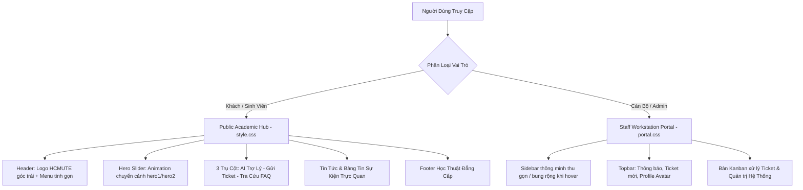

# 🏛️ CHIẾN DỊCH CẢI TỔ TOÀN DIỆN GIAO DIỆN & TRẢI NGHIỆM NGƯỜI DÙNG (UI/UX) - TIẾN ĐỘ 5 (TIENDO5.MD)

> **Dự án:** QAUTE Portal - Cổng Tư Vấn & Hỗ Trợ Học Vụ Sinh Viên HCMUTE  
> **Thời gian khởi tạo:** 30/09/2026  
> **Tài liệu tham chiếu:** `docs/requirements/brief.md`, `docs/team/engineering-rules.md`, `AGENTS.md`  
> **Mục tiêu:** Cải tổ toàn diện hệ thống theo chuẩn nhận diện thương hiệu HCMUTE (Crimson & Academic Elegance), tích hợp tài nguyên đồ họa mới (Logo trường, Hero Slider chuyển ảnh động, AI Pulse Widget), loại bỏ triệt để các thành phần rườm rà gây rối mắt người dùng, và chuẩn hóa cấu trúc Portal dành riêng cho Cán bộ & Sinh viên.

---

## 📑 MỤC LỤC
1. [Khảo Sát & Đánh Giá Tài Nguyên Mới (Static Assets)](#1-khảo-sát--đánh-giá-tài-nguyên-mới-static-assets)
2. [Phân Tích Hiện Trạng & Các Thành Phần Rườm Rà Cần Cải Tổ](#2-phân-tích-hiện-trạng--các-thành-phần-rườm-rà-cần-cải-tổ)
3. [Tầm Nhìn & Triết Lý Thiết Kế Mới (Design System & Philosophy)](#3-tầm-nhìn--triết-lý-thiết-kế-mới-design-system--philosophy)
4. [Kế Hoạch Tác Chiến 5 Giai Đoạn (Implementation Phases)](#4-kế-hoạch-tác-chiến-5-giai-đoạn-implementation-phases)
   - [Giai đoạn 1: Chuẩn hóa Static Assets & Cấu hình Tài nguyên](#giai-đoạn-1-chuẩn-hóa-static-assets--cấu-hình-tài-nguyên)
   - [Giai đoạn 2: Tái cấu trúc Header/Navbar & Đặt Logo HCMUTE](#giai-đoạn-2-tái-cấu-trúc-headernavbar--đặt-logo-hcmute)
   - [Giai đoạn 3: Cải tổ Trang Chủ (Home) với Hero Slider & 3 Trụ Cột](#giai-đoạn-3-cải-tổ-trang-chủ-home-với-hero-slider--3-trụ-cột)
   - [Giai đoạn 4: Tách Biệt Không Gian Trải Nghiệm (Public vs Portal)](#giai-đoạn-4-tách-biệt-không-gian-trải-nghiệm-public-vs-portal)
   - [Giai đoạn 5: Trang Đăng Nhập & AI Floating Widget](#giai-đoạn-5-trang-đăng-nhập--ai-floating-widget)
5. [Bảng Phân Công & Tác Động File (File Impact Matrix)](#5-bảng-phân-công--tác-động-file-file-impact-matrix)
6. [Kế Hoạch Kiểm Thử & Tiêu Chí Nghiệm Thu (Acceptance Criteria)](#6-kế-hoạch-kiểm-thử--tiêu-chí-nghiệm-thu-acceptance-criteria)
7. [Cam Kết Git Workflow & An Toàn Mã Nguồn](#7-cam-kết-git-workflow--an-toàn-mã-nguồn)

---

## 1. KHẢO SÁT & ĐÁNH GIÁ TÀI NGUYÊN MỚI (STATIC ASSETS)

Qua kiểm tra thư mục tài nguyên mới copy qua (`static/`), hệ thống ghi nhận các tài nguyên chủ lực:

```text
static/
├── css/
│   ├── portal.css    # 6.2 KB: Giao diện Portal làm việc chuyên biệt (Sidebar thu gọn/mở rộng khi hover, Topbar, Search pill, Profile avatar)
│   └── style.css     # 9.9 KB: Giao diện Public Landing/Home (Harvard/HCMUTE Crimson tone, Hero Slider, News Cards, Footer đẳng cấp, AI Pulse Button)
└── images/
    ├── hero1.jpg     # 38 KB (WebP: 345 KB) - Ảnh khuôn viên trường góc rộng, chuẩn tỷ lệ Hero Banner
    ├── hero2.jpg     # 303 KB (WebP: 25 KB) - Ảnh tòa nhà trung tâm / giảng đường HCMUTE hiện đại
    └── logo.png      # 8.6 KB - Huy hiệu chính thức Trường Đại học Sư phạm Kỹ thuật TP.HCM (HCMUTE)
```

### Đánh giá kỹ thuật:
- **`logo.png`**: Độ phân giải sắc nét, nền trong suốt (PNG transparent), thích hợp đặt ở góc trên cùng bên trái Navbar trên mọi màn hình.
- **`hero1` & `hero2`**: Hai ảnh phối cảnh đại học có chiều sâu quang học lớn. Kết hợp cùng các lớp phủ `.hero-overlay` tạo độ tương phản cao, làm nổi bật thanh tìm kiếm và slogan học vụ.
- **`style.css` & `portal.css`**: Đã định nghĩa sẵn các biến màu CSS Variables chuẩn nhận diện học đường:
  - `--crimson: #A51C30;` (Màu đỏ truyền thống Sư phạm Kỹ thuật)
  - `--dark-crimson: #8a1525;`
  - `--portal-bg: #f4f7fa;`
  - `--text-main: #222222;`

---

## 2. PHÂN TÍCH HIỆN TRẠNG & CÁC THÀNH PHẦN RƯỜM RÀ CẦN CẢI TỔ

### ❌ Hiện trạng gây rối cho người dùng (Cognitive Friction):
1. **Navbar bị "quá tải" (Overcrowded Navigation):**
   - Thanh Menu đang nhồi nhét tới 9 mục cùng lúc: *Trang Chủ, Bảng Tin, Diễn Đàn, Tra Cứu FAQ, Gửi Yêu Cầu, Ticket Của Tôi, Bàn Xử Lý Staff, Duyệt Bài, Quản Trị*.
   - Sinh viên và khách bị ngợp, không biết nên bấm vào đâu khi cần hỗ trợ gấp.
   - Chưa có logo trường, chỉ dùng chữ viết tắt "QAUTE" thô sơ.
2. **Trang chủ đơn điệu & văn bản khô khan:**
   - Dùng một khối banner xanh nước biển đơn giản, thiếu sinh khí và tinh thần học đường HCMUTE.
   - Các khoa/phòng ban chỉ là các hộp văn bản xám tĩnh, không có ảnh đại diện, không tạo được cảm giác tin cậy.
3. **Trộn lẫn không gian Public và Workspace:**
   - Cán bộ và Admin phải dùng chung thanh menu của sinh viên, không có cảm giác một bàn làm việc chuyên nghiệp (Desk/Portal).
4. **Trang đăng nhập thô sơ:**
   - Trang login hiện tại là form trắng đơn điệu, chưa tận dụng hình nền khuôn viên trường `hero1.jpg` với lớp kính mờ (Glassmorphism) đẳng cấp.

---

## 3. TẦM NHÌN & TRIẾT LÝ THIẾT KẾ MỚI (DESIGN SYSTEM & PHILOSOPHY)



- **Màu sắc chủ đạo:** Đỏ Crimson (`#A51C30`) kết hợp Trắng Tinh Khiết (`#FFFFFF`) và Xám Học Thuật (`#F4F7FA`).
- **Typography:** Phông chữ không chân `Inter` cho nội dung số liệu hiện đại kết hợp phông có chân `Playfair Display` cho các tiêu đề học thuật trang nghiêm.
- **Zero Full-Page Refresh:** 100% các thao tác tìm kiếm, chuyển tab, thả tim, gửi phản hồi đều qua AJAX và Toast góc phải.

---

## 4. KẾ HOẠCH TÁC CHIẾN 5 GIAI ĐOẠN (IMPLEMENTATION PHASES)

### 🚀 Giai đoạn 1: Chuẩn hóa Static Assets & Cấu hình Tài nguyên
- **Mục tiêu:** Đồng bộ toàn bộ tài nguyên vào `src/main/resources/static/` để Spring Boot phục vụ chính xác qua các URL `/images/*` và `/css/*`.
- **Nội dung thực hiện:**
  1. Tạo cấu trúc thư mục `src/main/resources/static/images/` và `src/main/resources/static/css/`.
  2. Đồng bộ các file: `logo.png`, `hero1.jpg`, `hero1.webp`, `hero2.jpg`, `hero2.webp`, `portal.css`, `style.css`.
  3. Cấu hình Spring Resource Handler (nếu cần cache-busting hoặc static mapping).

### 🚀 Giai đoạn 2: Tái cấu trúc Header/Navbar & Đặt Logo HCMUTE
- **Mục tiêu:** Đặt Logo HCMUTE sắc nét ở góc trên bên trái; tinh gọn thanh điều hướng để sinh viên thao tác nhanh nhất.
- **Nội dung thực hiện:**
  1. Chỉnh sửa `layout/navbar.html`:
     - Góc trên cùng bên trái: Thêm thẻ `` trỏ đến `@{/images/logo.png}` với chiều cao cân đối (48px - 52px), đi kèm nhãn thương hiệu *"TRƯỜNG ĐH SƯ PHẠM KỸ THUẬT TP.HCM - QAUTE PORTAL"*.
     - Tối giản Menu công khai cho Sinh viên: Chỉ giữ lại **Trang Chủ**, **Bảng Tin**, **Hỏi Đáp FAQ**, **Gửi Ticket**.
     - Gom các chức năng Cán bộ/Admin vào một nút duy nhất: **"Bàn Làm Việc Cán Bộ"** (Staff Desk) hoặc Dropdown có biểu tượng khiên bảo mật.
  2. Bổ sung liên kết nhanh đến **Trợ Lý AI** trực tiếp trên Header.

### 🚀 Giai đoạn 3: Cải tổ Trang Chủ (Home) với Hero Slider & 3 Trụ Cột
- **Mục tiêu:** Thay đổi hoàn toàn diện mạo trang chủ thành Cổng Thông Tin Hiện Đại với animation chuyển ảnh nền tự động.
- **Nội dung thực hiện:**
  1. **Hero Slider Section (`home.html`):**
     - Tạo 2 layer `.hero-slide` chứa background `hero1.jpg` và `hero2.jpg`.
     - Thêm script chuyển ảnh tự động (Auto-play carousel) sau mỗi 5 giây với hiệu ứng làm mờ êm dịu (`transition: opacity 1.5s ease-in-out`).
     - Đặt thanh tìm kiếm đa năng (Omni Search Box): Sinh viên nhập từ khóa để tự động tìm câu hỏi FAQ hoặc chuyển tiếp sang AI Chat.
  2. **Khối 3 Trụ Cột Hỗ Trợ (Core Services):**
     - *Trụ cột 1:* **Trợ Lý Học Vụ AI (24/7)** - Giải đáp quy chế tức thì, trích dẫn quy định nhà trường.
     - *Trụ cột 2:* **Tiếp Nhận Ticket Đào Tạo & CTSV** - Cam kết thời hạn xử lý SLA 24h - 72h.
     - *Trụ cột 3:* **Diễn Đàn & Bảng Tin Học Vụ** - Trao đổi thông tin chính thức giữa Nhà trường và Sinh viên.
  3. **Bảng Tin Đào Tạo Nổi Bật (News Grid):**
     - Thiết kế các thẻ tin (`.news-card`) có ngày đăng nổi bật, tóm tắt nội dung và ảnh preview hiện đại.
  4. **Danh mục Khoa/Phòng Ban Trực quan:**
     - Thiết kế lại các thẻ Khoa thành Card có huy hiệu, phòng làm việc, email và nút "Liên hệ hỗ trợ".

### 🚀 Giai đoạn 4: Tách Biệt Không Gian Trải Nghiệm (Public vs Portal)
- **Mục tiêu:** Tạo trải nghiệm làm việc riêng biệt cho Cán bộ (Staff/Admin) bằng bộ CSS `portal.css`.
- **Nội dung thực hiện:**
  1. Xây dựng layout riêng `layout/portal-layout.html`:
     - Thanh điều hướng bên trái (Sidebar) tự động thu gọn (`80px`) hiển thị icon sang trọng và bung rộng (`260px`) khi rê chuột (hover).
     - Topbar hiển thị thanh tìm kiếm Ticket nội bộ, chuông thông báo có badge số đỏ, và thông tin tài khoản cán bộ.
  2. Áp dụng layout này cho:
     - Màn hình Quản trị Admin: `/admin/dashboard`, `/admin/users`, `/admin/departments`.
     - Màn hình Xử lý Ticket Staff: `/staff/tickets`.
     - Màn hình Duyệt bài viết Moderation: `/moderation/posts`.

### 🚀 Giai đoạn 5: Trang Đăng Nhập & AI Floating Widget
- **Mục tiêu:** Nâng cấp trang đăng nhập và nút Chat AI nổi trên màn hình.
- **Nội dung thực hiện:**
  1. Cải tiến trang `templates/auth/login.html`:
     - Sử dụng class `.login-body` với hình nền đại học phủ gradient sang trọng.
     - Form đăng nhập thiết kế thẻ nổi viền bo tròn, hỗ trợ chuyển đổi giữa Sinh viên / Cán bộ.
  2. Tích hợp nút Chatbot AI chuyển động (`.ai-widget-btn`):
     - Hiệu ứng phát sáng lượn sóng (`pulse-ring`) góc dưới bên phải màn hình.
     - Bấm vào mở hộp thoại Chatbot AI thông minh tức thì mà không cần chuyển trang.

---

## 5. BẢNG PHÂN CÔNG & TÁC ĐỘNG FILE (FILE IMPACT MATRIX)

| Tên File | Loại Tác Động | Mô Tả Thay Đổi |
| :--- | :---: | :--- |
| `src/main/resources/static/**` | **Thêm mới / Đồng bộ** | Đưa toàn bộ file từ `static/` (images, css) vào đúng vị trí classpath của Spring Boot. |
| `templates/layout/navbar.html` | **Tái cấu trúc** | Nhúng `logo.png` góc trên trái, tinh gọn menu sinh viên, gom cụm chức năng cán bộ. |
| `templates/layout/main.html` | **Nâng cấp** | Nhúng `style.css`, phông chữ `Playfair Display`, cập nhật màu sắc thương hiệu. |
| `templates/home.html` | **Cải tổ lớn** | Triển khai Hero Slider 2 ảnh animation, thanh tìm kiếm thông minh, 3 trụ cột hỗ trợ, loại bỏ text rườm rà. |
| `templates/auth/login.html` | **Nâng cấp** | Sử dụng layout login mới với background khuôn viên trường và form đăng nhập hiện đại. |
| `templates/ai/chat-widget.html`| **Nâng cấp** | Tích hợp nút bấm `.ai-widget-btn` có hiệu ứng sóng xung điện (pulse-ring). |
| `templates/layout/portal-layout.html` | **Tạo mới (Dự kiến)** | Layout chuyên dụng cho Staff/Admin ứng dụng `portal.css`. |
| `docs/progress/roadmap_and_logs.md` | **Cập nhật** | Ghi nhận mốc Sprint 5 về Cải tổ UI/UX & Tối ưu hóa Trải nghiệm người dùng. |

---

## 6. KẾ HOẠCH KIỂM THỬ & TIÊU CHÍ NGHIỆM THU (ACCEPTANCE CRITERIA)

### Tiêu chí nghiệm thu (Checklist):
- [ ] **Hiển thị Logo:** Logo trường HCMUTE hiển thị sắc nét ở góc trên bên trái Navbar trên cả máy tính (Desktop) và điện thoại (Mobile).
- [ ] **Hero Slider Hoạt Động:** Trang chủ hiển thị 2 ảnh khuôn viên trường chuyển cảnh mượt mà, không giật lag.
- [ ] **Giao Diện Không Rườm Rà:** Sinh viên truy cập vào là thấy ngay 3 lối đi chính (Hỏi AI, Tạo Ticket, Xem Thông báo) trong vòng 3 giây đầu tiên (quy tắc 3-second rule).
- [ ] **Độ Tương Thích Trình Duyệt:** Chạy mượt mà trên Chrome, Edge, Safari, Firefox; hỗ trợ hiển thị đáp ứng (Responsive) hoàn hảo.
- [ ] **Kỷ luật DTO & Không Lỗi Hệ Thống:** Mọi dữ liệu hiển thị trên View tuân thủ `OSIV = false`, không phát sinh `LazyInitializationException`.
- [ ] **Build & Test:** Chạy lệnh `mvn clean test` đạt 100% BUILD SUCCESS (toàn bộ 50+ unit/integration test cases vượt qua).

---

## 7. CAM KẾT GIT WORKFLOW & AN TOÀN MÃ NGUỒN

Tuân thủ nghiêm ngặt quy định tại `AGENTS.md`:
1. Sau khi hoàn thành và xác minh từng giai đoạn trong chiến dịch, tự động chạy lệnh terminal:
   ```bash
   git add .
   git commit -m "feat(ui): overhaul hcmute portal branding with hero slider and logo"
   git push origin <tên-nhánh>
   ```
2. Tuyệt đối không dùng cờ `--force`.
3. Giữ gìn sự an toàn của toàn bộ logic nghiệp vụ (Security, SLA Engine, AI RAG, Ticket Engine) đã hoàn thành ở các Sprint trước.
