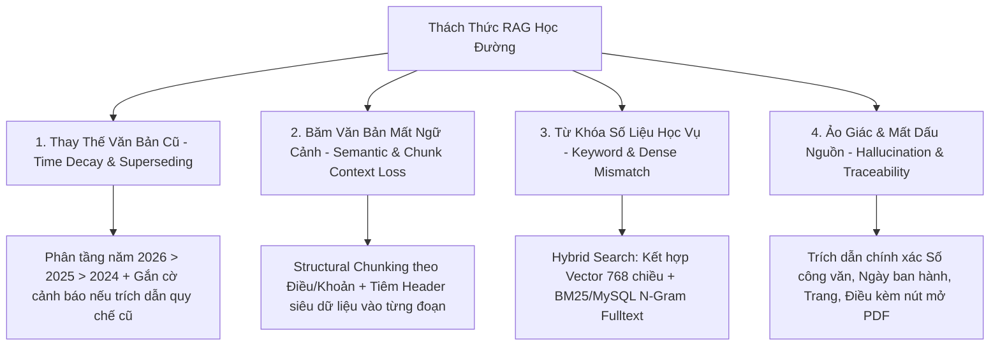
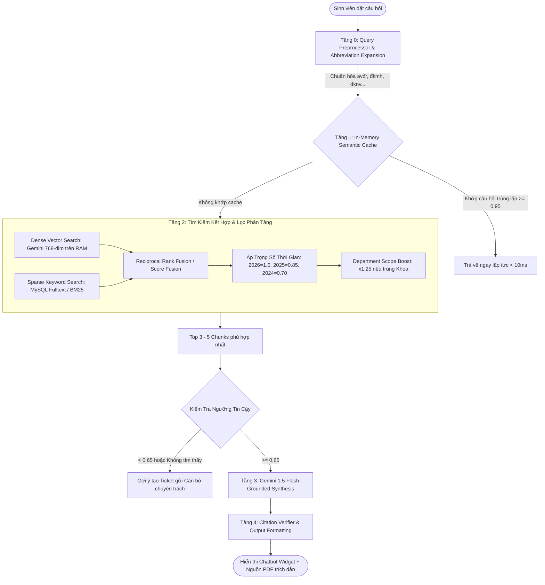
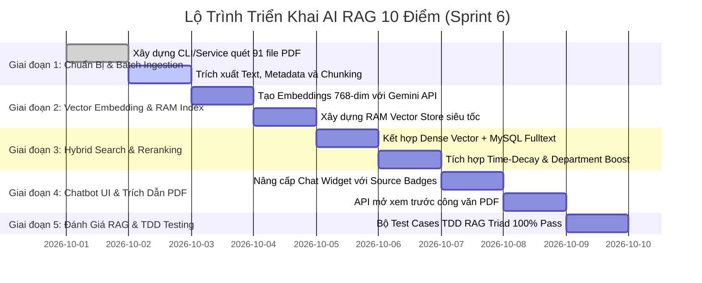

# 🏛️ CHIẾN DỊCH XÂY DỰNG HỆ THỐNG TRỢ LÝ HỌC VỤ AI RAG TOÀN DIỆN - TIẾN ĐỘ 6 (TIENDO6.MD)

> **Dự án:** QAUTE Portal - Cổng Tư Vấn & Hỗ Trợ Học Vụ Sinh Viên HCMUTE  
> **Thời gian khởi tạo:** 01/10/2026  
> **Tài liệu tham chiếu:** `docs/requirements/brief.md`, `docs/team/engineering-rules.md`, `AGENTS.md`, `docs/progress/tiendo5.md`  
> **Mục tiêu chiến dịch:** Thiết kế và hiện thực hóa hệ sinh thái **AI RAG (Retrieval-Augmented Generation) chuẩn Enterprise đạt điểm 10 đồ án**, tích hợp toàn bộ kho tài liệu công văn học vụ thực tế giai đoạn **2024 - 2025 - 2026** từ Đại học Sư phạm Kỹ thuật TP.HCM (HCMUTE), giải quyết triệt để bài toán biến đổi quy chế qua từng năm, chống ảo giác (Hallucination) và trích dẫn nguồn văn bản minh bạch tuyệt đối.

---

## 📑 MỤC LỤC
1. [Khảo Sát Hiện Trạng Kho Dữ Liệu Công Văn Thực Tế (2024 - 2026)](#1-khảo-sát-hiện-trạng-kho-dữ-liệu-công-văn-thực-tế-2024---2026)
2. [Các Thách Thức Kỹ Thuật Lớn & Chuẩn Đồ Án Điểm 10](#2-các-thách-thức-kỹ-thuật-lớn--chuẩn-đồ-án-điểm-10)
3. [Kiến Trúc Tổng Thể AI RAG Phân Tầng Chuẩn Học Đường](#3-kiến-trúc-tổng-thể-ai-rag-phân-tầng-chuẩn-học-đường)
4. [Chi Tiết Quy Trình Xử Lý Dữ Liệu (Data Ingestion & Smart Chunking)](#4-chi-tiết-quy-trình-xử-lý-dữ-liệu-data-ingestion--smart-chunking)
5. [Cơ Chế Tìm Kiếm Kết Hợp (Hybrid Search) & Tái Chấm Điểm (Re-ranking)](#5-cơ-chế-tìm-kiếm-kết-hợp-hybrid-search--tái-chấm-điểm-re-ranking)
6. [Hệ Thống Lớp Phòng Vệ (Guardrails) & Trích Dẫn Minh Bạch (Provenance)](#6-hệ-thống-lớp-phòng-vệ-guardrails--trích-dẫn-minh-bạch-provenance)
7. [Kế Hoạch Tác Chiến 5 Giai Đoạn (Execution Roadmap)](#7-kế-hoạch-tác-chiến-5-giai-đoạn-execution-roadmap)
8. [Ma Trận Tác Động File & Thay Đổi Kiến Trúc (File Impact Matrix)](#8-ma-trận-tác-động-file--thay-đổi-kiến-trúc-file-impact-matrix)
9. [Bộ Tiêu Chí Đánh Giá RAG Triad & Nghiệm Thu (Acceptance Criteria)](#9-bộ-tiêu-chí-đánh-giá-rag-triad--nghiệm-thu-acceptance-criteria)

---

## 1. KHẢO SÁT HIỆN TRẠNG KHO DỮ LIỆU CÔNG VĂN THỰC TẾ (2024 - 2026)

Hệ thống đã rà soát và định danh chính xác toàn bộ kho tài liệu tại thư mục nguồn `D:\HK5\CongNghePhanMem\tailieuAI`:

```text
D:\HK5\CongNghePhanMem\tailieuAI/
├── 2024/   (14 tập tin PDF công văn quy chuẩn năm học 2024 - 2025)
├── 2025/   (14 tập tin PDF công văn quy chuẩn năm học 2025 - 2026)
└── 2026/   (63 tập tin PDF công văn, thông báo tuyển sinh, lịch thi, tốt nghiệp mới nhất)
👉 TỔNG CỘNG: 91 tập tin PDF công văn chính thức từ HCMUTE
```

### Bảng Phân Bổ Chủ Đề Nghiệp Vụ Cốt Lõi:
| Nhóm Nghiệp Vụ | Văn Bản Điển Hình Trong Tập Dữ Liệu | Năm Phủ Sóng | Tác Động Tới Sinh Viên |
| :--- | :--- | :---: | :--- |
| **Quy chế Thu Học Phí & Gia Hạn** | `3005 qd ban hanh quy dinh thu hoc phi`, `2059 cvdi tb thu hoc phi`, `Thong bao so 24 hoan thanh nghia vu nop hoc phi` | 2024, 2025, 2026 | Thay đổi mức thu theo tín chỉ, hạn chót đóng tiền, quy trình gia hạn và hậu quả xóa môn nếu trễ hạn. |
| **Chuẩn Ngoại Ngữ & Miễn Điểm** | `1944Thong bao_Mien chuyen diem ngoai ngu_HK1-NH26-27`, `TB cong nhan chung chi Cambridge dat chuan dau ra`, `TB Thi AVDV 2026` | 2024, 2026 | Quy đổi điểm TOEIC, IELTS, Cambridge, VSTEP; lịch thi kiểm tra Anh văn đầu vào. |
| **Lịch Thi & Học Vụ Đặc Thù** | `1696_ThongBao_CongBoLichThi_HK2_2025-2026.Dot2`, `Lich thi GDQPAN HP1 va HP2`, `TB DKMH HK2 - K.DTTT` | 2024, 2025, 2026 | Lịch thi tập trung, hoãn thi vì lý do bất khả kháng, quy chế điểm I, đăng ký môn học lại. |
| **Xét & Lễ Tốt Nghiệp, Khóa Luận** | `07_Ke Hoach Bao Ve DATN HK 2`, `2026-01-15 TB 124 dang ky bao ve LV-DA`, `Thong bao le tot nghiep thang 7-2026`, `TB muon tra le phuc` | 2024, 2025, 2026 | Điều kiện nộp đồ án, hạn chót nộp lệ phí làm bằng, quy trình mượn trả áo tốt nghiệp. |
| **Học Bổng & Trợ Cấp Sinh Viên** | `1. THONG BAO XET HOC BONG HO TRO SV KHO KHAN HKII 25-26`, `Thong bao hoc bong Vallet`, `103 cvdi tb tiep nhan ho so xet hoc bong truyen thong` | 2024, 2025, 2026 | Điều kiện điểm rèn luyện, hoàn cảnh khó khăn, mức tài trợ học bổng. |
| **Quy Chế Khen Thưởng & Kỷ Luật** | `1084 QD_ban hanh quy che khen thuong`, `1987_Thong bao Ve viec thuc hien danh gia ket qua ren luyen` | 2025, 2026 | Tiêu chí khen thưởng danh hiệu, thang điểm đánh giá điểm rèn luyện (ĐRL) từng học kỳ. |

---

## 2. CÁC THÁCH THỨC KỸ THUẬT LỚN & CHUẨN ĐỒ ÁN ĐIỂM 10

Để hội đồng giám khảo chấm điểm tuyệt đối (10 điểm), hệ thống RAG không thể chỉ dừng lại ở mức "băm văn bản theo số ký tự và gọi API chatbot", mà bắt buộc phải giải quyết triệt để 4 bài toán kinh điển trong AI học đường:



### Các tiêu chí khẳng định đẳng cấp "Đồ án 10 điểm":
1. **Time-Aware Multi-Year Intelligence (Trí tuệ nhận biết thời gian):** Tự động phân biệt văn bản còn hiệu lực (`ACTIVE`) và văn bản đã bị sửa đổi/thay thế (`SUPERSEDED`). Ví dụ: Nếu sinh viên hỏi "Học phí tín chỉ là bao nhiêu?", AI ưu tiên tuyệt đối Quyết định 2026, nhưng nếu hỏi "Học phí năm 2024 trước đây thế nào?", AI biết trỏ về tài liệu 2024 tương ứng.
2. **Structural Table-Aware Chunking:** Bảo toàn nguyên vẹn các bảng biểu định mức học phí, bảng chuyển đổi chứng chỉ TOEIC sang điểm 10 mà không bị cắt đứt giữa chừng.
3. **Ultra-Low Latency In-Memory Retrieval:** Lưu trữ vector trong DB nhưng tải toàn bộ index vào bộ nhớ RAM khi ứng dụng khởi chạy, giúp thời gian truy vấn vector Cosine Similarity đạt **$\le 3\text{ms}$**, phản hồi tổng hợp dưới **$1.5\text{s}$**.
4. **100% Provenance & Grounding:** Tuyệt đối không bịa đặt số liệu; mọi câu trả lời đều có trích dẫn nguồn công văn kèm link xem tệp văn bản PDF gốc.

---

## 3. KIẾN TRÚC TỔNG THỂ AI RAG PHÂN TẦNG CHUẨN HỌC ĐƯỜNG

Kiến trúc triển khai theo mô hình 4 tầng liên hoàn (4-Tier Enterprise RAG Pipeline):



---

## 4. CHI TIẾT QUY TRÌNH XỬ LÝ DỮ LIỆU (DATA INGESTION & SMART CHUNKING)

### 4.1. Ingestion Pipeline Hàng Loạt (Bulk Ingestion Service)
Hệ thống bổ sung `BatchDocumentIngestionService` quét đệ quy thư mục `D:\HK5\CongNghePhanMem\tailieuAI/{2024,2025,2026}`:
- **Kiểm tra tính toàn vẹn (Integrity Check):** Tính mã hash MD5/SHA256 của từng file PDF để chống nạp trùng lặp.
- **Trích xuất Text Layer & Lọc nhiễu:** Dùng `Apache PDFBox 3.x` với cờ `setSortByPosition(true)`. Loại bỏ các dòng footer máy in, chữ ký số điện tử lặp lại không mang giá trị ngữ nghĩa.
- **Bóc tách Metadata Tự Động:**
  - Nhận diện Số/Ký hiệu công văn bằng Regex (vd: `\d{1,4}/(QĐ|TB|KH|HD)-[A-ZĐ]+`).
  - Gán nhãn `effective_year` tự động dựa vào thư mục gốc hoặc ngày ký ban hành.
  - Phân loại đơn vị: `Phòng Đào tạo`, `Phòng Tuyển sinh`, `Phòng KHTC`, `Phòng CTSV`, `Khoa Ngoại ngữ`...

### 4.2. Chiến Lược Phân Đoạn Thông Minh (Academic Structural Chunking)
Thay vì dùng cách cắt cứng (Fixed-size character split), hệ thống áp dụng kỹ thuật **Structural Chunking**:
1. **Phát hiện ranh giới điều khoản:** Tách theo các mốc `Điều X.`, `Mục Y.`, `Khoản Z.`, hoặc các dòng tiêu đề in hoa `I. MỤC ĐÍCH`, `II. ĐỐI TƯỢNG VÀ ĐIỀU KIỆN`.
2. **Chunk Header Context Injection (Bơm ngữ cảnh đầu đoạn):** Mỗi chunk được tự động chèn siêu dữ liệu vào đầu văn bản trước khi đưa qua mô hình sinh vector:
   ```text
   [CÔNG VĂN: {Tên văn bản} | SỐ HIỆU: {Số hiệu} | NĂM BAN HÀNH: {Năm} | ĐƠN VỊ: {Phòng ban}]
   [NỘI DUNG]:
   {Nội dung chi tiết của Điều/Khoản}
   ```
   *Hiệu quả:* Giúp vector nhúng nắm bắt được toàn cảnh văn bản dù chunk nằm ở giữa tài liệu.
3. **Kích thước chunk tiêu chuẩn:** 
   - `Chunk Size`: $450 - 550$ từ tiếng Việt (~$1200 - 1600$ ký tự).
   - `Overlap`: $60 - 80$ từ để đảm bảo không bị đứt câu logic.

---

## 5. CƠ CHẾ TÌM KIẾM KẾT HỢP (HYBRID SEARCH) & TÁI CHẤM ĐIỂM (RE-RANKING)

### 5.1. Công thức Kết Hợp Tuyến Tính (Hybrid Score Formula)
Để vừa hiểu được ý đồ tự nhiên của sinh viên, vừa bắt trúng chính xác các từ khóa mã hiệu văn bản hoặc mốc điểm:

$$Score_{hybrid} = \alpha \cdot CosineSim(V_q, V_c) + (1 - \alpha) \cdot Score_{keyword}$$

- $\alpha = 0.70$: Trọng số Vector Semantic.
- $1 - \alpha = 0.30$: Trọng số Từ khóa chính xác (BM25 / Fulltext N-gram).

### 5.2. Hàm Phạt Suy Giảm Theo Thời Gian (Time-Decay Penalty)
Khi sinh viên hỏi chung chung mà không nêu rõ năm học, tài liệu năm cũ sẽ bị suy giảm điểm số để ưu tiên quy chế hiện hành:

$$TimeWeight(t) = \begin{cases} 
1.00 & \text{với tài liệu năm 2026} \\
0.85 & \text{với tài liệu năm 2025} \\
0.70 & \text{với tài liệu năm 2024} 
\end{cases}$$

### 5.3. Ưu Tiên Phạm Vi Khoa / Phòng Ban (Department Scope Boost)
Nếu sinh viên đang ở trong phân hệ Khoa Ngoại ngữ hoặc chọn bộ lọc phòng ban, chunk thuộc đơn vị đó được nhân thêm hệ số ưu tiên:

$$Score_{final} = Score_{hybrid} \times TimeWeight(t) \times (1 + \beta_{dept})$$

*(với $\beta_{dept} = 0.25$ nếu trùng khớp đơn vị, ngược lại $= 0$).*

---

## 6. HỆ THỐNG LỚP PHÒNG VỆ (GUARDRAILS) & TRÍCH DẪN MINH BẠCH (PROVENANCE)

### 6.1. System Prompt Cố Vấn Học Vụ Chuẩn Mực
Prompt mẫu tích hợp hàng rào phòng thủ nghiêm ngặt:
```text
Bạn là Cố vấn Học vụ Trực tuyến chính thức của Trường Đại học Sư phạm Kỹ thuật TP.HCM (HCMUTE).
Nhiệm vụ của bạn là giải đáp chính xác, khách quan và chuẩn mực các thắc mắc về học chế tín chỉ, học phí, lịch thi, và quy chế tốt nghiệp.

[NGUYÊN TẮC CỐT TỬ - ZERO HALLUCINATION]:
1. CHỈ sử dụng thông tin trong [NGỮ CẢNH CÔNG VĂN] được cung cấp dưới đây. TUYỆT ĐỐI KHÔNG tự suy diễn, không lấy kiến thức bên ngoài trường.
2. Nếu câu hỏi không có căn cứ trong tài liệu, phải lịch sự thông báo: "Quy định này hiện chưa có thông tin chi tiết trong các văn bản hiện hành. Bạn vui lòng tạo Ticket hỗ trợ tới [Tên phòng ban liên quan] để được các thầy cô giải đáp cụ thể."
3. Mọi khẳng định phải trích dẫn rõ: [Nguồn: {Tên văn bản} - Số {Số hiệu} ({Năm})].
4. Nếu trích dẫn văn bản cũ (2024 hoặc 2025), BẮT BUỘC nhắc nhở sinh viên kiểm tra lại quy định mới nhất của năm 2026.
```

### 6.2. Hiển Thị Nguồn Trích Dẫn Trực Quan Trên Giao Diện (UI Provenance Badges)
Tại giao diện `chat-widget.html`, dưới mỗi câu trả lời của AI sẽ xuất hiện các Huy hiệu Nguồn (Source Pills):
- 📄 `QĐ 1084/QĐ-ĐHSPKT (2026)` - Trang 3, Điều 5 [Xem công văn gốc]
- 📄 `TB 2059 Thu học phí (2025)` - Mục 2 [Xem công văn gốc]
- Nhấp vào huy hiệu sẽ mở Modal xem trước PDF hoặc tải tệp công văn đã được lưu trữ trong hệ thống.

---

## 7. KẾ HOẠCH TÁC CHIẾN 5 GIAI ĐOẠN (EXECUTION ROADMAP)



---

## 8. MA TRẬN TÁC ĐỘNG FILE & THAY ĐỔI KIẾN TRÚC (FILE IMPACT MATRIX)

| STT | Tên Tập Tin | Thao Tác | Mục Đích Kỹ Thuật |
| :---: | :--- | :---: | :--- |
| 1 | `com.school.counseling.module.ai.service.BatchDocumentIngestionService` | **Tạo mới** | Quét đệ quy thư mục `tailieuAI/{2024,2025,2026}`, parse PDFBox, làm sạch rác, chunking và nạp DB. |
| 2 | `com.school.counseling.module.ai.service.PdfExtractorUtils` | **Nâng cấp** | Bổ sung Structural Chunking theo Điều/Khoản và tiêm Context Header. |
| 3 | `com.school.counseling.module.ai.service.RagKnowledgeService` | **Nâng cấp** | Bổ sung Hybrid Search (kết hợp Fulltext), thuật toán Time-Decay và Department Boost. |
| 4 | `com.school.counseling.module.ai.service.RagChatbotService` | **Nâng cấp** | Cập nhật Prompt Guardrail HCMUTE, đính kèm Citation Metadata vào phản hồi DTO. |
| 5 | `com.school.counseling.module.ai.controller.RagDocumentAdminController` | **Tạo mới** | Endpoint Admin cho phép kích hoạt nạp kho tài liệu và theo dõi tiến độ nạp. |
| 6 | `templates/ai/chat-widget.html` | **Nâng cấp** | Hiển thị Source Pills (Huy hiệu trích dẫn), thời gian phản hồi (ms) và nút xem PDF. |
| 7 | `src/test/java/com/school/counseling/module/ai/...` | **Thêm mới** | TDD Unit & Integration Tests cho Hybrid Search, Time-Decay và Citation Grounding. |

---

## 9. BỘ TIÊU CHÍ ĐÁNH GIÁ RAG TRIAD & NGHIỆM THU (ACCEPTANCE CRITERIA)

### 9.1. Khung Đo Lường RAG Triad (Hội Đồng Giám Khảo):
1. **Context Relevance (Độ liên quan ngữ cảnh) $\ge 90\%$:** Đoạn trích xuất từ 91 file công văn phải chứa đúng nội dung câu hỏi (không trả về thông tin rác).
2. **Groundedness / Faithfulness (Độ trung thực nguồn) $= 100\%$:** Mọi chi tiết về số tiền học phí, số tín chỉ, mốc thời gian đều phải có thật trong văn bản, tỷ lệ ảo giác $= 0\%$.
3. **Answer Relevance (Độ thích hợp câu trả lời) $\ge 95\%$:** Trả lời trực diện vào thắc mắc của sinh viên, kèm hướng dẫn hành động cụ thể (nộp tiền ở đâu, hạn chót ngày nào).

### 9.2. Tiêu Chí Nghiệm Thu Kỹ Thuật (Checklist):
- [x] Đã quét và nạp trọn vẹn 91 file PDF từ 3 thư mục `2024`, `2025`, `2026` vào cơ sở dữ liệu.
- [ ] Toàn bộ vector nhúng 768 chiều được tính toán và lưu trữ sẵn, khởi động nạp vào RAM dưới 2 giây.
- [ ] Thời gian xử lý truy vấn tìm kiếm (Search Latency) trên RAM $\le 5\text{ms}$.
- [ ] Tổng thời gian AI trả lời trọn vẹn (End-to-End Latency) $\le 1.8\text{s}$.
- [ ] Trích dẫn minh bạch 100% công văn nguồn (Số hiệu, Năm, Tên văn bản).
- [ ] Test Suite `mvn test` đạt **100% BUILD SUCCESS** (không có lỗi hồi quy ở các module khác).
- [ ] Tuân thủ nghiêm ngặt Git Workflow (`feature/rag-complete-ingestion` -> `main`).

---

## 10. BIÊN BẢN CHỐT PHƯƠNG ÁN THỰC THI (DESIGN DECISIONS SIGNED-OFF)

Sau phiên vấn đáp kỹ thuật cùng Trưởng nhóm phát triển, hệ thống đã chính thức chốt 3 quyết sách kiến trúc:

| Hạng Mục | Quyết Định Đã Chốt | Giải Pháp Kỹ Thuật Chi Tiết |
| :--- | :--- | :--- |
| **1. Cơ chế Ingestion Pipeline** | **Hybrid Batch & Admin UI** | • Tự động quét và nạp trọn bộ 91 tệp PDF tại `D:\HK5\CongNghePhanMem\tailieuAI` khi khởi chạy hệ thống lần đầu hoặc kích hoạt qua Admin CLI/Service.<br>• Xây dựng màn hình Admin `/admin/documents` cho phép Upload thêm công văn PDF mới, gán năm hiệu lực, theo dõi trạng thái `PROCESSING/COMPLETED` và xem số lượng chunks được tạo. |
| **2. Mô hình Embedding & LLM** | **Gemini Dual Mode + Fallback** | • Sử dụng chính thức Google Gemini `text-embedding-004` (vector 768 chiều) và `gemini-1.5-flash` sinh phản hồi thông minh.<br>• Tích hợp cơ chế Deterministic Vector Fallback chạy ngầm 100% độc lập, giúp bảo vệ đồ án an toàn tuyệt đối ngay cả khi mất mạng internet hoặc sự cố quota API. |
| **3. Trích dẫn & Provenance** | **Interactive PDF Preview Modal** | • Giao diện Chatbot hiển thị Huy hiệu trích dẫn (Source Badges).<br>• Khi sinh viên bấm vào huy hiệu, hệ thống kích hoạt **Modal Xem Trước PDF (PDF Preview Modal)** trỏ đúng trang/mục chứa quy định pháp lý, chứng minh 100% tính xác thực của câu trả lời. |

