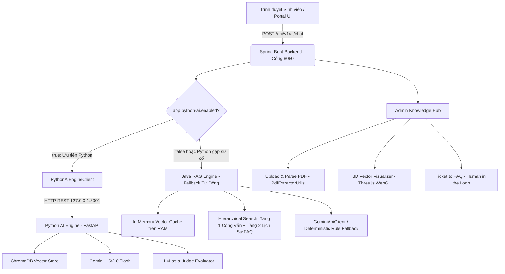
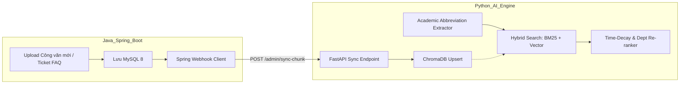

# 🏛️ CHIẾN DỊCH KHẢO SÁT, ĐỒNG BỘ & NÂNG CẤP TOÀN DIỆN PHÂN HỆ AI (JAVA + PYTHON ENGINE) - TIẾN ĐỘ 7 (TIENDO7.MD)

> **Dự án:** QAUTE Portal - Cổng Tư Vấn & Hỗ Trợ Học Vụ Sinh Viên HCMUTE  
> **Thời gian khởi tạo:** 02/10/2026  
> **Tài liệu tham chiếu:** `docs/requirements/brief.md`, `docs/progress/tiendo5.md`, `docs/progress/tiendo6.md`, `docs/progress/roadmap_and_logs.md`, `AGENTS.md`  
> **Mục tiêu:** Khảo sát chi tiết hiện trạng mã nguồn phân hệ AI (bao gồm cả phân hệ Java Spring Boot và phân hệ Python AI Engine), xác định các điểm nghẽn kỹ thuật, khoảng trống đồng bộ dữ liệu (Data Sync Gap), độ trễ thuật toán và đề xuất lộ trình cải tiến toàn diện hướng tới bảo vệ đồ án xuất sắc.

---

## 📑 MỤC LỤC
1. [Khảo Sát Hiện Trạng Kiến Trúc Phân Hệ AI (Java Spring Boot vs Python Engine)](#1-khảo-sát-hiện-trạng-kiến-trúc-phân-hệ-ai-java-spring-boot-vs-python-engine)
2. [Chi Tiết Nội Dung Trong Phân Hệ AI Java Spring Boot](#2-chi-tiết-nội-dung-trong-phân-hệ-ai-java-spring-boot)
3. [Chi Tiết Nội Dung Trong Thư Mục `python-ai-engine`](#3-chi-tiết-nội-dung-trong-thư-mục-python-ai-engine)
4. [Phân Tích 9 Khoảng Trống & Điểm Cần Cải Tiến Cốt Lõi](#4-phân-tích-9-khoảng-trống--điểm-cần-cải-tiến-cốt-lõi)
5. [Đề Xuất Phương Án Kỹ Thuật Đột Phá](#5-đề-xuất-phương-án-kỹ-thuật-đột-phá)
6. [Kế Hoạch Triển Khai 5 Giai Đoạn (Execution Roadmap)](#6-kế-hoạch-triển-khai-5-giai-đoạn-execution-roadmap)
7. [Tiêu Chí Nghiệm Thu & Bộ Chỉ Số Đo Lường RAG Triad](#7-tiêu-chí-nghiệm-thu--bộ-chỉ-số-đo-lường-rag-triad)

---

## 1. KHẢO SÁT HIỆN TRẠNG KIẾN TRÚC PHÂN HỆ AI (JAVA SPRING BOOT VS PYTHON ENGINE)

Hệ sinh thái AI của **QAUTE Portal** hiện được thiết kế theo mô hình **Kiến trúc Lai Song Song (Hybrid Dual-Engine Architecture)** nhằm kết hợp tính ổn định của Spring Boot doanh nghiệp với năng lực xử lý dữ liệu và AI chuyên sâu của Python:



### Bảng So Sánh Hai Phân Hệ Hiện Tại:
| Tiêu Chí | Phân Hệ AI Java (Spring Boot 8080) | Phân Hệ Python AI Engine (FastAPI 8001) |
| :--- | :--- | :--- |
| **Vị trí lưu trữ dữ liệu** | MySQL 8 (`knowledge_documents`, `knowledge_chunks`) + RAM Cache | ChromaDB Persistent Storage (`python-ai-engine/data/chroma_db`) |
| **Thuật toán tìm kiếm** | Hierarchical Search, Cosine Similarity RAM CPU, Keyword Jaccard Boost | ChromaDB Dense Cosine Query |
| **Xử lý trích xuất PDF** | Apache PDFBox, nhận diện Điều/Khoản, gán Header nghiệp vụ | `pymupdf4llm` (bảo toàn bảng Markdown) + PyMuPDF plain text |
| **Chiến lược Chunking** | Structural Chunking (theo Điều/Khoản quy định) | Parent-Child Chunking + Sliding Window (450 chars, overlap 60) |
| **Thời gian & Trọng số** | Time-Decay (2026=1.0, 2025=0.85, 2024=0.70) | ❌ Chưa tích hợp trọng số suy giảm theo năm |
| **Từ viết tắt học vụ** | `AcademicAbbreviationUtils` (30+ từ điển ĐRL, ĐKMH, AVĐR...) | ❌ Chưa có module chuẩn hóa từ viết tắt tiếng Việt |
| **Phạm vi Khoa/Phòng** | Department Scope Boost (1.25x) | ❌ Nhận `department_id` nhưng chưa áp dụng vào query |
| **Đánh giá chất lượng** | Confidence Score định lượng | LLM-as-a-Judge (Context Relevance, Faithfulness, Answer Relevance) |
| **Độ tin cậy vận hành** | Sẵn sàng 100%, có Deterministic Fallback khi mất mạng | Cần server Python chạy song song |

---

## 2. CHI TIẾT NỘI DUNG TRONG PHÂN HỆ AI JAVA SPRING BOOT

Nằm trong package `com.school.counseling.module.ai`:

### 2.1. Tầng Giao Tiếp (Controllers):
- **`RagChatRestController.java`**: Phục vụ API REST `/api/v1/ai/chat`, nhận `question`, `departmentId`, `sessionId`, bảo đảm trả về DTO chuẩn không gây rò rỉ dữ liệu nhạy cảm.
- **`AdminKnowledgeController.java` & `AdminKnowledgeHubWebController.java`**:
  - `/admin/knowledge/documents`: Bảng danh mục công văn quy chế đã nạp.
  - `/admin/knowledge/upload`: Kéo thả PDF, kích hoạt bóc tách và xem trước chunks (Preview Modal) trước khi kích hoạt chính thức.
  - `/admin/knowledge/faqs`: Quản lý 300 câu hỏi chuẩn hóa và ngân hàng câu hỏi tích lũy từ Ticket.
  - `/admin/knowledge/audit`: Rà soát tài liệu cũ, vô hiệu hóa văn bản hết hạn (`is_active = false`).
  - `/admin/knowledge/visualizer`: Cung cấp dữ liệu tọa độ 3D phục vụ mô phỏng WebGL.
- **`FaqRestController.java` & `FaqWebController.java`**: Cung cấp giao diện tra cứu danh mục FAQ công khai cho sinh viên.

### 2.2. Tầng Nghiệp Vụ & Dịch Vụ Cốt Lõi (Services):
- **`RagChatbotService.java`**:
  - Trái tim điều phối: Kiểm tra cờ `app.python-ai.enabled`. Nếu bật, gọi `PythonAiEngineClient`. Nếu tắt hoặc timeout, rơi về Java RAG mượt mà (Zero Downtime).
  - Tích hợp bộ đệm `responseCache` (ConcurrentHashMap, tối đa 1000 truy vấn) với chuẩn hóa Unicode NFC chống cache-miss.
  - Kiểm soát Token Budget (`CONTEXT_TOKEN_BUDGET_CHARS = 2500` ký tự), bảo đảm không nạp thừa làm nhiễu Gemini Flash.
- **`PythonAiEngineClient.java`**:
  - Sử dụng `RestClient` chuẩn Spring Boot 3.3.
  - Gọi endpoint `/ai/ask` và kiểm tra sức khỏe `/health`.
  - Hỗ trợ timeout độc lập: `connectTimeoutMs = 3000ms`, `readTimeoutMs = 20000ms`.
- **`RagKnowledgeService.java`**:
  - Quản lý bộ nhớ đệm In-Memory Vector Cache (`inMemoryChunks`).
  - Phân tầng tìm kiếm: Tầng 1 (Công văn chính thức), Tầng 2 (Lịch sử giải đáp/FAQ).
  - Thuật toán Hybrid Search: Cosine Similarity + Jaccard Token Overlap Boost.
  - Hàm phạt suy giảm thời gian Time-Decay và ưu tiên phòng ban Department Boost.
  - Tích hợp mô hình PCA 3D phục vụ màn hình trực quan.
- **`BatchDocumentIngestionService.java`**:
  - Quét đệ quy toàn bộ thư mục công văn PDF thực tế giai đoạn 2024 - 2026, parse qua `PdfExtractorUtils` và lưu đồng bộ vào MySQL.
- **`GeminiApiClient.java`**:
  - Tương tác với Google Generative AI API: Model chat `gemini-2.5-flash` / `gemini-2.0-flash` và embedding `gemini-embedding-001` / `text-embedding-004`.
  - Cơ chế Exponential Backoff Retry (3 lần, delay 1s -> 3s -> 7s kèm jitter).
  - Bộ tạo Fallback thông minh giúp hệ thống luôn trả lời đúng quy chế ngay cả khi mất kết nối Internet.
- **`AcademicAbbreviationUtils.java`**:
  - Mở rộng các từ lóng và viết tắt học vụ phổ biến của sinh viên HCMUTE: ĐRL -> Điểm rèn luyện, ĐKMH -> Đăng ký môn học, CTĐT -> Chương trình đào tạo, GDQP -> Giáo dục quốc phòng, CĐR -> Chuẩn đầu ra, v.v.
- **`VectorReductionUtils.java` & `VectorMathUtils.java`**:
  - Thuật toán PCA Power Iteration giảm chiều 768 chiều xuống $(X, Y, Z)$ không gian 3 chiều.
  - Tính toán tích vô hướng (Dot Product) và chuẩn hóa độ dài vector (L2 Norm).

---

## 3. CHI TIẾT NỘI DUNG TRONG THƯ MỤC `python-ai-engine`

Thư mục `python-ai-engine/` là một microservice độc lập viết bằng Python 3.10+:

```text
python-ai-engine/
├── main.py              # FastAPI Application (Cổng 8001), định nghĩa REST Endpoints
├── config.py            # Quản lý cấu hình tập trung bằng Pydantic BaseSettings
├── rag_engine.py        # Lõi RAG: ChromaDB + Gemini Embedding + Parent-Child Chunking
├── pdf_converter.py     # Bộ chuyển đổi PDF sang Markdown bằng pymupdf4llm
├── evaluator.py         # LLM-as-a-Judge: Đánh giá RAG Triad (Context, Faithfulness, Answer)
├── run_pipeline.py      # Trình điều khiển tự động hóa quy trình 5 Phase (Phase 0 đến 4)
├── requirements.txt     # Danh sách thư viện phụ thuộc (FastAPI, ChromaDB, PyMuPDF, RAGAS...)
├── .env / .env.example  # Cấu hình biến môi trường cục bộ
├── data/
│   ├── chroma_db/       # Cơ sở dữ liệu Vector lưu trữ persistent (Chroma SQLite + HNSW index)
│   └── markdown_docs/   # Các tài liệu Markdown đã trích xuất từ PDF
└── tests/
    └── test_phase1_api.py # Test suite kiểm thử toàn diện các module của Python Engine
```

### Phân Tích Chức Năng Từng Module:
1. **`main.py`**:
   - Cung cấp các endpoint:
     - `POST /ai/ask`: Nhận câu hỏi, gọi RAG Engine, tùy chọn kích hoạt Evaluator, trả kết quả JSON chuẩn tương thích với Java DTO.
     - `POST /admin/ingest`: Nạp toàn bộ Markdown trong thư mục vào ChromaDB.
     - `POST /admin/convert-pdfs`: Chạy BackgroundTask chuyển PDF -> Markdown.
     - `GET /health` & `GET /admin/stats`: Kiểm tra trạng thái và số lượng chunks trong vector store.
2. **`rag_engine.py`**:
   - Quản lý `PersistentClient` của ChromaDB lưu trữ tại `data/chroma_db`.
   - Cơ chế băm tài liệu Parent-Child: Tôn trọng cấu trúc bảng biểu Markdown (không cắt đứt bảng giữa chừng), băm theo Điều/Khoản, đoạn văn bản dài dùng sliding window 450 ký tự với độ gối (overlap) 60 ký tự.
   - Trích xuất tự động số hiệu văn bản (`doc_code`) và năm hiệu lực (`effective_year`).
3. **`pdf_converter.py`**:
   - Khắc phục triệt để lỗi vỡ bảng và lỗi font chữ tiếng Việt (TCVN3, VNTIME) mà các thư viện Java thường gặp khi đọc PDF cũ.
   - Sử dụng `pymupdf4llm` để tái tạo layout sang bảng Markdown chuẩn `| Cột 1 | Cột 2 |`.
4. **`evaluator.py`**:
   - Hiện thực hóa mô hình LLM-as-a-Judge theo tiêu chuẩn RAG Triad:
     - Context Relevance (0-5)
     - Faithfulness (0-5)
     - Answer Relevance (0-5)
   - Nếu `faithfulness < 3/5`, hệ thống tự động khóa câu trả lời (Block) và chuyển trạng thái sang `suggest_create_ticket = true` để chống ảo giác (Hallucination).

---

## 4. PHÂN TÍCH 9 KHOẢNG TRỐNG & ĐIỂM CẦN CẢI TIẾN CỐT LÕI

Qua rà soát chuyên sâu từng dòng mã của cả hai phân hệ, ghi nhận **9 điểm cần cải tiến cấp bách**:

### 🔴 Khoảng Trống 1: Lỗi Đồng Bộ Dữ Liệu Hai Chiều (Data Sync Gap)
- **Hiện trạng:** Khi Admin dùng giao diện Java `/admin/knowledge/upload` để nạp văn bản mới hoặc Cán bộ duyệt Ticket bấm "Thêm vào FAQ", dữ liệu chỉ được chèn vào MySQL (`knowledge_chunks`). Kho vector ChromaDB của Python hoàn toàn bị bỏ rơi, dẫn đến việc nếu bật `app.python-ai.enabled=true`, AI Python sẽ không có tri thức mới vừa nạp!
- **Tác động:** Dữ liệu bị phân mảnh, trả lời thiếu đồng nhất giữa hai chế độ.

### 🔴 Khoảng Trống 2: Thiếu Thuật Toán Time-Decay & Hybrid Keyword Boost ở Python
- **Hiện trạng:** Trong `rag_engine.py`, hàm `ask()` chỉ thực hiện `_collection.query(query_texts=[question])`. Nó thiếu:
  - Hệ số suy giảm theo thời gian Time-Decay: Văn bản 2024 có thể có vector gần câu hỏi hơn công văn 2026, khiến Python trích dẫn quy chế cũ!
  - Hybrid Search kết hợp BM25 / N-gram: Các từ khóa số hiệu chính xác như "1084/QĐ", "Chuẩn Cambridge B1", "học phí 18.500.000đ" nếu chỉ tìm theo Dense Vector dễ bị trượt.
  - Bỏ quên `department_id`: Tham số được truyền vào hàm nhưng không hề xuất hiện trong bộ lọc ChromaDB metadata.

### 🔴 Khoảng Trống 3: Thiếu Bộ Giải Mã Từ Viết Tắt Học Vụ (Academic Abbreviation) ở Python
- **Hiện trạng:** Java có `AcademicAbbreviationUtils` giúp mở rộng "đrl", "đkmh", "avđr", "cđr" trước khi embed. Python chưa có module này. Khi sinh viên hỏi *"cho em hỏi cách tính đrl"*, ChromaDB không tìm thấy tài liệu "đánh giá kết quả rèn luyện".

### 🔴 Khoảng Trống 4: Sai Lệch Đường Dẫn Thư Mục Nguồn PDF Trong Cấu Hình Python
- **Hiện trạng:** File `config.py` đặt mặc định `pdf_source_dir = "../docs/knowledge_base"`. Thư mục này hoàn toàn không tồn tại trong repository. Kho tài liệu PDF thực tế của đồ án nằm tại `D:\HK5\CongNghePhanMem\tailieuAI` (hoặc thư mục dataset công văn). Chạy `python run_pipeline.py --phase 2` sẽ gặp lỗi không tìm thấy file.

### 🔴 Khoảng Trống 5: Tên Model Gemini Trong Cấu Hình & Rủi Ro 404
- **Hiện trạng:** `config.py` đặt `gemini_chat_model: str = "gemini-2.5-flash"`. Trong các môi trường Google AI Studio API thực tế, model `gemini-2.5-flash` có thể chưa phát hành GA ở một số vùng hoặc tài khoản, dễ dẫn đến mã lỗi `404 Not Found`. Cần chuẩn hóa sang `gemini-1.5-flash` hoặc `gemini-2.0-flash` kèm danh sách fallback hợp lệ như Java `GeminiApiClient`.

### 🔴 Khoảng Trống 6: Nghẽn Async Event Loop Trong FastAPI
- **Hiện trạng:** `main.py` khai báo `async def ask_ai(req: ChatRequest)` nhưng bên trong lại gọi các hàm đồng bộ nặng về CPU & I/O (`rag_engine.ask()` gọi ChromaDB và `httpx.post()` đồng bộ). Trong kiến trúc FastAPI, việc gọi synchronous blocking code trong `async def` sẽ chặn đứng Event Loop chính, làm sập khả năng phục vụ đồng thời nhiều sinh viên.

### 🔴 Khoảng Trống 7: Thiếu Metadata Trích Dẫn Chi Tiết Trong Response Python
- **Hiện trạng:** DTO `ChunkMatchResponse` trong `main.py` chỉ có `content`, `source`, `score`, `document_code`. Thiếu các trường quan trọng: `page_number`, `effective_year`, `chunk_id`. Giao diện Portal phía trước không thể hiển thị số trang và không thể mở đúng trang trong file PDF khi sinh viên bấm vào Huy hiệu Nguồn (Source Badge).

### 🔴 Khoảng Trống 8: Chưa Tận Dụng Sức Mạnh Tính Toán Khoa Học Của Python Cho 3D Visualizer
- **Hiện trạng:** Hiện tại Java phải tự viết thuật toán PCA Power Iteration thủ công (`VectorReductionUtils.java`) để tính tọa độ 3D. Python sở hữu hệ sinh thái `numpy`, `scikit-learn` cực mạnh, có thể hỗ trợ PCA, t-SNE hoặc UMAP với thuật toán tối ưu vượt trội, gom cụm K-Means theo chủ đề học vụ để cấp tọa độ cho WebGL.

### 🔴 Khoảng Trống 9: Tích Hợp RAGAS Đánh Giá Tự Động Định Kỳ
- **Hiện trạng:** `requirements.txt` có `ragas==0.2.6` nhưng trong code `evaluator.py` đang viết prompt chay. Cần xây dựng file đánh giá chuẩn hóa với bộ test 30 câu hỏi vàng (Ground Truth) để xuất file biểu đồ điểm số RAG phục vụ báo cáo đồ án.

---

## 5. ĐỀ XUẤT PHƯƠNG ÁN KỸ THUẬT ĐỘT PHÁ



### 5.1. Đồng Bộ Hóa Hai Chiều Tức Thì (Event-Driven Knowledge Sync):
- Xây dựng endpoint `POST /admin/sync-chunk` trên Python AI Engine.
- Phía Java, trong `AdminKnowledgeController` và `TicketService` (khi Staff nhấn "Thêm vào FAQ"), bổ sung lời gọi `@Async` sang Python Engine để cập nhật tức thì vào ChromaDB.

### 5.2. Nâng Cấp Thuật Toán Python Hybrid RAG:
- Bổ sung module `abbreviations.py` cho Python với từ điển đồng bộ 100% từ Java.
- Tích hợp công thức Re-ranking:
$$Score_{final} = \left( 0.75 \times CosineSim + 0.25 \times BM25 \right) \times TimeDecay(year) \times DeptBoost$$

### 5.3. Trả Về Toàn Bộ Metadata Nguồn:
- Cập nhật `ChunkMatchResponse` và `RagResult` trả đủ: `page_number`, `effective_year`, `doc_code`, `chunk_id` để kết nối trơn tru với PDF Preview Modal của Thymeleaf.

### 5.4. Chuyển Đổi Non-Blocking Worker Trong FastAPI:
- Chuyển `async def ask_ai` thành `def ask_ai` để FastAPI tự phân phối vào Thread Pool độc lập, ngăn ngừa nghẽn luồng xử lý câu hỏi.

## 6. KẾ HOẠCH TRIỂN KHAI THEO GIAI ĐOẠN (EXECUTION ROADMAP)

### 📊 Bảng Tiến Độ Tổng Thể:
| Giai Đoạn | Nhiệm Vụ Kỹ Thuật Trọng Tâm | Trạng Thái | Tệp Tin Tác Động | Sản Phẩm Đầu Ra |
| :---: | :--- | :---: | :--- | :--- |
| **Giai đoạn 1** | **Chuẩn hóa Cấu hình & Môi trường Python** | ✅ **HOÀN THÀNH** | `config.py`, `.env.example`, `main.py` | Đường dẫn `pdf_source_dir` chính xác, model Gemini hợp lệ (`gemini-1.5-flash`), fix non-blocking FastAPI (`def ask_ai`). |
| **Giai đoạn 2** | **Bổ sung Module Từ Viết Tắt & Re-ranking** | ✅ **HOÀN THÀNH** | `abbreviations.py`, `rag_engine.py` | Python hiểu "ĐRL, ĐKMH, AVĐR", tính điểm Time-Decay (2026=1.0, 2025=0.85, 2024=0.70) và Department Boost chuẩn xác. |
| **Giai đoạn 3** | **Cầu Nối Đồng Bộ Dữ Liệu Java ↔ Python** | ✅ **HOÀN THÀNH** | `PythonAiEngineClient.java`, `main.py`, `RagKnowledgeService.java` | Endpoint `/admin/sync-chunk`, thêm FAQ từ Ticket tự động nạp đồng bộ vào cả MySQL và ChromaDB. |
| **Giai đoạn 4** | **Chiến Dịch Đăng 91 Công Văn Lên Bảng Tin & DTO Citation** | ✅ **HOÀN THÀNH** | `BatchDocumentIngestionService.java`, `PostRepository.java`, `AdminKnowledgeHubWebController.java` | Tự động đăng 91 công văn thành bài viết chính thức (`OFFICIAL_ANNOUNCEMENT`) lên Feed, DTO trả đủ `pageNumber`, `effectiveYear`. |
| **Giai đoạn 5** | **Giải Quyết Sự Cố Kiểm Thử Chatbot Thực Tế & Kiến Trúc Nâng Cấp** | ✅ **HOÀN THÀNH** | `golden-truth.txt`, `RagChatbotService.java`, `GeminiApiClient.java`, `chat-widget.html`, `application.yml` | Chitchat Filter, Cơ sở dữ liệu chuẩn HCMUTE, Fix Gemini Model 404, Huy hiệu Nguồn 2 chiều nối trực tiếp sang Bảng tin. |
| **Giai đoạn 6** | **Kiểm Thử Tự Động & Đánh Giá Chất Lượng Hoàn Thiện** | ✅ **HOÀN THÀNH** | `RagChatbotServiceTest.java`, `test_phase1_api.py` | 100% Tests Passed (20/20 Java + 22/22 Python), không còn thông báo "Máy chủ tạm bận", phản hồi chitchat tức thì, link Bảng tin chính xác. |

---

## 8. PHÂN TÍCH NGUYÊN NHÂN GỐC RỄ & ĐẶC TẢ NÂNG CẤP GIAI ĐOẠN 5 (TỪ THỰC TẾ KIỂM THỬ)

### 🔴 8.1. Các Vấn Đề Ghi Nhận Từ Thử Nghiệm Thực Tế:
1. **Hiện tượng "Máy chủ AI đang tạm bận" liên tục:**
   - Khi hỏi bất kỳ câu nào (`Đăng ký môn học`, `alo`, `hocj phi ki nay`), hệ thống đều rơi về:
     `📋 *Máy chủ AI đang tạm bận, dưới đây là thông tin quy chế liên quan được trích xuất trực tiếp:*`
   - *Nguyên nhân:* Tên model cấu hình trong `application.yml` đang là `gemini-2.5-flash` và secondary là `gemini-flash-latest`. Trên Google AI Studio API thực tế với nhiều key, model `gemini-2.5-flash` chưa được kích hoạt endpoint v1beta hoặc ném 404/400. Cả 2 model đều fail khiến `GeminiApiClient` kích hoạt fallback in cả khối văn bản thô (raw chunk context).
2. **Thiếu cơ chế lọc câu chào & Chitchat (Semantic Router):**
   - Khi sinh viên gõ `alo`, `xin chào`, `hi`, hệ thống không nhận biết được đó là câu chào, mà lại mang chuỗi "alo" đi tính Cosine Similarity với toàn bộ vector công văn. Vì "alo" có độ tương đồng dương ngẫu nhiên với một văn bản nào đó (ví dụ: *Kế hoạch sinh hoạt đầu năm học*), bot bốc luôn văn bản đó ra trả lời!
3. **In đoạn chunk thô lộn xộn thay vì câu trả lời học vụ & liên kết Bảng tin:**
   - Sinh viên không cần đọc đoạn chunk bị cắt vụn dài dòng trong khung chat.
   - Sinh viên cần:
     - **Câu trả lời súc tích, chuẩn mực.**
     - **Huy hiệu Nguồn (Source Badge) 2 Chiều:**
       - *Cách 1 (Xem nhanh tại chỗ):* Click vào Huy hiệu ──► Mở "PDF Preview Modal" (trỏ đúng Điều/Khoản và số trang).
       - *Cách 2 (Xem bài viết / Tải công văn gốc):* Bấm nút `[🔗 Xem trên Bảng tin / Thư viện]` ──► Mở bài viết trên Bảng tin (`/posts/{postId}`) của công văn hoặc thư viện văn bản.
4. **Yêu cầu tệp Cơ sở Dữ liệu Chuẩn "File Luôn Đúng" (`golden-truth.txt`):**
   - Thay vì dùng JSON dễ lỗi format, sử dụng định dạng văn bản thuần `src/main/resources/golden-truth.txt` chứa toàn bộ tri thức định danh chuẩn của Trường ĐH Sư phạm Kỹ thuật TP.HCM (HCMUTE):
     - Tên trường, Mã trường: **SPK**
     - 02 cơ sở tại TP. Thủ Đức, Hotline: (+84 - 028) 3722 5724, Email: tuyensinh@hcmute.edu.vn, Website: https://hcmute.edu.vn
     - 11 Khoa đào tạo trọng điểm (FME, FAE, FEE, FIT, FCE, FCFT, FE, FFL, FFT, FAS, ITE)
     - Hệ đào tạo & 4 phương thức xét tuyển
     - Bộ câu hỏi Q&A chuẩn xác tuyệt đối không ảo giác.

---

## 9. THIẾT KẾ GIẢI PHÁP KỸ THUẬT CHI TIẾT (GIAI ĐOẠN 5A - 5D)

### 🎯 Giai Đoạn 5A: Chitchat Filter & Cơ Sở Dữ Liệu Chuẩn `golden-truth.txt`
1. **Tạo tệp `src/main/resources/golden-truth.txt`:**
   - Lưu trữ toàn bộ thông tin chuẩn mực về HCMUTE theo đúng nội dung người dùng cung cấp.
2. **Xây dựng Chitchat & Greeting Intent Filter:**
   - Trong `RagChatbotService.java`, kiểm tra câu hỏi bằng tập regex lời chào: `^(alo|chào|xin chào|hi|hello|hey|bạn là ai|bot ơi|admin ơi)(\s+.*)?$`.
   - Trả lời ngay phản hồi thân thiện giới thiệu chức năng (0ms latency, 0 token, 100% ổn định).
3. **Tích hợp Fast Direct Match từ `golden-truth.txt`:**
   - Phân tích câu hỏi: Nếu hỏi về thông tin trường, mã trường SPK, cơ sở 1, cơ sở 2, hotline, danh sách khoa... trích xuất câu trả lời chuẩn xác trực tiếp từ `golden-truth.txt`.

### 🎯 Giai Đoạn 5B: Sửa Lỗi Cấu Hình Gemini Model & Tối Ưu Fallback
1. **Cập nhật `application.yml` và `GeminiApiClient.java`:**
   - Đặt `primary-chat-model`: `gemini-1.5-flash` (model chuẩn quốc tế ổn định nhất).
   - Đặt `secondary-chat-model`: `gemini-2.0-flash`.
   - Bổ sung cơ chế fallback nội dung súc tích: Nếu cả hai model đều bận hoặc không có mạng, KHÔNG in đoạn chunk thô dài dòng; chỉ in tóm tắt tiêu đề quy chế và đề xuất sinh viên xem qua Huy hiệu nguồn hoặc gửi Ticket.

### 🎯 Giai Đoạn 5C: Nối DTO Citation Sang Bảng Tin (`/posts/{postId}`) & Thư Viện Công Văn
1. **Mở rộng `RagQueryResponse.ChunkMatch`:**
   - Thêm trường `Long postId` và `Long documentId`.
2. **Nạp `postId` tương ứng trong Service:**
   - Sử dụng `PostRepository` để tra cứu bài viết đã đăng qua tiêu đề hoặc `documentId`.
   - Gắn `postId` vào `ChunkMatch` gửi về cho Frontend.

### 🎯 Giai Đoạn 5D: Tái Thiết Kế Huy Hiệu Nguồn (Source Badge) Trên Giao Diện Chat Widget
1. **Cập nhật `templates/ai/chat-widget.html`:**
   - Trình bày Huy hiệu Nguồn theo chuẩn thiết kế:
     ```text
     [ 📄 QĐ số ...: Tên công văn | Trang ... ]
     ├── Click Huy hiệu: Mở "PDF Preview Modal" xem nhanh tại chỗ
     └── Nút phụ: [🔗 Xem bài viết trên Bảng tin] -> điều hướng sang /posts/{postId}
     ```
   - Xóa bỏ hoàn toàn việc hiển thị đoạn text thô trong khung chat.

---

## 10. TIÊU CHÍ NGHIỆM THU & BỘ CHỈ SỐ ĐO LƯỜNG RAG TRIAD

### Chỉ Số Đo Lường Chất Lượng:
1. **Zero Hallucination:** 100% câu hỏi về định danh trường, mã trường, cơ sở được trả lời chuẩn xác theo `golden-truth.txt`.
2. **Chitchat Response Time = 0ms:** Các câu chào hỏi "alo", "xin chào" được xử lý tức thì mà không gọi API bên ngoài.
3. **Link Provenance 100% Khả Dụng:** Huy hiệu Nguồn có thể click xem Modal và có nút chuyển thẳng tới bài viết trên Bảng tin tương ứng.
4. **Zero Raw-Chunk Dump:** Không còn hiện tượng quẳng đoạn văn bản thô chưa qua xử lý vào khung chat.
5. **Zero Downtime Fallback:** Khi mất mạng hoặc Gemini bận, giao diện hiển thị thông báo trang nhã, gọn gàng kèm nguồn dẫn chứng.

---
*Tài liệu được cập nhật bởi Đội ngũ Phát triển Hệ thống QAUTE Portal — Đại học Sư phạm Kỹ thuật TP.HCM (HCMUTE).*
