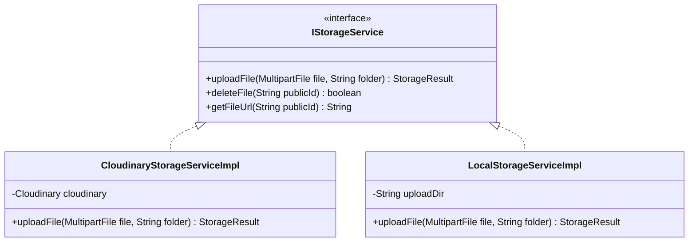

# QUY CHUẨN KỸ THUẬT & KIẾN TRÚC HỆ THỐNG (ENGINEERING RULES & ARCHITECTURE STANDARDS)

* **Dự án:** QAUTE Portal (Spring Boot 3 + MySQL + Thymeleaf + Bootstrap 5)
* **Phiên bản:** 1.0.0
* **Tài liệu tham chiếu tối cao:** [docs/brief.md](file:///d:/CauHinh_Java/workspace_sts/luyentap/doancuoiki_demo1/docs/brief.md)

---

## 1. Thứ Tự Ưu Tiên Văn Bản (Hierarchy of Truth)

Khi phát sinh bất kỳ sự không đồng nhất hoặc xung đột trong quá trình phát triển, các kỹ sư và AI phải tuân thủ nghiêm ngặt theo thứ tự ưu tiên sau:

$$\mathbf{docs/brief.md} \ > \ \mathbf{docs/team/engineering-rules.md} \ > \ \mathbf{docs/team/dev-assignment.md} \ > \ \mathbf{docs/team/dev-tasks.md}$$

1. **`docs/brief.md` (Product Brief & Business Rules):** Quyết định phạm vi tính năng, luồng nghiệp vụ, phân quyền RBAC và mã quy tắc nghiệp vụ (`BRULE-*`).
2. **`docs/team/engineering-rules.md` (Tài liệu này):** Quyết định chuẩn thiết kế code, cấu trúc thư mục, quy tắc bảo mật, Entity JPA và giao diện UI/UX.
3. **`docs/team/dev-assignment.md`:** Phân chia trách nhiệm giữa 4 Lập trình viên.
4. **`docs/team/dev-tasks.md`:** Danh sách task chi tiết từng sprint.

---

## 2. Cấu Trúc Dự Án Modular Monolith

Dự án áp dụng mô hình **Modular Monolith** phân chia theo Domain/Feature Package thay vì Layered Package phẳng (tránh gom chung tất cả Controller vào 1 thư mục).

```text
com.school.counseling
  ├── config/                       # Cấu hình hệ thống toàn cục
  │     ├── SecurityConfig.java     # Spring Security Session Cookie & RBAC
  │     ├── WebMvcConfig.java       # Interceptor, Resource Handlers
  │     ├── AsyncConfig.java        # ThreadPoolTaskExecutor cho Mail/Log
  │     ├── StorageConfig.java      # Cloudinary & Local Storage Bean
  │     ├── WebSocketConfig.java    # STOMP/SockJS Realtime Notifications
  │     └── AiConfig.java           # AI RAG Vector Client & Embeddings
  │
  ├── common/                       # Các thành phần tái sử dụng dùng chung
  │     ├── entity/
  │     │     └── BaseEntity.java   # id, created_at, updated_at, is_deleted
  │     ├── dto/
  │     │     └── ApiResponse.java  # Chuẩn hoá response JSON API
  │     ├── exception/
  │     │     ├── AppException.java
  │     │     ├── ResourceNotFoundException.java
  │     │     ├── AccessDeniedBusinessException.java
  │     │     └── GlobalExceptionHandler.java
  │     ├── storage/
  │     │     ├── IStorageService.java
  │     │     ├── CloudinaryStorageServiceImpl.java
  │     │     └── LocalStorageServiceImpl.java
  │     └── util/
  │           ├── SecurityUtils.java
  │           └── DateTimeUtils.java
  │
  └── module/                       # Các module nghiệp vụ tự đóng gói
        ├── auth/                   # [Module Xác thực & Người dùng]
        │     ├── controller/       # AuthController, ProfileController
        │     ├── dto/              # LoginDto, RegisterDto, OtpVerifyDto
        │     ├── entity/           # User, Role, Department, OtpToken
        │     ├── repository/       # UserRepository, RoleRepository
        │     └── service/          # AuthService, UserDetailsServiceImpl
        │
        ├── ticket/                 # [Module Quản lý Ticket & SLA Engine]
        │     ├── controller/       # TicketController, StaffTicketController
        │     ├── dto/              # CreateTicketDto, ReplyTicketDto, SlaFilterDto
        │     ├── entity/           # Ticket, TicketMessage, TicketStatus, Priority
        │     ├── repository/       # TicketRepository, TicketMessageRepository
        │     └── service/          # TicketService, SlaCalculatorService
        │
        ├── feed/                   # [Module Bảng tin & Diễn đàn Sinh viên]
        │     ├── controller/       # OfficialFeedController, ForumController, ModerationController
        │     ├── dto/              # CreatePostDto, ReportPostDto, CommentDto
        │     ├── entity/           # Post, PostAttachment, PostReport, Comment, Reaction
        │     ├── repository/       # PostRepository, PostReportRepository, CommentRepository
        │     └── service/          # PostService, ModerationService, FeedAttachmentService
        │
        ├── integration/            # [Module Tích hợp Microservice Vệ tinh]
        │     ├── controller/       # NodejsWebhookController
        │     ├── dto/              # VideoRenderWebhookPayloadDto
        │     └── service/          # WebhookSecurityService, VideoAttachmentService
        │
        ├── ai/                     # [Module Trợ lý AI RAG & Semantic Search]
        │     ├── controller/       # AiChatController, DocumentKnowledgeController
        │     ├── dto/              # AiQueryDto, AiResponseDto
        │     ├── entity/           # KnowledgeDocument, FaqSeed
        │     └── service/          # RagService, VectorEmbeddingService
        │
        └── notification/           # [Module Thông báo & Email Bất đồng bộ]
              ├── entity/           # NotificationLog
              ├── repository/       # NotificationLogRepository
              └── service/          # EmailAsyncService, NotificationRealtimeService
```

---

## 3. Tiêu Chuẩn Kiến Trúc Lớp (Layered Architecture Rules)

### 3.1. Lớp Controller (`@Controller`, `@RestController`)
* **Trách nhiệm duy nhất:** Nhận HTTP Request, trích xuất dữ liệu, validate dữ liệu đầu vào bằng `@Valid`, gọi Service và trả về tên View Thymeleaf hoặc `ApiResponse<T>`.
* **CẤM:** Tuyệt đối không viết logic nghiệp vụ, tính toán tiền/hạn chót hay gọi trực tiếp `Repository` trong Controller.
* **Xử lý BindingResult:**
  ```java
  @PostMapping("/create")
  public String createTicket(@Valid @ModelAttribute("form") CreateTicketDto form,
                             BindingResult bindingResult,
                             RedirectAttributes redirectAttributes,
                             Model model) {
      if (bindingResult.hasErrors()) {
          model.addAttribute("departments", departmentService.getAllActive());
          return "ticket/create";
      }
      ticketService.createTicket(form);
      redirectAttributes.addFlashAttribute("successMessage", "Yêu cầu đã được gửi thành công!");
      return "redirect:/tickets";
  }
  ```

### 3.2. Lớp Service (`@Service`)
* **Trách nhiệm:** Nắm giữ 100% Business Logic của hệ thống.
* **Quản lý Giao dịch:** Bắt buộc gắn `@Transactional(readOnly = true)` ở mức class. Các phương thức thêm/sửa/xóa gắn `@Transactional` rõ ràng.
* **Tách biệt Service:** Không để 1 class Service vượt quá 500 dòng code. Chia nhỏ thành các Service chức năng (ví dụ: `TicketService`, `SlaCalculatorService`, `TicketEmailNotifierService`).

### 3.3. Lớp Repository (`@Repository`)
* Kế thừa `JpaRepository<T, Long>` và `JpaSpecificationExecutor<T>` phục vụ việc tìm kiếm lọc linh hoạt.
* **Quy tắc Query:** 
  * Ưu tiên JPQL chuẩn (`@Query("SELECT t FROM Ticket t WHERE t.department.id = :deptId")`).
  * Chỉ dùng Native SQL trong trường hợp tính toán thống kê phức tạp hoặc tối ưu hiệu năng đặc biệt.

### 3.4. Lớp Entity & Database Mapping
* **BaseEntity chung:** Mọi Entity đều kế thừa `BaseEntity` chứa các trường: `id`, `created_at`, `updated_at`, `is_deleted`.
* **Quy tắc FetchType:** **100% quan hệ `@ManyToOne` và `@OneToMany` BẮT BUỘC đặt `fetch = FetchType.LAZY`**. Tuyệt đối không để `EAGER` mặc định gây lỗi N+1 Query.
* **Soft Delete:** Triển khai cơ chế xóa mềm:
  ```java
  @SQLDelete(sql = "UPDATE posts SET is_deleted = true WHERE id = ?")
  @Where(clause = "is_deleted = false")
  ```
* **Lombok:** Dùng `@Getter`, `@Setter`, `@NoArgsConstructor`, `@AllArgsConstructor`, `@Builder`. Không dùng `@Data` trên Entity để tránh vòng lặp đệ quy trong `toString()` và `equals()`.

---

## 4. Tiêu Chuẩn Giao Diện (UI/UX - Tối Giản & Chuẩn Công Sở Học Đường)

> [!IMPORTANT]
> **TIÊU CHÍ BẮT BUỘC: GIAO DIỆN TỐI GIẢN, TRANG NHÃ, DỊU MẮT (ACADEMIC MINIMALISM)**
> Cổng thông tin trường đại học phục vụ học vụ, không phải trang game hay giải trí. Tuyệt đối không dùng màu mè sặc sỡ, không dùng gradient chói lóa, không dùng hiệu ứng chuyển động rườm rà.

### 4.1. Bảng Màu Tiêu Chuẩn (Color Palette)
* **Nền trang (Background):** Màu xám sáng dịu nhẹ `#f8f9fa` (hoặc `#f3f4f6`).
* **Nền khối nội dung (Card / Panel):** Màu trắng tinh `#ffffff` kèm viền mỏng `#e5e7eb` và đổ bóng nhẹ (`shadow-sm`).
* **Màu chủ đạo (Brand Primary):** Màu xanh Navy trường học `#1e3a8a` hoặc `#0f172a`.
* **Màu chữ (Typography):**
  * Tiêu đề chính: `#111827` (Đen xám đậm, font chữ Inter / Roboto rõ ràng).
  * Nội dung thân bài: `#374151` (Xám than, dễ đọc trong thời gian dài).
  * Chú thích/Thời gian: `#6b7280` (Xám nhạt).
* **Màu trạng thái (Bootstrap 5 Standard Badges):**
  * `OPEN` / `PENDING_APPROVAL`: `.badge.bg-warning.text-dark` (Vàng dịu).
  * `IN_PROGRESS`: `.badge.bg-info.text-dark` (Xanh dương dịu).
  * `RESOLVED` / `APPROVED`: `.badge.bg-success` (Xanh lá chuẩn).
  * `OVERDUE` / `REJECTED`: `.badge.bg-danger` (Đỏ cảnh báo).
  * `CLOSED`: `.badge.bg-secondary` (Xám).

### 4.2. Khung Bố Cục Giao Diện (Thymeleaf Layout)
* Sử dụng `layout/main.html` bao bọc:
  * **Header/Navbar:** Thanh menu tối giản trên cùng (Logo trường, Danh mục Bảng tin, Diễn đàn, Gửi Ticket, Trợ lý AI, Profile/Logout).
  * **Breadcrumb:** Đường dẫn điều hướng trang rõ ràng (`Trang chủ > Quản lý Ticket > Ticket #136469`).
  * **Container:** Giới hạn độ rộng hợp lý (`max-width: 1200px`) căn giữa màn hình.
  * **Footer:** Chân trang xám nhạt với thông tin liên hệ phòng ban và bản quyền.

---

## 5. Quy Chuẩn Lưu Trữ & Quản Lý File (IStorageService)

### 5.1. Thiết Kế Hỗ Trợ 2 Chế Độ Lưu Trữ (Dual Storage Strategy)
Hệ thống định nghĩa Interface `IStorageService` duy nhất để Controller/Service gọi, dễ dàng chuyển đổi qua cấu hình `app.storage.provider=cloudinary|local`:



### 5.2. Phân Tách Thư Mục & Giới Hạn Tệp
* `/documents`: Dành cho `.pdf`, `.docx`, `.xlsx` (Tối đa 100MB cho Staff, 10MB cho Sinh viên).
* `/videos`: Dành cho `.mp4` (Tối đa 100MB từ Staff hoặc Node.js Webhook).
* `/images`: Dành cho `.jpg`, `.png`, `.webp` (Tối đa 5MB).

### 5.3. Kiểm Tra Bảo Mật Tệp Tin (Magic Byte Validation)
* Tuyệt đối không chỉ kiểm tra phần mở rộng file (Extension đuôi `.pdf`). Bắt buộc đọc **Magic Bytes** đầu file để chống tấn công thực thi file độc hại:
  * PDF: `%PDF-` (`0x25, 0x50, 0x44, 0x46`)
  * PNG: `0x89, 0x50, 0x4E, 0x47`
  * JPEG: `0xFF, 0xD8, 0xFF`
  * MP4: `....ftyp`

---

## 6. Xử Lý Thông Báo (Flash Messages) & Trang Lỗi Tập Trung

### 6.1. Flash Message Tiêu Chuẩn
* Mọi chuyển hướng (`redirect:`) kèm thông báo đều dùng `RedirectAttributes`:
  * Thành công: `redirectAttributes.addFlashAttribute("successMessage", "Thao tác thành công!");`
  * Cảnh báo/Lỗi: `redirectAttributes.addFlashAttribute("errorMessage", "Không thể thực hiện hành động này!");`
* Layout Thymeleaf tự động render Alert Bootstrap 5 ở vị trí đầu trang.

### 6.2. Trang Lỗi Hệ Thống
* Xây dựng giao diện trang nhã, có nút "Quay lại trang chủ" và thông tin mã lỗi:
  * `templates/error/403.html`: Bạn không có quyền truy cập khu vực này (Phân quyền Khoa/Phòng).
  * `templates/error/404.html`: Không tìm thấy yêu cầu hoặc bài viết này.
  * `templates/error/500.html`: Hệ thống đang xử lý, vui lòng thử lại sau.
